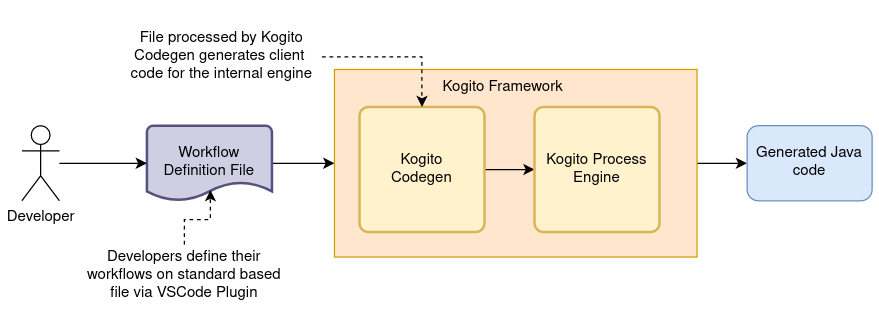
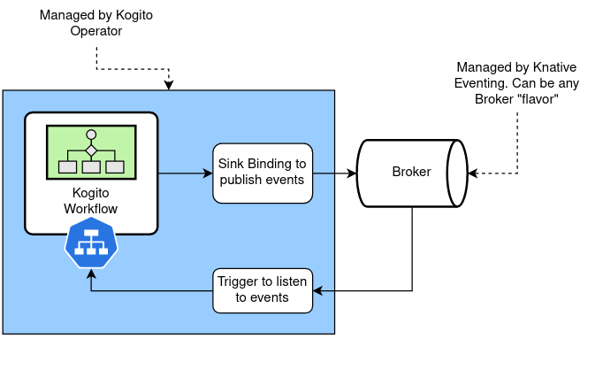

| Reviewer  | Date | Approval |
| ------------- | ------------- | ------------- |
| <!-- Your Github handle here -->  |   |:+1:, :monocle_face:, :-1:  |
| <!-- Your Github handle here --> |   |  |

[Kogito](https://kogito.kie.org/) is a platform for the development of cloud-native business automation applications. Kogito is designed targeting cloud-native architectures, and it comes with a series of features to make it easy for architects and developers to create business applications.

Kogito implements the [CNCF Serverless Workflow Project](https://github.com/serverlessworkflow/specification), which is a specification for defining workflow models that orchestrate event-driven, serverless applications. It focuses on defining a vendor-neutral, platform-independent, and declarative workflow model for orchestrating services that can be used across multiple cloud and container platforms. To date, the Serverless Workflow specification is a CNCF sandbox project.

As part of the Serverless Workflow implementation, Kogito offers a Kubernetes Operator to deploy these workflows with Knative. The goal is to make it as simple as possible to deploy and manage user-defined workflows in  cloud environments. Knative Eventing plays a very important role in this scenario by providing the underlying infrastructure for event-driven architectures.

### Kogito Serverless Workflow

To demonstrate how the Kogito workflow implementation works on event-driven architectures, we will use the [patient onboarding example](https://github.com/kiegroup/kogito-examples/tree/master/serverless-workflow-functions-events-quarkus). In this example, we simulate a workflow used in hospitals to onboard new patients and assign them to the correct doctor.

The following image taken from the [specification examples page](https://github.com/serverlessworkflow/specification/blob/master/examples/examples.md#New-Patient-Onboarding) illustrates this workflow:

*Patient Onboarding workflow representation*

The workflow starts after receiving a [CloudEvent](https://github.com/cloudevents/spec) object that contains patient information. Three functions are then called by the spec in a sequence which: (1) stores the patient information, (2) assigns the patient to a doctor based on their symptoms, and (3) schedules an appointment with the assigned doctor for that patient.

Here is an example of the patient onboarding workflow YAML, based on this specification:

```yaml
id: onboarding
version: '1.0'
name: Patient Onboarding Workflow
states:
- name: Onboard
  type: event
  start:
    kind: default
  onEvents:
  - eventRefs:
    - NewPatientEvent
    actionMode: sequential
    actions:
    - functionRef:
        refName: StoreNewPatient
    - functionRef:
        refName: AssignPatientToDoctor
    - functionRef:
        refName: SchedulePatientAppointment
  end:
    kind: default
events:
- name: NewPatientEvent
  type: new.patient.events
  source: "/hospital/entry"
functions:
- name: StoreNewPatient
  operation: classpath:openapi.json#storeNewPatient
- name: AssignPatientToDoctor
  resource: classpath:openapi.json#assignPatientToDoctor
- name: SchedulePatientAppointment
  resource: classpath:openapi.json#schedulePatientAppointment
```

The above workflow definition is based on three parts. The first part is the “states” array which includes the workflow control-flow logic, in our case the “event” state which receives the new patient event and performs our three actions (service invocations).

The second part is our event definitions (the “events” array), which are based on the CloudEvents specification, so there is a clear 1-1 mapping between how the events are defined in the workflows, and how they are represented with the CloudEvents format.

The third part, the `functions` array, contains the function definitions that give more information to the runtime about how to execute the required services.

Serverless Workflow specification is standards-based and leverages the OpenAPI specification to define details about restful executions of services. [In this gist](https://gist.github.com/ricardozanini/5ec66b4ddfbcf8ab40747b28b5f86333), you can see the OpenAPI file referenced by the functions in the above example.

You can reference the [Serverless Workflow specification](https://github.com/serverlessworkflow/specification/blob/master/specification.md) for information about all language constructs that the specification provides.

Note that the specification allows for both JSON and YAML workflow formats. This example uses YAML, however JSON is considered equivalent and is also parsable by the runtime.

During compilation, the Kogito runtime will parse this YAML file and will generate Java code that represents this workflow definition. The generated code is based on the Quarkus framework. The outcome is an OpenAPI standard REST service that can be deployed anywhere in your architecture.

*Kogito Runtime parsing flow*

In this example, we have also added the [Knative Kogito Eventing plugin](https://docs.jboss.org/kogito/release/latest/html_single/#con-knative-eventing_kogito-developing-process-services) to the project, which means that it can accept CloudEvent objects through HTTP on the root path. For example:

```bash
$ curl -X POST \
      -H "content-type: application/json"  \
      -H "ce-specversion: 1.0"  \
      -H "ce-source: /hospital/entry"  \
      -H "ce-type: new.patients.events"  \
      -H "ce-id: 12346"  \
      -d "{ \"name\": \"Mick\", \"dateOfBirth\": \"1983-08-15\", \"symptoms\":[\"seizures\"]}" \
http://localhost:8080
```

When sending this request to the service, a new instance of the workflow starts, and performs all of the operations defined in the spec.

There's much more included in this example. For comprehensive instructions on how to deploy and build it, please see the example page on the [Github repository](https://github.com/kiegroup/kogito-examples/tree/master/serverless-workflow-functions-events-quarkus).

### Knative Eventing Integration

Based on this generated service, you can build [an image](https://docs.jboss.org/kogito/release/latest/html_single/#proc-kogito-deploying-on-kubernetes_kogito-deploying-on-openshift) to be deployed with the [Kogito Operator](https://docs.jboss.org/kogito/release/latest/html_single/#con-kogito-operator-and-cli_kogito-deploying-on-openshift) on a Kubernetes cluster with [Knative Eventing](https://knative.dev/docs/eventing/) installed. The Operator will create all the necessary Knative resources to configure this service and subscribe it to the Knative [broker](https://knative.dev/docs/eventing/broker/):

*Knative Eventing and Kogito Operator integration*

The Kogito Operator creates a Knative [Trigger](https://knative.dev/docs/eventing/triggers/) resource, that links the service and the broker together. In this example, it will filter events of type `new.patients.events`. This means that every time a new event of this type comes to the broker, it will be redirected to the Kogito service.

The same concept also applies to [events produced by the workflow engine](https://github.com/serverlessworkflow/specification/blob/0.5.x/specification.md#event-definition). In this case, the operator will create a Knative [SinkBinding](https://knative.dev/docs/eventing/samples/sinkbinding/) resource, and will bind it to the Knative broker. Each time an event is produced by the service, a CloudEvent representing it will be sent to the broker.

### Conclusion

The Serverless Workflow specification can help us define complex workflows that can be used across many platforms and cloud providers. In this post, we shared how to use the specification with Kogito and the possibilities of integration with Knative as the serverless platform.

The specification implementation is ongoing work on the Kogito project, but we are aiming for a platform fully compliant with standards and the specification.

## Further Reading

To get to know more about the Serverless Workflow specification, we recommend reading the [specification document](https://github.com/serverlessworkflow/specification/blob/master/specification.md) in the Github repository and also to join the community!

To understand more about Knative Eventing and how the platform can help you create an event-driven architecture on Kubernetes, [please take a look at the official documentation](https://knative.dev/docs/eventing/#functionality).

## About the Authors

Ricardo Zanini is a Software Engineer currently working on Kogito Community project. Has has been working in the field of software engineering since 2000. He is a maintainer of the CNCF Serverless Workflow Specification.

Tihomir Surdilovic is a Software Developer at Red Hat working on business automation. He has been involved in business automation and open source since 2008. He also serves as an active lead of the CNCF Serverless Workflow Specification.
