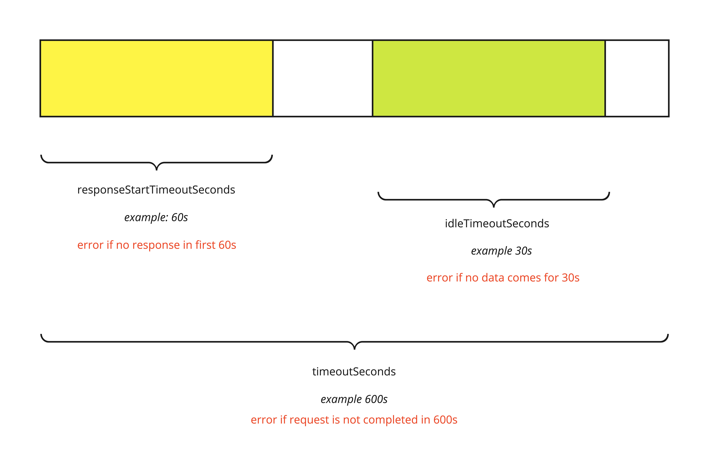

## About Serving Revision timeouts

**Author: [Nader Ziada](https://twitter.com/nziada),  Software Engineer @ [VMware](http://vmware.com)**

**Date: 2020-07-20**

Going through an http request to a Knative Revision’s lifecycle, you will find several different timeout values that handle different aspects of the request response time.

First, there is the **TimeoutSeconds** which is the maximum time (in seconds) that a user application can take to respond to a request.

And just to add more control for a cluster wide admin, the setting of max-revision-timeout-seconds defines the maximum duration that can be set in the timeout seconds for a revision.

Then there is **ResponseStartTimeoutSeconds** which is the time a user application can take before it starts responding to a request.

So the application has to begin responding before the ResponseStartTimeoutSeconds is over, but also has to finish responding before the TimeoutSeconds.

We also have **IdleTimeoutSeconds** which is the maximum time a request will be allowed to stay open while not receiving any data from the user's application.

#### For example

let's assume the following values:
```
timeoutSeconds = 600 seconds,
responseStartTimeoutSeconds = 60 seconds
idleTimeoutSeconds = 30 seconds
```
 - If the user application responding to the request doesn’t start sending data back after the initial 60 seconds, then the client gets an error indicating responseStartTimeoutSeconds is exceeded.
 - If the user application is idle during the span of the request and doesn’t send any data for the idleTimeoutSeconds of 30 seconds, the user gets an error message indicating that IdleTimeout is exceeded.
- And finally if the user application is not responding to the request for the complete timeoutSeconds time of 600 seconds, then the request has timed out.




More details about the Revision spec can be found [here](https://github.com/knative/serving/blob/main/docs/serving-api.md#serving.knative.dev/v1.Revision)
