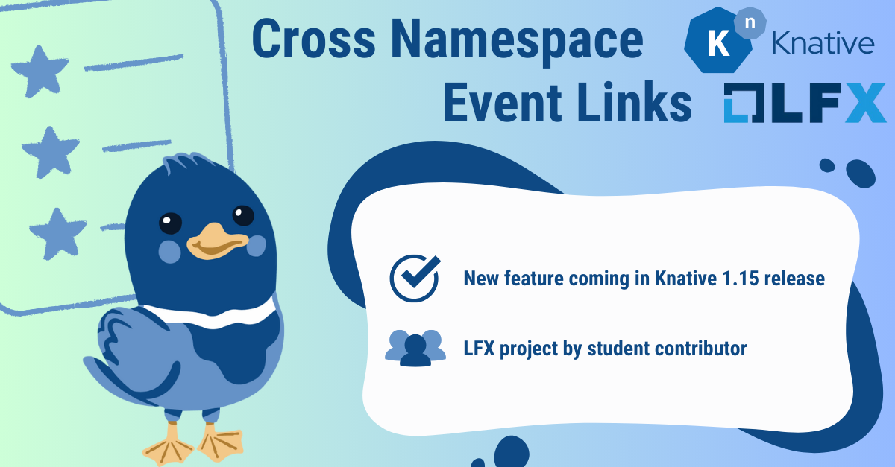

# My LFX Mentorship Experience: Cross Namespace Event Links Feature 

**Author: [Yijie Wang](https://www.linkedin.com/in/yijie-wang0806/){:target="_blank"}, LFX'24 Mentee**



Over the past three months, I’ve had the incredible opportunity to participate in the LFX Mentorship Program. My specific project was titled [CNCF - Knative Eventing: Cross Namespace Event Links](https://github.com/knative/eventing/issues/7530){:target="_blank"}, with my proposed feature track [here](https://docs.google.com/document/d/1rtDW446cldTrZaqeiOUdZuVC4u6SFHUneT3r4j2izaU/edit?usp=sharing&resourcekey=0-MNvWVD8pm_xnPfyCMMXHDA){:target="_blank"}. As the term wraps up, I want to take a moment to reflect on my journey and share it with you.

## Feature Description

In a multi-tenant scenario, some use cases might require separating brokers and channels in different namespaces than the services they send events to. While this setup would work if the team consuming the events has access to the namespaces where brokers and channels are in, this is not always the case. To address this issue, a new feature was proposed for triggers and subscriptions (event links) to exist in a different namespace from the broker or channel they reference.​​ The LFX Mentorship Program gave me the chance to bring this novel and highly requested feature into reality. 

For the specific implementation, I used Role-Based Access Control (RBAC) to manage permissions securely. A new RBAC verb, `knsubscribe`, was created to allow users to subscribe to a particular broker/channel. In addition, I used Subject Access Reviews to ensure only authorized users could create and manage these cross-namespace event links. 

Following the new changes, the control plane and data plane were adjusted accordingly to enable the smooth execution of the feature. Unit tests were created to ensure the feature works as expected and an E2E test was added to confirm event delivery between the resources. All the changes were placed behind a feature flag, allowing users to enable/disable this feature as desired. 

## Using the Cross Namespace Event Links Feature

This feature is planned to come out in the 1.15 release as an alpha feature and it's currently only supported for the InMemoryChannel and MTChannelBasedBroker using InMemoryChannels. Here’s how end users can use cross namespace referencing in Knative Eventing: 

### Enabling the Feature Flag

All the implementation is placed behind a feature flag, `cross-namespace-event-links`. To enable a feature, you can add it to the `config-features` ConfigMap under the `data` spec and set the value of the feature flag to be `enabled`. For example, you can enable the feature by adding the following ConfigMap entry: 

```
apiVersion: v1
kind: ConfigMap
metadata:
  name: config-features
  namespace: knative-eventing
  labels:
    eventing.knative.dev/release: devel
    knative.dev/config-propagation: original
    knative.dev/config-category: eventing
data:
  cross-namespace-event-links: enabled
```

### Setting Up Role-Based Access Control (RBAC)

RBAC policies define the permissions required for different resources to interact across namespaces. Here’s how you can set it up: 

**Create a Service Account or Specify a User:** In the namespace where the event source resides, create a service account or specify a user that will be used to access resources in the target namespace.

For example, to create a service account:

```
apiVersion: v1
kind: ServiceAccount
metadata:
  name: eventing-controller
  namespace: source-namespace
```

Alternatively, you can use a user with the necessary credentials. It may be easier to verify if you have the credentials to a different user in the cluster with fewer permissions and make the RoleBinding to that user.

**Create a Role in the Target Namespace:** Define a role that grants the necessary permissions for the event source to interact with resources, using the verb `knsubscribe`.

```
apiVersion: rbac.authorization.k8s.io/v1
kind: ClusterRole
metadata:
  name: broker-subscriber
rules:
- apiGroups:
   - eventing.knative.dev
  resources: 
   - brokers
  verbs: 
   - knsubscribe
```

**Binding the Role to the Service Account or User:** Create a role binding in the target namespace to bind the role to the service account or the user from the source namespace. 

This example uses the service account created from before:

```
apiVersion: rbac.authorization.k8s.io/v1
kind: ClusterRoleBinding
metadata:
  name: eventing-controller-crossnamespace-subscriber
subjects:
- kind: ServiceAccount
  name: eventing-controller
  namespace: source-namespace
roleRef:
  kind: ClusterRole
  name: broker-subscriber
  apiGroup: rbac.authorization.k8s.io
```

### Creating Cross Namespace References

 With RBAC configured, you can now create event sources and sinks that reference resources across namespaces. Here’s an example of how to reference a broker in a different namespace for a trigger:

**Trigger Subscribing to a Broker in Another Namespace:** Since the feature flag is enabled, the broker can be added to the `brokerRef` field in the Trigger spec, along with its own separate namespace.
```
apiVersion: eventing.knative.dev/v1
kind: Trigger
metadata:
  name: cross-namespace-trigger
  namespace: source-namespace
spec:
  brokerRef: 
      apiVersion: eventing.knative.dev/v1
      kind: Broker
      name: target-broker
      namespace: target-namespace
  subscriber: 
      ref:
         apiVersion: serving.knative.dev/v1 
         kind: Service 
         name: my-service
```

### Validating Cross Namespace Events

By following these steps, you can enable cross namespace referencing in Knative Eventing, set up the necessary RBAC permissions, and create triggers that reference brokers in another namespace. This setup enhances the flexibility of your event-driven applications, enabling event links across different namespaces. 

## Program Experience

I still remember skimming over the feature track document for the first time before applying to the program and barely understanding any of it. Now with the feature almost complete, this mentorship experience has been very insightful. 

One of the standout aspects of this program was the ample opportunities I had to engage with the Knative Eventing community. Initially, I was hesitant to ask questions, fearing it would expose my inexperience. However, as I started to participate in discussions more and noticed how helpful the community members were, I gained much more confidence. In addition, I developed a deeper appreciation for the collaborative nature of open source and I’m glad to be a part of the community.

The experience was not without technical challenges. One major challenge was integrating this new feature with existing infrastructure, which led to unforeseen issues. For example, modifying a function required ensuring that all parts of the code calling this function still operated correctly. Additionally, navigating the large Knative Eventing codebase was initially overwhelming. Understanding the architectural design, such as how the end-to-end (e2e) tests ran, took some time, but it was an invaluable learning process that enhanced my problem-solving skills and technical knowledge.

By the end of the program, I had achieved significant milestones: I opened [7 issues](https://github.com/knative/eventing/issues?q=is%3Aissue+CrossNamespace){:target="_blank"} and merged [11 PRs](https://github.com/knative/eventing/pulls?q=is%3Apr+CrossNamespace+){:target="_blank"}. For someone who entered the program with limited software experience, these accomplishments are particularly meaningful for me. 

## Final Comments

Finally, I would like to extend my gratitude to [Calum Murray](https://www.linkedin.com/in/calum-ra-murray/){:target="_blank"} and [Pierangelo Di Pilato](https://www.linkedin.com/in/pierdipi/){:target="_blank"} for giving me this opportunity, entrusting me in implementing this feature, and for the guidance and mentorship along the journey. It truly would not be possible without your help and support.

In a few years, I might not remember the exact lines of code that I wrote, but I will always recall the exhilarating feeling when my unit test first passed and the satisfaction of seeing this feature come to life step-by-step. This experience has broadened my career prospects and I’m looking forward to making more contributions to the open-source community in the future. 
