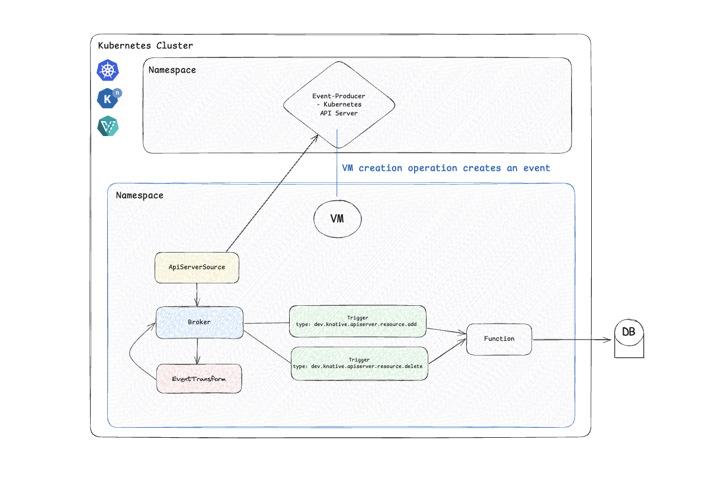

# Monitoring Virtual Machines with Knative Eventing

**Authors: Robert Guske, Senior Specialist Solution Architect OpenShift @ Red Hat, Matthias Weßendorf, Senior Principal Software Engineer @ Red Hat**

_In this blog post you will learn how to easily monitor the state of KubeVirt VMs with Knative Eventing's powerful building blocks._

Event-Driven Architecture (EDA) and the use of event sources fundamentally transforms how applications interact, fostering a highly decoupled and scalable environment where services react dynamically to changes. By abstracting the origin of information, event sources empower systems to integrate seamlessly and respond in real-time to a vast array of occurrences from diverse platforms.

This article shows how to use the `ApiServerSource` from Knative to monitor state of other Kubernetes resources, like KubeVirt's `VirtualMachine`. It also demonstrates how the `EventTransform` from Knative can simplify complex events, making processing simpler. In combination with the other Knative Eventing's powerful building blocks, like the `Broker`, it powers use cases such as updating a _Configuration Management Database (CMDB)_ with the state of all virtual machines in the Cluster, as illustrated in this graphic:



Knative Eventing is heavily based on [CNCF CloudEvents](https://cloudevents.io/){:target="_blank"}, which is a specification for describing event data in common formats to provide interoperability across services, platforms and systems. This allows Eventing to communicate natively with any system that understands HTTP or CloudEvents.

Lets dive in!

## The Knative `ApiServerSource`

The `ApiServerSource` is a [Knative Eventing Kubernetes custom resource](https://knative.dev/docs/eventing/sources/apiserversource/){:target="_blank"} that listens for events emitted by the Kubernetes API server (eg. pod creation, deployment updates, etc...) and forward them as CloudEvents to a designated sink or any http addressable URL.

Some common use cases for the `ApiServerSource` include:

* **Auditing and monitoring**: Triggering actions or notifications when specific custom Kubernetes resources are _created_, _updated_, or _deleted_.
* **Automating workflows**: Initiating a serverless function when a new Pod is _deployed_, a Deployment _scales_, or a ConfigMap is _modified_.
* **Integrating with external systems**: Sending Kubernetes events to data warehouses or databases, AI applications or even logging systems for analysis.

The following is an example of an `ApiServerSource` which only sends emitted events of the Kubernetes API server related to `kind: VirtualMachine`:

```yaml
kubectl create -f - <<EOF
apiVersion: sources.knative.dev/v1
kind: ApiServerSource
metadata:
  name: apiserversource
  labels:
    app: apiserversource
spec:
  mode: Resource
  resources:
    - apiVersion: kubevirt.io/v1
      kind: VirtualMachine
  serviceAccountName: events-sa
  sink:
    ref:
      apiVersion: eventing.knative.dev/v1
      kind: Broker
      name: broker-apiserversource
EOF
```

!!! note
    The source uses a service account which has proper RBAC setup for monitoring the referenced resources from KubeVirt.

### Event Routing

For the event routing itself we need to create an instance of a `Broker`:

```yaml
kubectl create -f - <<EOF
apiVersion: eventing.knative.dev/v1
kind: Broker
metadata:
  name: broker-apiserversource
spec: {}
EOF
```

This creates a memory-back `Broker` instance, which is perfectly fine for getting started. The `Broker` is an [`Addressable`](https://knative.dev/docs/eventing/sinks/) type, which can receive incoming CloudEvents over HTTP.

!!! note
    For a production-ready configuration of the Knative Broker for Apache Kafka see [this blog](https://developers.redhat.com/articles/2023/03/08/configuring-knative-broker-apache-kafka).


At this stage, the event flow is like:

```bash
                  Kubernetes Cluster
┌───────────────────────────────────────────────────┐
│                                                   │
│ ┌────────────┐    ┌────────────┐    ┌──────────┐  │
│ │ K8s        ◄────│ ApiServer  │────► Broker   │  │
│ │ API Server │    │ Source     │    │          │  │
│ └────────────┘    └────────────┘    └──────────┘  │
│                                                   │
└───────────────────────────────────────────────────┘

```


## Entering KubeVirt

As organizations continue to adopt microservices and containers, there’s still a need for legacy workloads that require virtual machines (VM). Enter [KubeVirt](https://kubevirt.io/) — the fast evolving open-source solution that integrates virtual machine management directly into Kubernetes.

KubeVirt allows you to run, manage, and scale virtual machines just as easily as you would containers, all within the same Kubernetes cluster. It enables teams to seamlessly combine the best of both worlds leveraging Kubernetes powerful orchestration capabilities for containerized workloads while still supporting VMs for legacy systems and specialized applications.

It’s a game-changer for teams looking to modernize their infrastructure without sacrificing compatibility with existing workloads.

## A Real-World Use Case

Now that KubeVirt allows you to run virtual machine workloads on your Kubernetes environment, imagine how your operational efficiency can be increased significantly leveraging the power of eventing. Envision a scenario where virtual machines are created, updated or deleted and every time this occurs, a Configuration Management Database (CMDB) will be updated to reflect the changes.

This use case can be elegantly handled with Knative Eventing and Functions-as-a-Service (FaaS). Whenever one of the aforementioned operations happened, an event will be created by the Kubernetes API Server, will be processed through Knative, including triggering and invoking a function (business logic) and will ultimtaley update the CMDB in real-time.

Picturing: _VM Operation_ --> _Event Creation_ --> _Event Processing_ --> _Automation_

### Trimmimg the fat from the Event-Payload

As mentioned above, the `ApiServerSource` is listening for events and forwards them as CloudEvents to an addressable or a callable resource. The challenge though is, that the produced events are data-heavy and making downstream processing tricky. "Downstream processing" != the further processing of the received data.

Below is a complete example of a _virtual machine creation_ event, which the `ApiServerSource` wraps into its `dev.knative.apiserver.resource.add` CloudEvent:

```shell
Context Attributes,
  specversion: 1.0
  type: dev.knative.apiserver.resource.add
  source: https://172.30.0.1:443
  subject: /apis/kubevirt.io/v1/namespaces/kubevirt-eventing/virtualmachines/rhel-vm-2
  id: 5508cafb-3332-4709-a1b1-a8657111d82c
  time: 2025-07-07T13:02:18.124604417Z
  datacontenttype: application/json
Extensions,
  apiversion: kubevirt.io/v1
  kind: VirtualMachine
  knativearrivaltime: 2025-07-07T13:02:18.132189108Z
  name: rhel-vm-2
  namespace: kubevirt-eventing
Data,
  {
    "apiVersion": "kubevirt.io/v1",
    "kind": "VirtualMachine",
    "metadata":
      "creationTimestamp": "2025-07-07T13:02:18Z",

// output omitted

      ],
      "name": "rhel-vm-2",
      "namespace": "kubevirt-eventing",
      "resourceVersion": "35172905",
      "uid": "17160b0a-9f0b-461c-9d6c-f1e477dacf93"
    },

// output omitted

        "spec": {
          "architecture": "amd64",
          "domain": {
            "cpu": {
              "cores": 4,
              "sockets": 2,
              "threads": 1
            },

/// output omitted

              ],
              "interfaces": [
                {
                  "bridge": {},
                  "name": "default"
                }
              ]
            },
            "machine": {
              "type": "pc-q35-rhel9.2.0"
            },
            "memory": {
              "guest": "8Gi"
            },
            "resources": {}
          },
          "networks": [
            {
              "name": "default",
              "pod": {}
            }
          ],

/// output omitted
```

As you can see the event is pretty verbose and would need some help in order to extract the relevant data for processing it further, in a meaningful way

!!! note
    The original event can be seen here: [rhel9-vm-creation-event](https://raw.githubusercontent.com/rguske/knative-functions/refs/heads/main/kn-py-vmdata-psql-fn/test/vm-creation-event-origin.json){:target="_blank"}

### Event Transformation with a low-code Approach

In Knative Eventing version 1.18, the new `EventTransform` API CRD [got introduced](https://knative.dev/docs/eventing/transforms/){:target="_blank"} which will be the needed scalpel in your toolbox to trimm the "data-heavy" data playload to your tailored requirements. It allows you to modify event attributes, extract data from event payloads, and reshape events to fit different systems requirements. `EventTransform` is designed to be a flexible component in your event-driven architecture that can be placed at various points in your event flow to facilitate seamless integration between diverse systems.

This new functionality will support us with extracting exactly the data in which we are interested in to feet our CMDB with proper data:

```yaml
kubectl create -f - <<EOF
apiVersion: eventing.knative.dev/v1alpha1
kind: EventTransform
metadata:
  name: vmdata-transform
spec:
  sink:
    ref:
      apiVersion: eventing.knative.dev/v1
      kind: Broker
      name: broker-transformer
  jsonata:
    expression: |
      {
        "specversion": specversion,
        "type": type,
        "source": source,
        "subject": subject,
        "id": id,
        "time": time,
        "kind": kind,
        "name": name,
        "namespace": namespace,
        "cpucores": data.spec.template.spec.domain.cpu.cores,
        "cpusockets": data.spec.template.spec.domain.cpu.sockets,
        "memory": data.spec.template.spec.domain.memory.guest,
        "datasource": data.spec.dataVolumeTemplates.spec.storage.resources.resources.storage,
        "storageclass": data.spec.dataVolumeTemplates.spec.storage.storageClassName,
        "network": data.spec.template.spec.networks.name
      }
EOF
```

The above `EventTransform` extracts values from the original event data and creates a new one. More details about the `EventTransform` API and the [JSONata](https://jsonata.org/){:target="_blank"} expression language can be found here [here](https://knative.dev/docs/eventing/transforms/){:target="_blank"}.

Having this in-place, the order of the event-flow got extended:

```bash
                          Kubernetes Cluster
┌────────────────────────────────────────────────────────────────────┐
│                                                                    │
│ ┌────────────┐    ┌────────────┐    ┌──────────┐    ┌────────────┐ │
│ │ K8s        ◄────│ ApiServer  │────► Broker   │────► Event      │ │
│ │ API Server │    │ Source     │    │          │    │ Transform  │ │
│ └────────────┘    └────────────┘    └──────────┘    └────────────┘ │
│                                                                    │
└────────────────────────────────────────────────────────────────────┘

```

Once this is implemented and a new virtual machine was created, the _new_ event payload will be much more simplified.

Example custom event payload:

```shell
Context Attributes,
  specversion: 1.0
  type: dev.knative.apiserver.resource.add
  source: https://172.30.0.1:443
  subject: /apis/kubevirt.io/v1/namespaces/kubevirt-eventing/virtualmachines/rhel-vm-2
  id: 5508cafb-3332-4709-a1b1-a8657111d82c
  time: 2025-07-07T13:02:18.124Z
Extensions,
  cpucores: 4
  cpusockets: 2
  kind: VirtualMachine
  knativearrivaltime: 2025-07-07T13:02:53.385732787Z
  memory: 8Gi
  name: rhel-vm-2
  namespace: kubevirt-eventing
  network: default
  storageclass: coe-netapp-san
```

This tailored event will perfectly serve our use case and makes the processing for functions much easier.

## Bringing It All (Event-Driven) Together

With having almost all necessary components ready-to-go it is time to bring the use case "Monitoring Virtual Machines with Knative Eventing" into live. The final missing pieces are the function, deployed as a Knative Service (`ksvc`), itself with the corresponding `triggers`. The `triggers` will do the routing of events from a Broker to a Sink. Think of it like: "When an event matching this filter arrives in the broker, send it to this service (e.g. a function)."

Remember, we want our CMDB database automatically and event-driven updated based on virtuial machine creation or deletion operations. Important is, that we are only interested in specific data which should be feet into the DB.

The following output shows a yet empty PostgreSQL DB. Notce that the columns are matching the jsonata expressions from the configured `EventTransform` CR.

```shell
psql -U postgres -h 10.32.98.110 -p 5432 -d vmdb -c 'SELECT * FROM "virtual_machines"'
Password for user postgres:
 type | id | kind | name | namespace | time | cpucores | cpusockets | memory | storageclass | network
------+----+------+------+-----------+------+----------+------------+--------+--------------+---------
(0 rows)
```

### Deploy the Function

The business-logic in this example is written in Python. It'll process the incoming tailored event, establish a connection to the PostgreSQL DB and will write the desired data into the columns of the DB `vmdb`. Keep in mind, that you have the freedom of deciding in which programming language you write your business-logic.

The code for the function can be found on Github here: [KubeVirt PostgreSQL Knative Function Example](https://github.com/rguske/knative-functions/tree/main/kn-py-vmdata-psql-fn){:target="_blank"}

!!! note
    A `secret` needs to be created beforehand to store the database related sensitive data which will be picked up by the function during its execution.

Next we create our `Trigger`s for our function and deploy it to the Kubernetes Cluster:

```shell
func subscribe --filter type=dev.knative.apiserver.resource.add --source broker-apiserversource
func subscribe --filter type=dev.knative.apiserver.resource.delete --source broker-apiserversource
func deploy
```

We can validate the successful creation of the function using `kubectl` or `kn`:

```shell
kubectl get ksvc
NAME                                   URL                                                                                                      LATESTCREATED                                LATESTREADY                                  READY   REASON
kn-py-psql-vmdata-fn                   https://kn-py-psql-vmdata-fn-kubevirt-eventing.apps.ocp1.stormshift.coe.muc.redhat.com                   kn-py-psql-vmdata-fn-00001                   kn-py-psql-vmdata-fn-00001                   True
```

```shell
kn service list
NAME                                   URL                                                                                                      LATEST                                       AGE     CONDITIONS   READY   REASON
kn-py-psql-vmdata-fn                   https://kn-py-psql-vmdata-fn-kubevirt-eventing.apps.ocp1.stormshift.coe.muc.redhat.com                   kn-py-psql-vmdata-fn-00001                   5h3m    3 OK / 3     True
```

Also validate the conditions of the Triggers:

```shell
kubectl get triggers
NAME                                           BROKER                   SUBSCRIBER_URI                                                                    AGE     READY   REASON
trigger-kn-py-psql-vmdata-fn-add               broker-apiserversource       http://kn-py-psql-vmdata-fn.kubevirt-eventing.svc.cluster.local                   5h36m   True
trigger-kn-py-psql-vmdata-fn-delete            broker-apiserversource       http://kn-py-psql-vmdata-fn.kubevirt-eventing.svc.cluster.local                   5h36m   True
```

```shell
kn trigger list
NAME                                           BROKER                   SINK                                                             AGE     CONDITIONS   READY   REASON
trigger-kn-py-psql-vmdata-fn-add               broker-apiserversource       ksvc:kn-py-psql-vmdata-fn                                        5h38m   7 OK / 7     True
trigger-kn-py-psql-vmdata-fn-delete            broker-apiserversource       ksvc:kn-py-psql-vmdata-fn                                        5h38m   7 OK / 7     True
```

Fasten your seatbelt 🚀 The complete event-flow is in-place and the function will feet the desired data into the DB.

Example output:

```shell
psql -U postgres -h 10.32.98.110 -p 5432 -d vmdb -c 'SELECT * FROM "virtual_machines"'
Password for user postgres:
                 type                  |                  id                  |      kind      |   name    |     namespace     |           time           | cpucores | cpusockets | memory |  storageclass  | network
---------------------------------------+--------------------------------------+----------------+-----------+-------------------+--------------------------+----------+------------+--------+----------------+---------
 dev.knative.apiserver.resource.add    | eb49fb88-48d3-4c3b-b94e-34208010109b | VirtualMachine | rhel-vm-2 | kubevirt-eventing | 2025-07-08T10:34:52.027Z | 4        | 2          | 8Gi    | coe-netapp-san | default
 dev.knative.apiserver.resource.delete | 0e9924cd-cd1a-4a4a-a3bf-717fd1caef50 | VirtualMachine | rhel-vm-2 | kubevirt-eventing | 2025-07-08T10:36:07.348Z | 4        | 2          | 8Gi    | coe-netapp-san | default
(2 rows)
```

## Watch the Show

The orchestra is complete and our function is waiting for the starting signal to kick-off.

Watch the show via the following recording:

[](https://asciinema.org/a/726717)

## Conclusion

Monitoring virtual machines in a modern, cloud-native environment becomes significantly more efficient and responsive when leveraging Knative Eventing. By tapping into Kubernetes-generated events and using Knative as the event-processing backbone, we can trigger lightweight, event-driven functions that update a database in real-time. This architecture not only decouples components and improves scalability but also ensures that your VM metadata stays up-to-date without the need for constant polling or heavy integration logic. With this approach, you lay the foundation for a reactive, extensible system that easily adapts to new event types and downstream consumers as your infrastructure grows.

To learn more about Knative Eventing visit the documentation on our website or join our CNCF Slack channel #knative-eventing!
