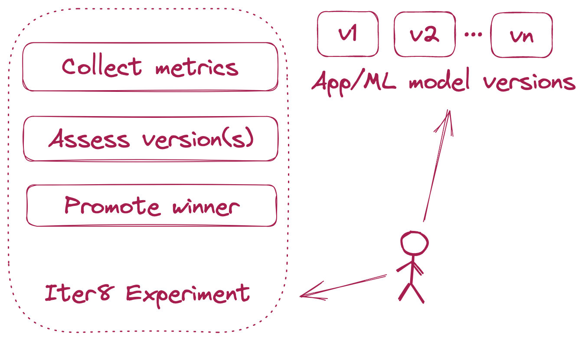
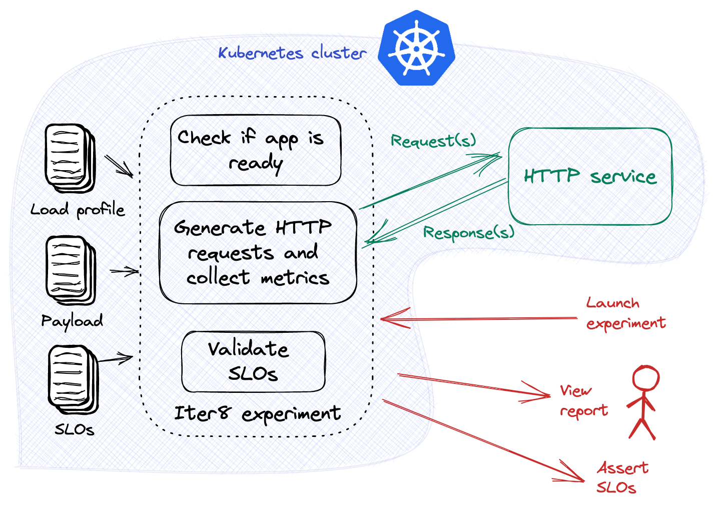
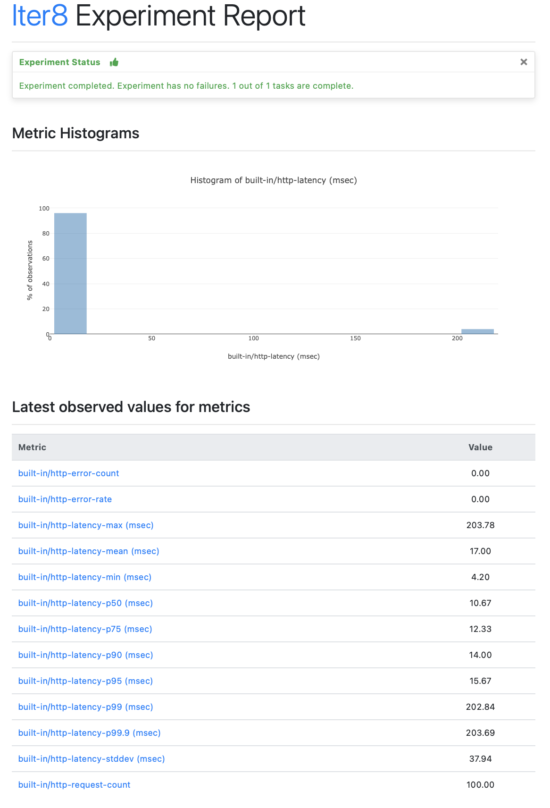

# Simple Performance Testing with SLOs

**Author: [Srinivasan Parthasarathy](https://researcher.watson.ibm.com/researcher/view.php?person=us-spartha), Senior Research Scientist and Manager, DevSecOps @ [IBM Research](https://research.ibm.com)**

**Date: 2022-07-18**


Performance testing is a core building block in the robust delivery of HTTP and gRPC services. One way to accomplish this is by sending a stream of requests to the target service, and evaluating the responses for error and latency-related violations. From a developer’s perspective, this approach has three main considerations, namely, i) the load-related characteristics of the request stream, such as the request rate; ii) the shape of the requests, in particular, whether the service requires any payload/data to be sent as part of the requests; and iii) the service-level objectives (SLOs) used to validate the quality of the target service.

You can use [Iter8](https://iter8.tools), the open source Kubernetes release optimizer, to flexibly launch performance tests for Knative services **in seconds**, with precise control over all of the above. This article introduces these capabilities.

## Overview of Iter8

Iter8 is the Kubernetes release optimizer built for DevOps, MLOps, SRE and data science teams. Iter8 makes it easy to ensure that Kubernetes apps and ML models perform well and maximize business value.

Iter8 supports the following use-cases.

1.  Performance testing and SLO validation of HTTP services.
2.  Performance testing and SLO validation of gRPC services.
3.  SLO validation using custom metrics from any database(s) or REST API(s).

### Iter8 experiment
Iter8 introduces the notion of an [experiment](https://iter8.tools/0.11/getting-started/concepts/#iter8-experiment), which is a list of configurable tasks that are executed in a specific sequence.



??? tip "Why Iter8?"
    Iter8 packs a number of powerful features that facilitate Kubernetes app testing and experimentation. They include the following.

    1.  **Generating load and collecting built-in metrics for HTTP and gRPC services.** Simplifies performance testing by eliminating the need to setup and use metrics databases.
    2.  **Well-defined notion of service-level objectives (SLOs).** Makes it simple to define and verify SLOs in experiments.
    3.  **Custom metrics.** Enables the use of custom metrics from any database(s) or REST API(s) in experiments.
    4.  **Readiness check.** The performance testing portion of the experiment begins only after the service is ready.
    5.  **HTML/text reports.** Promotes human understanding of experiment results through visual insights.
    6.  **Assertions.** Verifies whether the target app satisfies the specified SLOs or not after an experiment. Simplifies automation in CI/CD/GitOps pipelines: branch off into different paths depending upon whether the assertions are true or false.
    7.  **Multi-loop experiments.** Experiment tasks can be executed periodically (multi-loop) instead of just once (single-loop). This enables Iter8 to refresh metric values and perform SLO validation using the latest metric values during each loop.
    8.  **Experiment anywhere.** Iter8 experiments can be launched inside a Kubernetes cluster, in local environments, or inside a GitHub Actions pipeline.

## Quick start

Install the Iter8 CLI using `brew` as follows. You can also install using pre-built binaries as described [here](https://iter8.tools/0.11/getting-started/install/).

```shell
brew tap iter8-tools/iter8
brew install iter8@0.11
```

### Tutorial: Performance test for Knative HTTP service
In this tutorial, we will launch an Iter8 experiment that generates load for a Knative HTTP service, collects Iter8's built-in HTTP metrics, and validates the specified service-level objectives (SLOs). This experiment is illustrated in the figure below.



Install Knative in your Kubernetes cluster, and deploy your Knative HTTP Service as described in [this Knative tutorial](https://knative.dev/docs/getting-started/first-service/).

Launch the Iter8 experiment as follows.

```shell
iter8 k launch \
--set "tasks={ready,http,assess}" \
--set ready.ksvc=hello \
--set http.url=http://hello.default.svc.cluster.local:80 \
--set http.numRequests=100 \
--set http.connections=10 \
--set http.qps=20 \
--set assess.SLOs.upper.http/latency-mean=200 \
--set assess.SLOs.upper.http/error-count=0 \
--set runner=job
```

??? note "About this experiment"
    This experiment consists of three tasks, namely, [ready](https://iter8.tools/0.11/user-guide/tasks/ready/), [http](https://iter8.tools/0.11/user-guide/tasks/http/), and [assess](https://iter8.tools/0.11/user-guide/tasks/assess/).

    The [ready](https://iter8.tools/0.11/user-guide/tasks/ready/) task checks if the Knative service named `hello` exists and is ready.

    The [http](https://iter8.tools/0.11/user-guide/tasks/http/) task sends HTTP requests and collects [Iter8's built-in HTTP metrics](https://iter8.tools/0.11/user-guide/tasks/http/#metrics). It is configured to send 100 requests (`numRequests`) across 10 concurrent connections (`connections`) at 20 requests per second (`qps`). The task sends its requests to the cluster-local URL `http://httpbin.default/get`.

    The [assess](https://iter8.tools/0.11/user-guide/tasks/assess/) task verifies if the app satisfies the specified SLOs: i) the mean latency of the service does not exceed 200 msec, and ii) there are no errors.

    The value of the [runner](https://iter8.tools/0.11/getting-started/concepts/#runner) parameter is set to `job`, which enables Iter8 to use a [Kubernetes job workload](https://kubernetes.io/docs/concepts/workloads/controllers/job/) to run this experiment.

#### View experiment report
Once the experiment completes (~5 secs), view the experiment report as follows.

=== "Text"
    ```shell
    iter8 k report
    ```

    ??? note "The text report looks like this"
        ```shell
        Experiment summary:
        *******************

          Experiment completed: true
          No task failures: true
          Total number of tasks: 1
          Number of completed tasks: 1

        Latest observed values for metrics:
        ***********************************

          Metric                              |value
          -------                             |-----
          built-in/http-error-count           |0.00
          built-in/http-error-rate            |0.00
          built-in/http-latency-max (msec)    |203.78
          built-in/http-latency-mean (msec)   |17.00
          built-in/http-latency-min (msec)    |4.20
          built-in/http-latency-p50 (msec)    |10.67
          built-in/http-latency-p75 (msec)    |12.33
          built-in/http-latency-p90 (msec)    |14.00
          built-in/http-latency-p95 (msec)    |15.67
          built-in/http-latency-p99 (msec)    |202.84
          built-in/http-latency-p99.9 (msec)  |203.69
          built-in/http-latency-stddev (msec) |37.94
          built-in/http-request-count         |100.00
        ```

=== "HTML"
    ```shell
    iter8 k report -o html > report.html # view in a browser
    ```

    ??? note "The HTML report looks like this"
        

### Tutorial: Performance test for Knative gRPC service
In this tutorial, we will launch an Iter8 experiment that generates load for a Knative gRPC service, collects Iter8's built-in gRPC metrics, and validates the specified service-level objectives (SLOs). This experiment is illustrated in the figure below.


Use the [Knative (`kn`) CLI](https://knative.dev/docs/client/install-kn/) to update the Knative service deployed in the [above tutorial](#tutorial-performance-test-for-knative-http-service) to a gRPC service as follows.

```shell
kn service update hello \
--image docker.io/grpc/java-example-hostname:latest \
--port h2c:50051 \
--revision-name=grpc
```

Launch the Iter8 experiment as follows.

```shell
iter8 k launch \
--set "tasks={ready,grpc,assess}" \
--set ready.ksvc=hello \
--set grpc.host="hello.default.svc.cluster.local:80" \
--set grpc.call="helloworld.Greeter.SayHello" \
--set grpc.total=100 \
--set grpc.concurrency=10 \
--set grpc.rps=20 \
--set grpc.protoURL="https://raw.githubusercontent.com/grpc/grpc-java/master/examples/example-hostname/src/main/proto/helloworld/helloworld.proto" \
--set grpc.data.name="frodo" \
--set assess.SLOs.upper.grpc/error-rate=0 \
--set assess.SLOs.upper.grpc/latency/mean=400 \
--set assess.SLOs.upper.grpc/latency/p90=500 \
--set runner=job  \
--set logLevel=debug \
--noDownload
```

??? note "About this experiment"
    This experiment consists of three tasks, namely, [ready](https://iter8.tools/0.11/user-guide/tasks/ready/), [grpc](https://iter8.tools/0.11/user-guide/tasks/grpc/), and [assess](https://iter8.tools/0.11/user-guide/tasks/assess/).

    The [ready](https://iter8.tools/0.11/user-guide/tasks/ready) task checks if the Knative service named `hello` exists and is ready.

    The [grpc](https://iter8.tools/0.11/user-guide/tasks/grpc) task sends gRPC call requests and collects [Iter8's built-in gRPC metrics](https://iter8.tools/0.11/user-guide/tasks/grpc/#metrics). It is configured to send 100 `total` requests across 10 concurrent connections (`concurrency`) at 20 requests per second (`rps`). The task sends its requests to the `helloworld.Greeter.SayHello` method of the cluster-local gRPC service with host address `hello.default:50051`. The task is also configured with the protobuf specification of the gRPC service, available from the `protoURL`. Each request sent by the task includes a protobuf serialized data object, with a single field called `name` whose value is `frodo`.

    The [assess](https://iter8.tools/0.11/user-guide/tasks/assess/) task verifies if the app satisfies the specified SLOs: i) there are no errors, ii) the mean latency of the service does not exceed 400 msec, and iii) the 90th percentile latency does not exceed 500 msec.

    The value of the [runner](https://iter8.tools/0.11/getting-started/concepts/#runner) parameter is set to `job`, which enables Iter8 to use a [Kubernetes job workload](https://kubernetes.io/docs/concepts/workloads/controllers/job/) to run this experiment.

    The Iter8 experiment chart was already downloaded as part of the [HTTP tutorial](#tutorial-performance-test-for-knative-http-service) above. The `--noDownload` reuses the previously downloaded chart.

#### View experiment report
Once the experiment completes (~5 secs), view the experiment report as described in the [HTTP tutorial](#tutorial-performance-test-for-knative-http-service) above.

## What next?

Try the following enhancements and variations of the above tutorials.

1.  Try the [HTTP tutorial](#tutorial-performance-test-for-knative-http-service) with your own Knative HTTP service. At a minimum, you will need to modify the `ready.ksvc` and `http.url` parameters in order to match your service. You can also explore other parameters of the [`http` task](https://iter8.tools/0.11/user-guide/tasks/http/) in order to configure the number of requests, queries per second, duration, the number of parallel connections, and various types of request payloads.
2.  Try the [gRPC tutorial](#tutorial-performance-test-for-knative-grpc-service) with your own Knative gRPC service. At a minimum, you will need to modify the `ready.ksvc`, `grpc.host`, `grpc.call`, `grpc.data`, and `grpc.protoURL` parameters in order to match your service. You can also explore other parameters of [`grpc` task](https://iter8.tools/0.11/user-guide/tasks/grpc/) in order to configure the number of requests, queries per second, duration, number of parallel connections, and various types of request payloads. You can also use the [`grpc` task](https://iter8.tools/0.11/user-guide/tasks/grpc/) for performance testing of streaming gRPC.
3.  Configure the [assess task](https://iter8.tools/0.11/user-guide/tasks/assess/) used in the [HTTP tutorial](#tutorial-performance-test-for-knative-http-service) above with other SLOs based on [Iter8's built-in HTTP metrics](https://iter8.tools/0.11/user-guide/tasks/http/#metrics). Similarly, configure the [assess task](https://iter8.tools/0.11/user-guide/tasks/assess/) used in the [gRPC tutorial](#tutorial-performance-test-for-knative-grpc-service) above with other SLOs based on [Iter8's built-in gRPC metrics](https://iter8.tools/0.11/user-guide/tasks/grpc/#metrics).
4.  Assert experiment outcomes, view experiment logs, and clean up the experiment as documented in [this example](https://iter8.tools/0.11/getting-started/your-first-experiment/). Run experiments in your local environment instead of a Kubernetes cluster as documented in [this example](https://iter8.tools/0.11/tutorials/integrations/local/).
