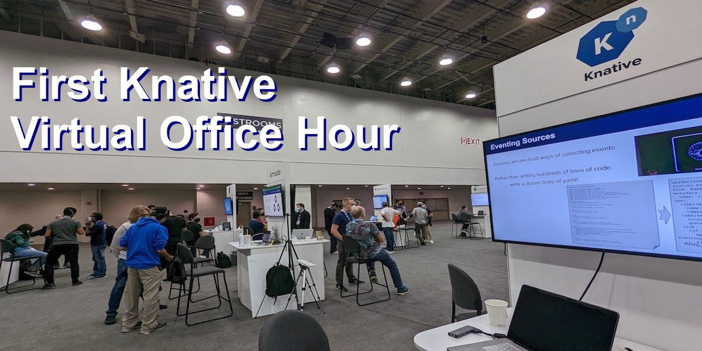

# First 🌱 Knative Virtual Office Hour

**Date: 2022-12-01**

**Authors: [Alek Slominski](https://aslom.net/), [Evan Anderson](https://off-by-one.dev/), [Lance Ball](https://twitter.com/lanceball), and Paul Schweigert**

We think that there should be an easy way for new Knative users and contributors to get started with our project. Holding virtual office hours for questions and help with using or contributing to Knative should help to get started with using code and contributing.

During the recent KubeCon NA 2022 in Detroit we had Knative Day, Maintainer Meetup, and ContribFest that showed there are people interested in using or contributing to Knative. However, today we do not have any ongoing online meetings for people to just show up. They can join Slack but that is asynchronous and requires joining yet another Slack, then reading channels, and figuring where to ask your questions. Driving your own engagement can be a barrier to participating in the community.

Therefore, we are organizing the first Knative Virtual Office Hour in 2022.

**When:** [December 9 (Friday) 11:30 AM US Eastern](https://dateful.com/convert/utc?t=430pm&d=2022-12-09)

**How to join:** Zoom: [https://zoom.us/j/94310596244](https://zoom.us/j/94310596244)

**Who should join?**

- You are curious about Knative and you are wondering where to start
- You have questions about how to build something using Knative
- You have great idea for Knative but you do not know where or how to share it
- You want to meet other people using Knative
- You want to get to know how Knative works inside and want to contribute to open source project

No prior knowledge of Knative is required.

Hope to see you there!

Alek, Evan, Lance, Paul

P.S. If there is enough interest we may continue in 2023.

