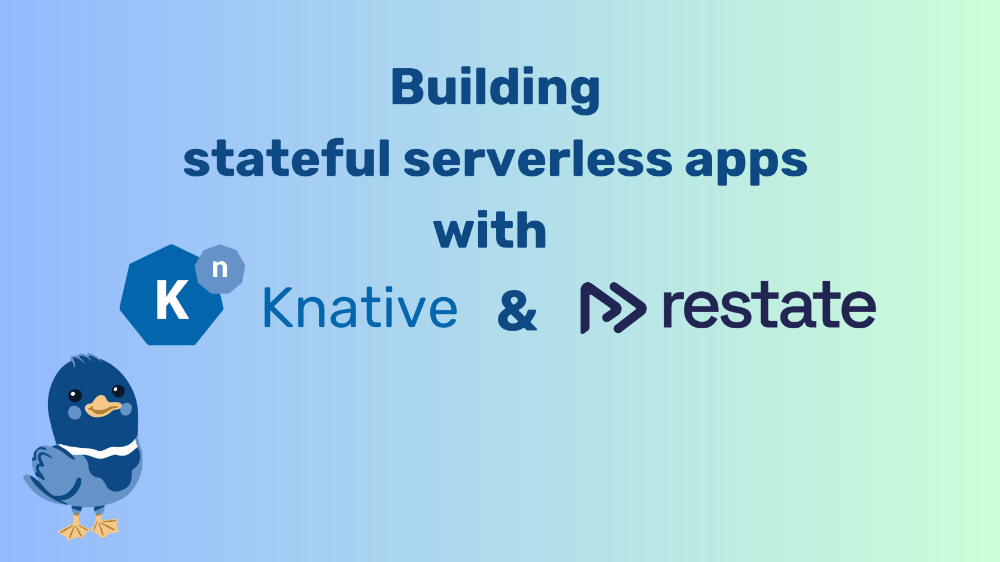

# Welcome to the Knative blog

<a href="./feed_rss_created.xml">RSS Feed</a>

Follow this blog to keep up-to-date with Knative.

* **Release and feature announcements:**

    Learn about each Knative release, what's new and changed, and how to get started with the latest and greatest.

* **Articles:**

    Read about Knative-centric features, tools, and related topics.

* **Steering Committee and TOC:**

    Updates on Knative governance, technical direction, and the community.

* **Future and past social events:**

    Find out where the Knative team will be talking next, and where they've been.

## Featured Posts

### AI powered Knative Functions for Llama Stack
Learn how to implement Knative functions for model inference.

[Read more :octicons-arrow-right-24:](articles/ai_functions_llama_stack.md){ .md-button }

### Knative meets KubeVirt!
Monitoring Virtual Machines with Knative Eventing

[Read more :octicons-arrow-right-24:](articles/kubevirt_meets_eventing.md){ .md-button }

### Announcing Knative v1.18 Release
Details on the 1.18 release of the Knative project.

[Read more :octicons-arrow-right-24:](releases/announcing-knative-v1-18-release.md){ .md-button }

### Building Stateful applications with Knative and Restate

Combine Knative with Restate's Durable Execution model to easily build serverless stateful applications

[Read more :octicons-arrow-right-24:](articles/Building-Stateful-applications-with-Knative-and-Restate.md){ .md-button }

### How IBM Watsonx Assistant uses Knative Eventing to train machine learning models!

[Read more :octicons-arrow-right-24:](https://www.cncf.io/case-studies/ibmwatsonxassistant/){ .md-button }

### Enhancing the Knative Contributor Experience!
Actionable Recommendations for Improving the Knative Contributor Experience!

[Read more :octicons-arrow-right-24:](articles/enhancing-the-knative-experience.md){ .md-button }

### Knative meets Apache Camel K!
Event Sourcing with Apache Camel K and Knative Eventing.

[Read more :octicons-arrow-right-24:](articles/knative-meets-apache-camel.md){ .md-button }

### Knative Completes Third-Party Security Audit
A third-party audit by Ada Logics found a small number of issues, including [one CVE](https://github.com/knative/serving/security/advisories/GHSA-qmvj-4qr9-v547).

[Read more :octicons-arrow-right-24:](events/security-audit-2023.md){ .md-button }

### Knative at KubeCon + CloudNativeCon Europe 2023

We are looking forward to seeing you all there.

[Read more :octicons-arrow-right-24:](events/knative-projectmeeting-kubecon-eu-2023.md){ .md-button }

### Knative joins the CNCF
This is a big milestone for our project and we are excited to join the [CNCF](https://www.cncf.io)

[Read more :octicons-arrow-right-24:](steering/cncf.md){ .md-button }

### Highlighting the value of Knative for the c-suite

Deploy faster and more cost-effectively without hard-to-find, specialized expertise. Knative—building on Kubernetes—supports serverless code  development and deployment. This allows your developers to focus on creating code and deploying resilient applications fast without having to become experts on Kubernetes...

[Read more :octicons-arrow-right-24:](articles/highlighting-value-knative-c-suite.md){ .md-button }

### Distributed tracing with Knative, OpenTelemetry and Jaeger

When trying to understand and diagnose our systems, one of the most basic tools we learn to lean on is the stack trace. Stack traces give us a structured view of the flow of logic that our program is executing in order to help us wrap our heads ...

[Read more :octicons-arrow-right-24:](articles/distributed-tracing.md){ .md-button }
