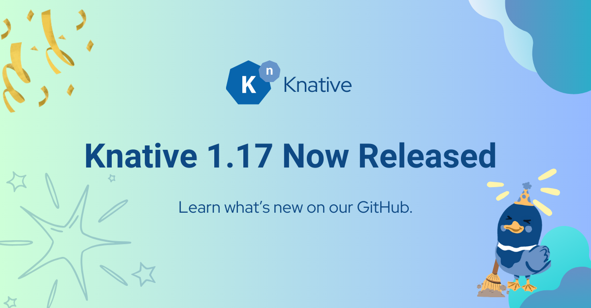

# Announcing Knative 1.17 Release

A new version of Knative is now available across multiple components. Follow the instructions in [Installing Knative](https://knative.dev/docs/install/) to install the components you require.

This release brings a number of smaller improvements to the core Knative Serving and Eventing components, and several improvements to specific plugins.

## Table of Contents
- [Serving](#serving)
- [Eventing](#eventing)
- [kn CLI](#kn-cli)
- [Functions](#functions)
- [Knative Operator](#knative-operator)

### Serving
**Release Notes:** [Knative Serving 1.17](https://github.com/knative/serving/releases/tag/knative-v1.17.0)

#### 💫 New Features & Changes
- Adding support for the "hostPath" volume type. This feature is behind the flag `kubernetes.podspec-volumes-hostpath`. ([#15648](https://github.com/knative/serving/pull/15648), @amarflybot)
- Add default container annotation to Pods created by the reconciler ([#15694](https://github.com/knative/serving/pull/15694), @konstfish)
- Allow explicitly setting `containers.securityContext.privileged` to `false` ([#15643](https://github.com/knative/serving/pull/15643), @KapilSareen)
- Kubernetes Deployments created for a Knative Revision are not configured with revisionHistoryLimit=0 to save storage space. ([#15698](https://github.com/knative/serving/pull/15698), @SaschaSchwarze0)

#### 🐞 Bug Fixes
- A revision is now set to ContainerHealthy=True when it has ready replicas ([#15503](https://github.com/knative/serving/pull/15503), @SaschaSchwarze0)
- Fixes previously supported probe syntax without a leading slash. ([#15681](https://github.com/knative/serving/pull/15681), @skonto)
- Fixes revision timeout defaulting when identical values are present in timeout settings. ([#15617](https://github.com/knative/serving/pull/15617), @skonto)
- Fixes a problem in configuration reconciliation where labeler creates a different order of the route names listed via the annotation `serving.knative.dev/routes` compared to the configuration reconciler. ([#15601](https://github.com/knative/serving/pull/15601), @skonto)

### Eventing
**Release Notes:** [Knative Eventing 1.17](https://github.com/knative/eventing/releases/tag/knative-v1.17.0)

### 🚨 Breaking or Notable Changes
- [Action required] for the callers of the `knative.dev/eventing/pkg/graph` package. The constructor that has previously accepted a `rest.RestConfig` is now accepting clients (Kubernetes clients) directly instead of creating them in the package. ([#8399](https://github.com/knative/eventing/pull/8399), @aliok)
- The event lineage package does not swallow the 400 and 401 errors anymore. Callers should handle those errors themselves. ([#8401](https://github.com/knative/eventing/pull/8401), @aliok)

#### 💫 New Features & Changes
- Add IntegrationSink for supporting generic event sinks based on Apache Camel Kamelets. ([#8304](https://github.com/knative/eventing/pull/8304), @matzew)
- Add IntegrationSource for supporting generic event sources based on Apache Camel Kamelets. ([#8304](https://github.com/knative/eventing/pull/8304), @matzew)
- Added the RequestReply CRD and types (no controller/data plane implementation yet) ([#8337](https://github.com/knative/eventing/pull/8337), @Cali0707)
- Allow configuring (opt-in) IMC async handler ([#8311](https://github.com/knative/eventing/pull/8311), @pierDipi)
- EventType autocreate now creates v1beta3 EventTypes ([#8276](https://github.com/knative/eventing/pull/8276), @Cali0707)
- JobSink: Inject a `K_EXECUTION_MODE` environment variable with value `batch` ([#8346](https://github.com/knative/eventing/pull/8346), @pierDipi)
- JobSink: bind secrets lifecycle to associated jobs lifecycle. Using OwnerReference and k8s garbage collection, now a secret created for a given event is bound to a given Job lifecycle, so that when a job is deleted, the associated secret will be deleted. ([#8331](https://github.com/knative/eventing/pull/8331), @pierDipi)
- MT-Broker: return retriable status code based on the state to leverage retries ([#8366](https://github.com/knative/eventing/pull/8366), @pierDipi)
- Made request reply timeout configurable through config-features ([#8361](https://github.com/knative/eventing/pull/8361), @AlexMamoukarys)
- The minimum Kubernetes version is now 1.30.x ([#8411](https://github.com/knative/eventing/pull/8411), @pierDipi)

#### 🐞 Bug Fixes
- Fix go vulnerability CVE-2024-4533 ([#8417](https://github.com/knative/eventing/pull/8417), @dsimansk)

### Client
**Release Notes:** [Knative Client 1.17](https://github.com/knative/client/releases/tag/knative-v1.17.0)

#### 💫 New Features & Changes
- Add target `--platform` flag to build script ([#1981](https://github.com/knative/client/pull/1981), @dsimansk)
- Refactor PingSourve to v1 API version ([#1991](https://github.com/knative/client/pull/1991), @dsimansk)
- Remove dependency on deprecated client-pkg ([#1990](https://github.com/knative/client/pull/1990), @dsimansk)

#### 🐞 Bug Fixes
- Fix `version` command to dispaly proper version string ([#1978](https://github.com/knative/client/pull/1978), @dsimansk)

### Functions
**Release Notes:** [Knative func 1.17](https://github.com/knative/func/releases/tag/knative-v1.17.0)

#### 💫 New Features & Changes
- Improved caching for local s2i builds ([#2581](https://github.com/knative/func/pull/2581), @matejvasek)
- Update go modules to match Knative versions ([#2652](https://github.com/knative/func/pull/2652), @dsimansk)

#### 🐞 Bug Fixes
- Fix: workspace binding "source" does not match any declared workspace for scaffold task ([#2587](https://github.com/knative/func/pull/2587), @matejvasek)
- Fix: wrong error message when running func commands if the function is not initialized ([#2574](https://github.com/knative/func/pull/2574), @tarunsunny3)

### Operator
**Release Notes:** [Knative Operator 1.17](https://github.com/knative/operator/releases/tag/knative-v1.17.0)

#### 💫 New Features & Changes
- Allow affinity to be specified in the Helm chart ([#1962](https://github.com/knative/operator/pull/1962), @sidprak)

## Thank you, contributors
**Release Leads:**

- [@dprotaso](https://github.com/dprotaso)
- [@dsimansk](https://github.com/dsimansk)
- [@skonto](https://github.com/skonto)

## Learn more
- [Knative docs](https://knative.dev/docs/)
- [Quickstart tutorial](https://knative.dev/docs/getting-started/)
- [Samples](https://knative.dev/docs/samples/)
- [Knative Working Groups](https://knative.dev/community/contributing/working-groups/)
- [Knative User Mailing List](https://groups.google.com/g/knative-users)
- [Knative Development Mailing List](https://groups.google.com/g/knative-dev)
- [Knative on Twitter @KnativeProject](https://twitter.com/KnativeProject)
- [Knative on StackOverflow](https://stackoverflow.com/questions/tagged/knative)
- [#knative on CNCF Slack](https://slack.knative.dev/)
- [Knative on YouTube](https://www.youtube.com/c/KnativeProject)
