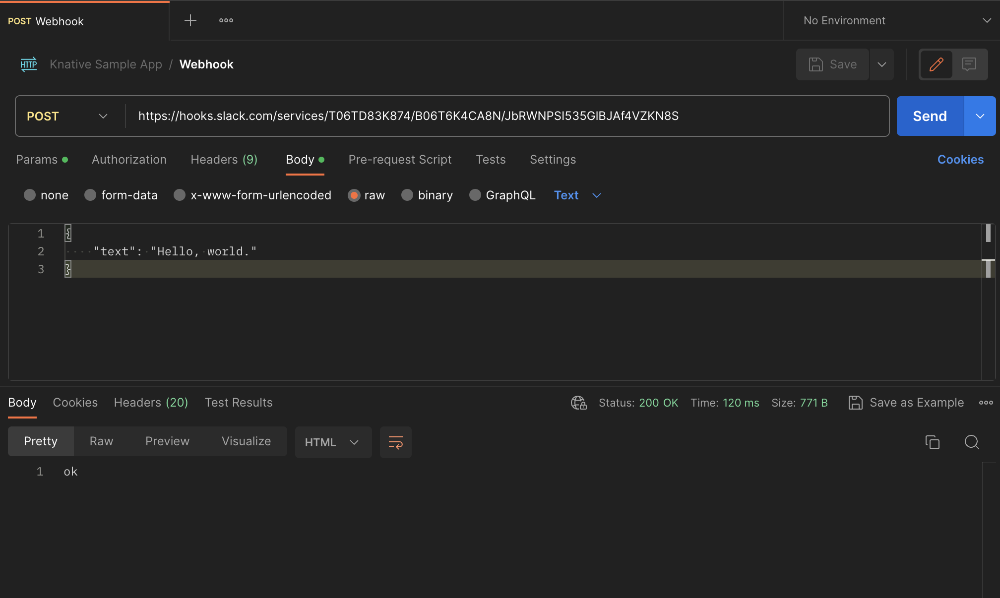

# Notification Service: Creating a Slack Workspace

## Create a Slack Workspace

To create a Slack workspace, follow these steps:

- Visit [https://slack.com/get-started#/createnew](https://slack.com/get-started#/createnew){:target="_blank"}.
- Enter your email address and click Continue, or continue with Apple or Google.
- Check your email for a confirmation code.
- Enter the code on the Slack website.
- Click "Create a Workspace" and follow the prompts.
- For detailed instructions how to create a workspace via the Desktop App, on Android or iOS, refer to [Create a Slack workspace](https://slack.com/help/articles/206845317-Create-a-Slack-workspace){:target="_blank"}.

## Adding Channels to Your Workspace

After creating your Slack workspace, you can add channels by following these steps:

- Click the '+' icon next to 'Channels' on the sidebar of your Slack workspace.
- Choose "Create a channel" and specify the channel name and purpose.
- For enterprise grid organizations, refer to [Slack's help article](https://slack.com/help/articles/115001399587-Add-a-channel-to-multiple-workspaces-in-your-Enterprise-Grid-organization){:target="_blank"} for instructions.

## Setting Up a Webhook for Notifications

To set up a webhook for sending notifications to your Slack workspace:

- Create a [Slack app](https://api.slack.com/apps/new){:target="_blank"}, following the instructions by signing in, adding name and workspace to put the app in.
- After this, you'll be redirected to the setting pages of your new app. Choose **Incoming Webhook** and toggle **Activate Webhook**.
- Scroll down to click the option **Add New Webhook to Workspace**.
  
- The page will give you a link associated with the app you created. This link will be where API requests are sent to send messages to your Slack workspace.
  
- To test if the webhook works as needed, you can try sending an API request to this link to see if the message goes through. I used Postman to test this. Remember that this is an application/json file.
  
- Afterwards, the text channel should have a new message
  
- Go to [Slack's webhook documentation](https://api.slack.com/messaging/webhooks){:target="_blank"} to learn more about setting up webhooks.
