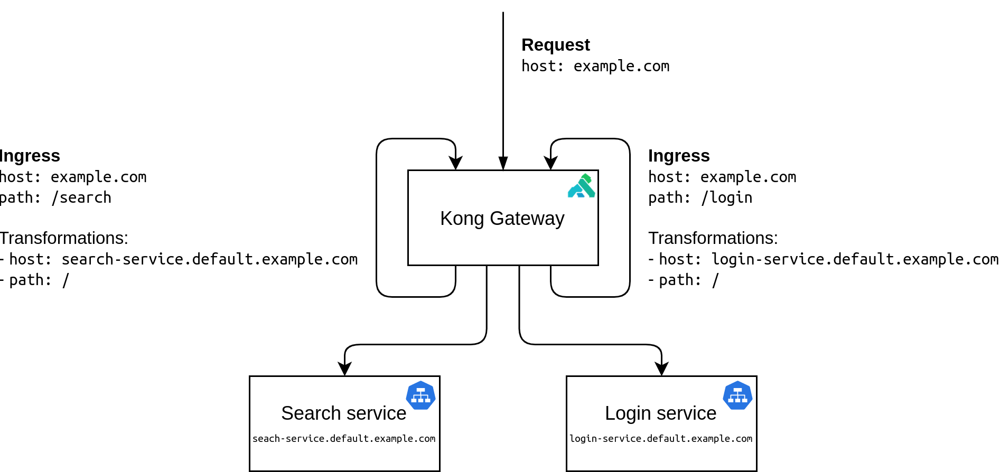

# Routing across multiple Knative services with Kong

This example shows how to map multiple Knative services to different paths under
a single domain name using [Kong Gateway](https://docs.konghq.com/gateway-oss/).
Kong Gateway is a general-purpose reverse proxy and API gateway built on
[Nginx](https://www.nginx.com/), therefore these directions can also be used to
configure routing based on other request data such as headers, or even to map
Knative and external resources under the same domain name.

In this sample, we set up two web services: _Search_ service and _Login_
service, which simply read in an env variable `SERVICE_NAME` and print
`"${SERVICE_NAME} is called"`. We'll then define routing rules via [Kong's
Kubernetes Ingress
Controller](https://docs.konghq.com/kubernetes-ingress-controller/) and [Kong's
request transformer
plugin](https://docs.konghq.com/hub/kong-inc/request-transformer/), so that
`example.com/search` maps to the _Search_ service, and `example.com/login` maps
to the _Login_ service.

## Prerequisites

1.  A Kubernetes cluster with [Knative Serving](https://knative.dev/docs/install/serving/install-serving-with-yaml) and
    [Kong](https://docs.konghq.com/kubernetes-ingress-controller/1.3.x/guides/using-kong-with-knative/)
    installed.
1.  Install
    [Docker](https://docs.docker.com/get-started/#prepare-your-docker-environment).
1.  Acquire a domain name.
    - In this example, we use `example.com`. If you don't have a domain name,
      you can modify your hosts file (on macOS or Linux) to map `example.com` to
      your cluster's ingress IP.
    - If you have configured a custom domain for your Knative installation, we
      will refer to it as `<YOUR_DOMAIN_NAME>` in the rest of this document
1.  Check out the code:

    ```bash
    go get -d github.com/knative/docs/code-samples/serving/kong-routing-go
    ```

## Setup

To check the domain name, run the following command:

```bash
kubectl get cm -n knative-serving config-domain -o yaml
```

Then, check the value for `data`. The domain name should be in the format of
`<YOUR_DOMAIN_NAME>: ""`, if it is available.

Build the application container and publish it to a container registry:

1.  Move into the sample directory:

    ```bash
    cd $GOPATH/src/github.com/knative/docs
    ```

1.  Set your preferred container registry:

    If you use Google Container Registry (GCR), you will need to enable the [GCR
    API](https://console.cloud.google.com/apis/library/containerregistry.googleapis.com)
    in your GCP project.

    ```bash
    export REPO="gcr.io/<YOUR_PROJECT_ID>"
    ```

    If you use Docker Hub as your Docker image registry, replace `<username>`
    with your Docker Hub username and run the following command:

    ```bash
    export REPO="docker.io/<username>"
    ```

1.  Use Docker to build your application container:

    ```bash
    docker build \
      --tag "${REPO}/kong-routing-go" \
      --file=code-samples/serving/kong-routing-go/Dockerfile .
    ```

1.  Push your container to a container registry:

    ```bash
    docker push "${REPO}/kong-routing-go"
    ```

1.  Replace the image reference path with our published image path in the
    configuration file `code-samples/serving/kong-routing-go/sample.yaml` in one
    of the following ways:

    - Manually replace `image:
      github.com/knative/docs/code-samples/serving/kong-routing-go` with `image:
      ${REPO}/kong-routing-go`. If you manually changed the `.yaml` file, you
      must replace `${REPO}` with the correct path on your local machine.
    - Run this command:
      ```bash
      perl -pi -e "s@github.com/knative/docs/code-samples/serving@${REPO}@g" code-samples/serving/kong-routing-go/sample.yaml
      ```

## Deploy the Service

Deploy the Knative Serving sample:

```bash
kubectl apply -f code-samples/serving/kong-routing-go/sample.yaml
```

Inspect the deployed Knative services with:

```bash
kubectl get ksvc
```

You should see 2 Knative services: `search-service` and `login-service`.

## Exploring the Routes

Kong Gateway serves all incoming traffic to services managed by Knative. You can
inspect the corresponding Kubernetes service for the gateway:

```bash
INGRESSGATEWAY=kong-proxy

kubectl get svc $INGRESSGATEWAY -n kong --output yaml
```

### Access the Services

1.  Find the gateway IP and export it as an environment variable:

    ```bash
    export GATEWAY_IP=`kubectl get svc $INGRESSGATEWAY -n kong \
        --output jsonpath="{.status.loadBalancer.ingress[*]['ip']}"`
    ```

1.  Find the _Search_ service URL:

    ```bash
    kubectl get route search-service --output=custom-columns=NAME:.metadata.name,URL:.status.url
    ```

    The output should looks like this:

    ```
    NAME              URL
    search-service    http://search-service.default.example.com
    ```

1.  Make a cURL request to the service:

    ```bash
    curl http://${GATEWAY_IP} --header "Host:search-service.default.example.com"
    ```

    The output should look like this:

    ```
    Search Service is called!
    ```

1.  Similarly, you can also directly access _Login_ service:

    ```bash
    curl http://${GATEWAY_IP} --header "Host:login-service.default.example.com"
    ```

    The output should look like this:

    ```
    Login Service is called!
    ```

## Apply Custom Routing Rule

1.  Apply the custom routing rules defined in the `routing.yaml` file:

    ```bash
    kubectl apply -f code-samples/serving/kong-routing-go/routing.yaml
    ```

    If you have configured a custom domain name for your service, please replace
    all mentions of `example.com` in `routing.yaml` with `<YOUR_DOMAIN_NAME>`.

    In addition, you need to verify how your domain template is defined. By
    default, we use the format of `{{.Name}}.{{.Namespace}}`, like `search-service.default` and `login-service.default`. However, some
    Knative environments may use other formats like `{{.Name}}-{{.Namespace}}`. You can find out the format by
    running the command:

    ```bash
    kubectl get cm config-network -n knative-serving -o yaml
    ```

    Then, look for the value for `domain-template`. If it is `{{.Name}}-{{.Namespace}}.{{.Domain}}`, you need to change
    `search-service.default` into `search-service-default` and
    `login-service.default` into `login-service-default` as well in
    `routing.yaml`.

1.  The `routing.yaml` file will create an ingress that forwards incoming
    requests at `example.com/search` to `search-service.default.example.com` by
    updating the "Host" header to `search-service.default.example.com` and
    stripping the request path. This modified request is then forwarded to the
    Knative ingress (Kong) and routed to the service as usual. Another ingress
    like this is also created for the _Login_ service.

    ```bash
    kubectl get ingress {search,login}-service-ingress -n kong --output yaml
    ```

1.  Send a request to the _Search_ service and the _Login_ service by using
    their corresponding URLs. You should get the same results as directly
    accessing these services.

    - Send a request to the _Search_ service:
      ```bash
      curl http://${GATEWAY_IP}/search --header "Host: example.com"
      ```
      or
      ```bash
      curl http://${GATEWAY_IP}/search --header "Host: <YOUR_DOMAIN_NAME>"
      ```
      for the case using your own domain.

    - Send a request to the _Login_ service:
      ```bash
      curl http://${GATEWAY_IP}/login --header "Host: example.com"
      ```
      or
      ```bash
      curl http://${GATEWAY_IP}/login --header "Host: <YOUR_DOMAIN_NAME>"
      ```
      for the case using your own domain.

## How It Works

When a request with host `example.com` or your own domain name reaches Kong
Gateway, Kong will check if the URL path prefix is `/search` or `/login`. If the
URL matches on of the two rules, then the "Host" header of the request will be
rewritten into the host of the _Search_ service or _Login_ service,
respectively, and the path will be stripped. The modified request will be
forwarded to Kong again. Kong will check the "Host" header and forward the
request to the _Search_ or _Login_ service according to the header value.



## Clean Up

To clean up the sample resources:

```bash
kubectl delete --filename code-samples/serving/kong-routing-go/sample.yaml
kubectl delete --filename code-samples/serving/kong-routing-go/routing.yaml
```
