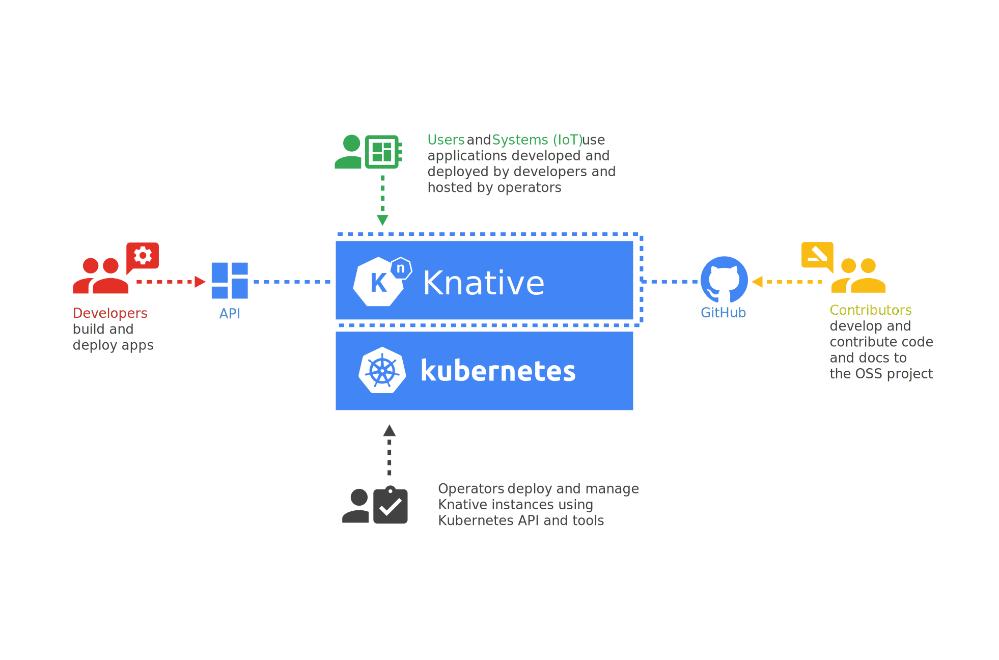

Learn how to join the community of Knative contributors.

## Audience

Knative is designed for different personas:

### Developers

Knative components offer developers Kubernetes-native APIs for deploying
serverless-style functions, applications, and containers to an auto-scaling
runtime.

To join the conversation, head over to the
[Knative users](https://groups.google.com/d/forum/knative-users) Google group.

### Operators

Knative components are intended to be integrated into more polished products
that cloud service providers or in-house teams in large enterprises can then
operate.

Any enterprise or cloud provider can adopt Knative components into their own
systems and pass the benefits along to their customers.

### Contributors

With a clear project scope, lightweight governance model, and clean lines of
separation between pluggable components, the Knative project establishes an
efficient contributor workflow.

Knative is a diverse, open, and inclusive community.
Your own path to becoming a Knative contributor can begin in any of the
following components:

- [serving](https://github.com/knative/serving/issues?q=is%3Aissue+is%3Aopen+sort%3Aupdated-desc+label%3Akind%2Fgood-first-issue)
- [eventing](https://github.com/knative/eventing/issues?q=is%3Aissue+is%3Aopen+sort%3Aupdated-desc+label%3Akind%2Fgood-first-issue)
- [documentation](https://github.com/knative/docs/issues?q=is%3Aissue+is%3Aopen+sort%3Aupdated-desc+label%3Akind%2Fgood-first-issue)

[Bug reports](https://github.com/knative/serving/issues/new) and friction logs
from new developers are especially welcome.

{}
