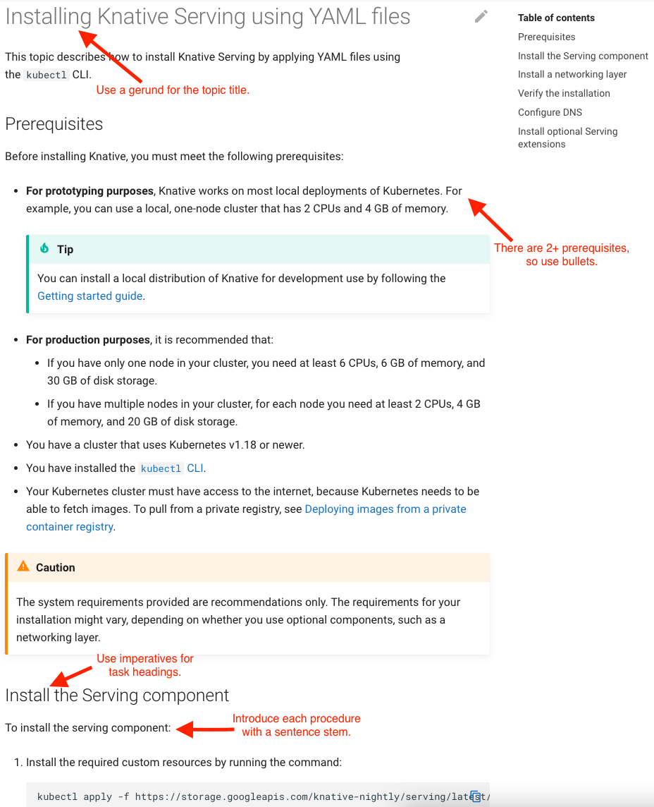

# Procedure template

Use this template when writing procedural (how-to) topics. Procedural topics include detailed steps
to perform a task as well as some context about the task.


## Template

The following template includes the standard sections that should appear in procedural topics, including
a topic sentence, an overview section, and sections for each task within the procedure.
Copy and paste the markdown from the template to use it in your topic.

```
This topic describes...
Write a sentence or two that describes the topic itself, not the subject of the topic.
The goal of the topic sentence is to help readers understand if this topic is for them.
For example, "This topic instructs how to set up a broker."


## Overview

Write a few sentences to describe the subject of the topic, if useful.
For example, if the topic is about configuring a broker, you might provide some useful context about
brokers.

If there are multiple tasks in the procedure and they must be completed in order, create an ordered
list that contains each task in the topic. Use bullets for sub-tasks. Include anchor links to the
headings for each task.

To [task]:

1. [Name of Task 1 (for example, Apply default configuration)](#task-1)
1. [Optional: Name of Task 2](#task-2)

!!! note
    Unless the number of tasks in the procedure is particularly high, do not use numbered lead-ins in the task headings.
    For example, instead of "Task 1: Apply default configuration", use "Apply default configuration".


## Prerequisites

Use one of the following formats for the Prerequisites section.


### Formatting for two or more prerequisites

If there are two or more prerequisites, use the following format.
Include links for more information, if necessary.

Before you [task], you must have/do:

* Prerequisite. See [Link]().
* Prerequisite. See [Link]().

For example:

Before you implement Apache Kafka Broker, you must have:

* Knative Eventing. See [Installing the Eventing component](link-to-that-topic).
* An Apache Kafka cluster. See [Link to Instructions to Download](link-to-that-topic).


### Format for one prerequisite

If there is one prerequisite, use the following format.
Include a link for more information, if necessary.

Before you [task], you must have/do [prerequisite]. See [Link](link).

For example:

Before you create the `helloworld-java` sample app, you must have a Kubernetes cluster with Knative
installed and DNS configured.
See the [installation instructions](../../../install/README.md) if you need to create one.


## Task 1

Write a few sentences to describe the task and provide additional context on the task.

!!! note
    When writing a single-step procedure, write the step in one sentence and make it a bullet.
    The signposting is important given readers are strongly inclined to look for numbered steps and
    bullet points when searching for instructions.
    If possible, expand the procedure to include at least one more step.
    Few procedures truly require a single step.

[Task]:

1. Step 1
1. Step 2


## Optional: Task 2

If the task is optional, put "Optional:" in the heading.
Write a few sentences to describe the task and provide additional context on the task.

[Task]:

1. Step 1
2. Step 2
```

## Procedure content samples

This section provides common content types that appear in procedural topics.
Copy and paste the markdown to use it in your topic.


### Markdown embedded image

The following is an embedded image reference in markdown.

```

```


### Tables

Introduce the table with a sentence. For example, “The following table lists which operations must be
made available to a developer accessing a Knative Route using a minimal profile.”


#### Markdown table template

```
|Header 1|Header 2|
|--------|--------|
|Data1   |Data2   |
|Data3   |Data4   |
```

#### “Fill-in-the-Fields” table

Where the reader must enter many values in, for example, a YAML file, use a table within the
procedure as follows:

    1. Open the YAML file.

        ```yaml
        Key1: Value1
        Key2: Value2
        metadata:
          annotations:
            # case-sensitive
            Key3: Value3
          Key4: Value4
          Key5: Value5
        spec:
          # Configuration specific to this broker.
          config:
            Key6: Value6
        ```

    2. Change the relevant values to your needs, using the following table as a guide.

        | Value   | Value Type     | Description  |
        |---------|----------------|--------------|
        | Value1  | String         | Description  |
        | Value2  | Integer        | Description  |
        | Value3  | String         | Description  |
        | Value4  | String         | Description  |
        | Value5  | Float          | Description  |
        | Value6  | String         | Description  |


### Ordered lists

Write a sentence or two to introduce the content of the list.
For example, “If you want to fix or add content to a past release, you can find the source files in
the following folders.”. Optionally, include bold lead-ins before each list item.

**NOTE:** For the formatting to render correctly, you must add an empty line
between the list and the preceding sentence.

#### Markdown ordered list template

```
Introductory sentence:

1. Item 1
1. Item 2
1. Item 3
```

```
Introductory sentence:

1. **Lead-in description:** Item 1
1. **Lead-in description:** Item 2
1. **Lead-in description:** Item 3
```

#### Nested ordered lists template

For formatting to render correctly, nested items must be indented by four spaces
in relation to their parent item.

```
Introductory sentence:

1. Item 1

    1. Item 1a

1. Item 2
```

### Unordered Lists

Write a sentence or two to introduce the content of the list.
For example, “Your own path to becoming a Knative contributor can begin in any of the following
components:”. Optionally, include bold lead-ins before each list item.

**NOTE:** For the formatting to render correctly, you must add an empty line
between the list and the preceding sentence.

#### Markdown unordered list template

```
Introductory sentence:

* List item
* List item
* List item
```

```
Introductory sentence:

* **Lead-in**: List item
* **Lead-in**: List item
* **Lead-in**: List item
```

#### Nested unordered list template

Nested items must be indented by four spaces in relation to their parent item.

```
Introductory sentence:

* List item

    * List sub-item

* List item
```

### Notes

Ensure the text beneath the **note** is indented as much as **note** is.

```
!!! note
    This is a note.
```

### Warnings

If the note regards an issue that could lead to data loss, the note should be a warning.

```
!!! warning
    This is a warning.
```

### Tabs

Place multiple versions of the same procedure (such as a kn CLI procedure vs a YAML procedure)
within tabs. Indent the tab content four spaces to make the tabs display properly.

    == "tab1 name"

        This is a stem:

        1. This is a step.

          ```
          This is some code.
          ```

        1. This is another step.

    == "tab2 name"

        This is a stem:

        1. This is a step.

          ```
          This is some code.
          ```

        1. This is another step.


### Documenting code and code snippets

For instructions on how to format code and code snippets, see the [Style guide](../style-guide/documenting-code.md).
