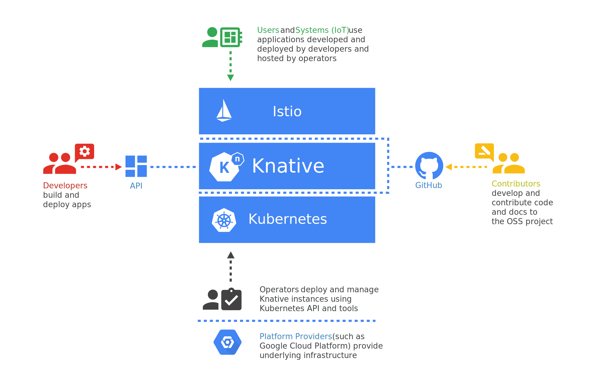

Knative (pronounced kay-nay-tiv) extends Kubernetes to provide a set of
middleware components that are essential to build modern, source-centric, and
container-based applications that can run anywhere: on premises, in the cloud,
or even in a third-party data center.

Each of the components under the Knative project attempt to identify common
patterns and codify the best practices that are shared by successful,
real-world, Kubernetes-based frameworks and applications. Knative components
focus on solving mundane but difficult tasks such as:

- [Deploying a container](install/getting-started-knative-app)
- [Orchestrating source-to-URL workflows on Kubernetes](serving/samples/source-to-url-go/)
- [Routing and managing traffic with blue/green deployment](serving/samples/blue-green-deployment)
- [Scaling automatically and sizing workloads based on demand](serving/samples/autoscale-go)
- [Binding running services to eventing ecosystems](eventing/samples/kubernetes-event-source)

Developers on Knative can use familiar idioms, languages, and frameworks to
deploy functions, applications, or containers workloads.

## Components

The following Knative components are available:

- [Build](https://github.com/knative/build) - Source-to-container build
  orchestration
- [Eventing](https://github.com/knative/eventing) - Management and delivery of
  events
- [Serving](https://github.com/knative/serving) - Request-driven compute that
  can scale to zero

## Audience

Knative is designed for different personas:

### Developers

Knative components offer developers Kubernetes-native APIs for deploying
serverless-style functions, applications, and containers to an auto-scaling
runtime.

To join the conversation, head over to the
[Knative users](https://groups.google.com/d/forum/knative-users) Google group.

### Operators

Knative components are intended to be integrated into more polished products
that cloud service providers or in-house teams in large enterprises can then
operate.

Any enterprise or cloud provider can adopt Knative components into their own
systems and pass the benefits along to their customers.

### Contributors

With a clear project scope, lightweight governance model, and clean lines of
separation between pluggable components, the Knative project establishes an
efficient contributor workflow.

Knative is a diverse, open, and inclusive community. To get involved, see
[CONTRIBUTING.md](../../contributing/CONTRIBUTING/) and join the
[Knative community](../../community/).

Your own path to becoming a Knative contributor can
[begin anywhere](https://github.com/knative/serving/issues?q=is%3Aissue+is%3Aopen+sort%3Aupdated-desc+label%3Akind%2Fgood-first-issue).
[Bug reports](https://github.com/knative/serving/issues/new) and friction logs
from new developers are especially welcome.

## Documentation

Follow the links below to learn more about Knative.

### Getting started

- [Installing Knative](install/)
- [Getting started with app deployment](install/getting-started-knative-app)
- [Getting started with serving](serving)
- [Getting started with builds](build)
- [Getting started with eventing](eventing)

### Configuration and networking

- [Configuring outbound network access](serving/outbound-network-access)
- [Using a custom domain](serving/using-a-custom-domain)
- [Assigning a static IP address for Knative on Google Kubernetes Engine](serving/gke-assigning-static-ip-address)
- [Configuring HTTPS with a custom certificate](serving/using-an-ssl-cert)

### Samples and demos

- [Autoscaling](serving/samples/autoscale-go/)
- [Source-to-URL deployment](serving/samples/source-to-url-go/)
- [Binding running services to eventing ecosystems](eventing/samples/kubernetes-event-source)
- [Telemetry](serving/samples/telemetry-go/)
- [REST API sample](serving/samples/rest-api-go/)
- [All samples for serving](serving/samples/)
- [All samples for eventing](eventing/samples/)

### Logging and metrics

- [Installing logging, metrics and traces](serving/installing-logging-metrics-traces)
- [Accessing logs](serving/accessing-logs)
- [Accessing metrics](serving/accessing-metrics)
- [Accessing traces](serving/accessing-traces)
- [Setting up a logging plugin](serving/setting-up-a-logging-plugin)

### Debugging

- [Debugging application issues](serving/debugging-application-issues)
- [Debugging performance issues](serving/debugging-performance-issues)

---

Except as otherwise noted, the content of this page is licensed under the
[Creative Commons Attribution 4.0 License](https://creativecommons.org/licenses/by/4.0/),
and code samples are licensed under the
[Apache 2.0 License](https://www.apache.org/licenses/LICENSE-2.0).
