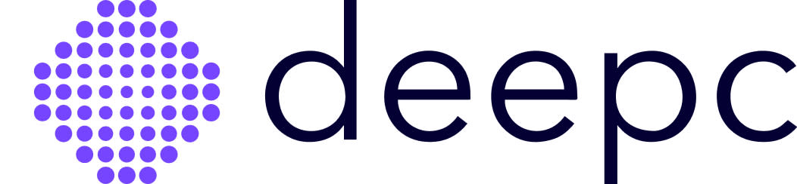
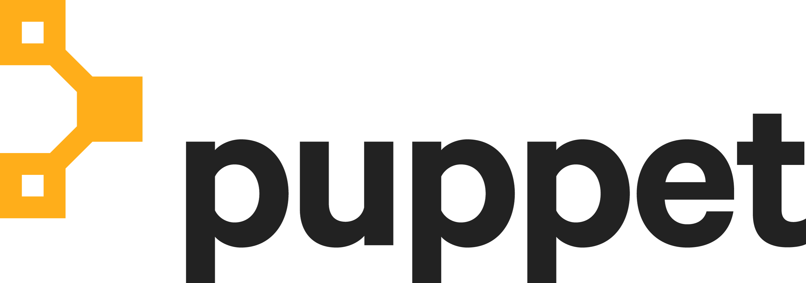

---
hide:
  - toc
---

# Knative Case Studies
<table>
    <tr onclick="window.location='./deepc/';" style="cursor: pointer;">
        <td style="text-align: center; vertical-align: middle;"></td>
        <td style="text-align: center; vertical-align: middle;">AI Startup deepc Connects Researchers to Radiologists with Knative Eventing</td>
    </tr>
    <tr onclick="window.location='./outfit7/';" style="cursor: pointer;">
        <td style="text-align: center; vertical-align: middle;"></td>
        <td style="text-align: center; vertical-align: middle;">Game maker Outfit7 automates high performance ad bidding with Knative Serving</td>
    </tr>
    <tr onclick="window.location='./pnc/';" style="cursor: pointer;">
        <td style="text-align: center; vertical-align: middle;"></td>
        <td style="text-align: center; vertical-align: middle;">PNC Bank automated software supply chain compliance</td>
    </tr>
    <tr onclick="window.location='./puppet/';" style="cursor: pointer;">
        <td style="text-align: center; vertical-align: middle;"></td>
        <td style="text-align: center; vertical-align: middle;">Relay by Puppet Brings Workflows to Everything using Knative</td>
    </tr>
    <tr onclick="window.location='./sva/';" style="cursor: pointer;">
        <td style="text-align: center; vertical-align: middle;"></td>
        <td style="text-align: center; vertical-align: middle;">SVA uses Knative to kickstart cloud native adoption and patterns</td>
    </tr>
</table>
