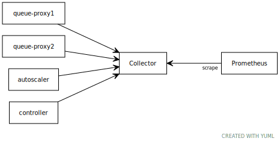

# Collecting Metrics with OpenTelemetry

You can set up the [OpenTelemetry Collector](https://opentelemetry.io/docs/collector/) to receive metrics from Knative components and distribute them to Prometheus.

## About OpenTelemetry

OpenTelemetry is a CNCF observability framework for cloud-native software, which provides a collection of tools, APIs, and SDKs.

You can use OpenTelemetry to instrument, generate, collect, and export telemetry data. This data includes metrics, logs, and traces, that you can analyze to understand the performance and behavior of Knative components.

OpenTelemetry allows you to easily export metrics to multiple monitoring services without needing to rebuild or reconfigure the Knative binaries.

## Understanding the collector

The collector provides a location where various Knative components can push metrics to be retained and collected by a monitoring service.

In the following example, you can configure a single collector instance using a ConfigMap and a Deployment.

!!! tip
    For more complex deployments, you can automate some of these steps by using the [OpenTelemetry Operator](https://github.com/open-telemetry/opentelemetry-operator).



<!-- yuml.me UML rendering of:
[queue-proxy1]->[Collector]
[queue-proxy2]->[Collector]
[autoscaler]->[Collector]
[controller]->[Collector]
[Collector]<-scrape[Prometheus]
-->

## Set up the collector

1. Create a namespace for the collector to run in, by entering the following command:

       ```bash
       kubectl create namespace <namespace>
       ```
    Where

    - `<namespace>` is the name of the namespace that you want to create for the collector.

1. Create a Deployment, Service, and ConfigMap for the collector by entering the following command:

       ```bash
       kubectl apply -f https://raw.githubusercontent.com/knative/docs/master/docs/install/collecting-metrics/collector.yaml
       ```

1. Update the `config-observability` ConfigMaps in the Knative Serving and
   Eventing namespaces, by entering the follow command:

       ```bash
       kubectl patch --namespace knative-serving configmap/config-observability \
         --type merge \
         --patch '{"data":{"metrics.backend-destination":"opencensus","request-metrics-backend-destination":"opencensus","metrics.opencensus-address":"otel-collector.metrics:55678"}}'
       kubectl patch --namespace knative-eventing configmap/config-observability \
         --type merge \
         --patch '{"data":{"metrics.backend-destination":"opencensus","metrics.opencensus-address":"otel-collector.metrics:55678"}}'
       ```

## Verify the collector setup

1. You can check that metrics are being forwarded by loading the Prometheus export port on the collector, by entering the following command:

    ```bash
    kubectl port-forward --namespace metrics deployment/otel-collector 8889
    ```

1. Fetch `http://localhost:8889/metrics` to see the exported metrics.

## About Prometheus

[Prometheus](https://prometheus.io/) is an open-source tool for collecting and
aggregating timeseries metrics. It can be used to scrape the OpenTelemetry collector that you created in the previous step.

## Setting up Prometheus

1. Install the [Prometheus Operator](https://github.com/prometheus-operator/prometheus-operator) by entering the following command:

       ```bash
       kubectl apply -f https://raw.githubusercontent.com/prometheus-operator/prometheus-operator/master/bundle.yaml
       ```

    !!! caution
        The manifest provided installs the Prometheus Operator into the `default` namespace. If you want to install the Operator in a different namespace, you must download the [YAML manifest](https://raw.githubusercontent.com/prometheus-operator/prometheus-operator/master/bundle.yaml) and update any namespace references to your target namespace.

1. Create a `ServiceMonitor` object to track the OpenTelemetry collector.
1. Create a `ServiceAccount` object with the ability to read Kubernetes services and pods, so that Prometheus can track the resource endpoints.
1. Apply the `prometheus.yaml` file to create a Prometheus instance, by entering the following command:

       ```bash
       kubectl apply -f prometheus.yaml
       ```
<!--TODO: Add links / commands for the two steps above?-->

### Make the Prometheus instance public

By default, the Prometheus instance is only exposed on a private service named `prometheus-operated`.

To access the console in your web browser:

1. Enter the command:

    ```bash
    kubectl port-forward --namespace metrics service/prometheus-operated 9090
    ```

1. Access the console in your browser via `http://localhost:9090`.
