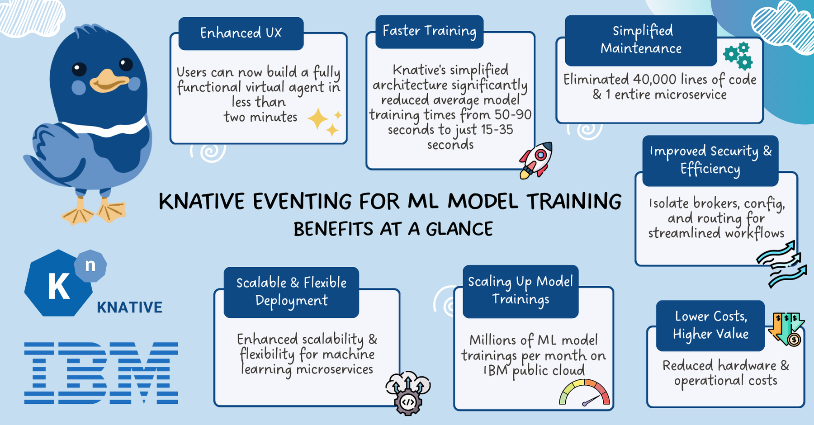

# How IBM Watsonx Assistant uses Knative Eventing to train machine learning models

Read the full case study on the [CNCF website](https://www.cncf.io/case-studies/ibmwatsonxassistant/)!

Thanks to [Firat Bezir](https://www.linkedin.com/in/firatbezir/)
and [Zainab Husain](https://www.linkedin.com/in/zainabhusain1/) for creating the impact visual
summary.
