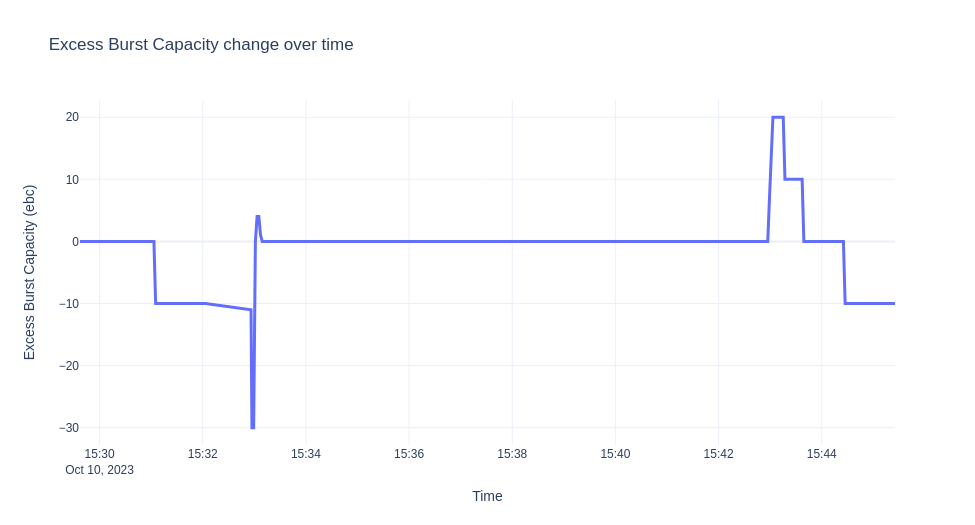
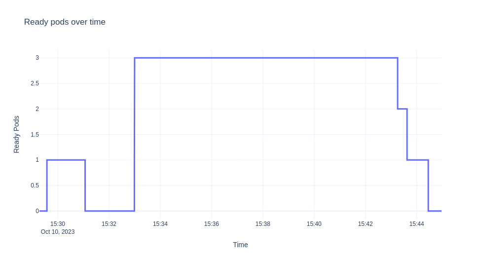
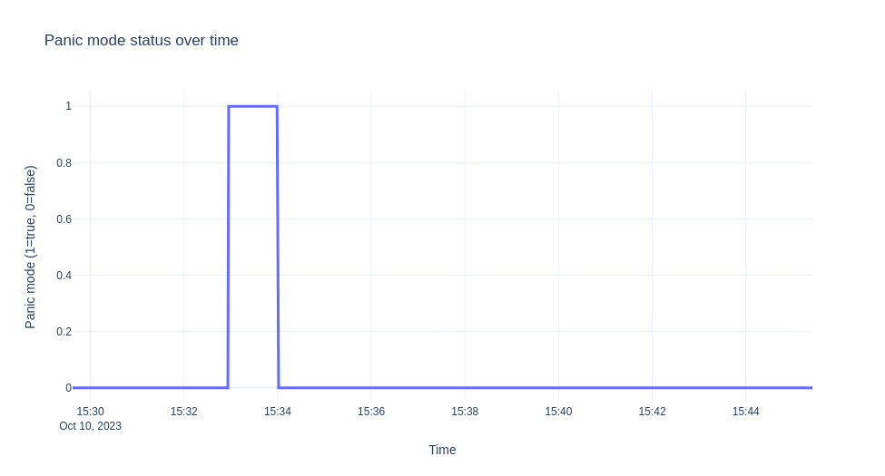
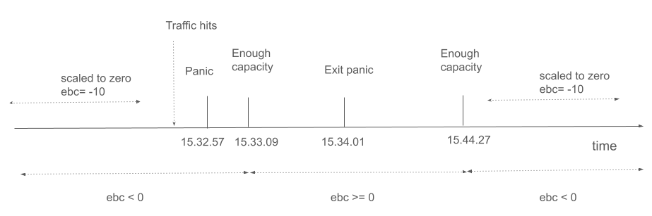

# Demystifying Activator on the data path

**Author: [Stavros Kontopoulos](https://www.linkedin.com/in/stavroskontopoulos), Principal Software Engineer @ RedHat**

_In this blog post, you will learn how to recognize when the activator is on the data path and what triggers that behavior._

A Knative service can operate in two modes when serving traffic: the `proxy` mode and the `serve` mode.
When in proxy mode, the [activator component](https://github.com/knative/serving/tree/main/docs/scaling#activator) is on the data path (which means the incoming requests are routed through the activator), and it will stay on the path until certain conditions are met (more on this later).
If these conditions are met, the activator will be removed from the data path, and the service will transition to serve mode.
For example, when a service scales from/to zero, the activator is added to the data path by default.
This default setting often confuses users, as the activator will not be removed from the path unless enough capacity is available.
This is by intention, as one of the activator's roles is to offer back pressure capabilities (acting as a request buffer) so that a Knative service is not overloaded by incoming traffic.
In addition, a Knative service can define how much traffic it can handle using [annotations](https://knative.dev/docs/serving/autoscaling/autoscaling-targets/#configuring-targets).
The autoscaler component will use this information to calculate the number of pods needed to handle the incoming traffic for a specific Knative service.

## Background

The default pod autoscaler in Knative (KPA) is a sophisticated algorithm that uses metrics from pods to make scaling decisions.
Let's see in detail what happens when a new Knative service is created.

Once the user creates a new service the corresponding Knative reconciler creates a Knative `Configuration` and a Knative `Route` for that service (more on the Knative K8s resources [here](https://github.com/knative/specs/blob/main/specs/serving/overview.md)). 
Then the Configuration reconciler creates a `Revision` resource and the reconciler for the latter will create a `PodAutoscaler` (PA) resource along with the K8s deployment for the service.
The Route reconciler will create the `Ingress` resource that will be picked up by the Knative net-* components responsible for managing traffic locally in the cluster and externally to the cluster.

Now, the creation of the PA triggers the KPA reconciler, which goes through certain steps to set up an autoscaling configuration for the revision:

- creates an internal Decider resource that holds the initial desired scale in `decider.Status.DesiredScale` and
  sets up a pod scaler via the multi-scaler component. The pod scaler calculates a new Scale result every two seconds and makes a decision based on the condition whether the desired scale isn't equal to the pod count. If it is not, it will trigger a new reconciliation for the KPA reconciler. The goal is the KPA to get the latest scale result.

- creates a Metric resource that triggers the metrics collector controller to set up a scraper for the revision pods.

- calls a scale method that decides the number of wanted pods and also updates the K8s raw deployment that corresponds to the revision.

- creates/updates a `ServerlessService` (SKS) that holds info about the operation mode (proxy or serve) and stores the number of activators that should be used in proxy mode.
  The number of activators specified in the SKS depends on the capacity that needs to be covered.

- updates the PA and reports the active and wanted pods in the PA's status

!!! note

    The SKS create/update event above triggers a reconciliation for the SKS from its specific controller that creates the required public and private K8s services so traffic can be routed to the raw K8s deployment.
    Also, in proxy mode, the SKS controller will pick up the number of activators and configure an equal number of endpoints for the revision's [public service](https://github.com/knative/serving/blob/main/docs/scaling/SYSTEM.md#data-flow-examples).
    In combination with the networking setup done by a Knative networking component (driven by the Ingress resource), this is roughly the end-to-end networking setup that needs to happen for a Knative service (ksvc) to be ready to serve traffic.
    The Knative networking component can be any of the following: net-istio, net-kourier, net-contour, and net-gateway-api.

## Capacity and Operation Modes in Practice

As described earlier, the activator will be removed from the path, if enough capacity is available. 
Let's see how this capacity is calculated, but before that, let's introduce two concepts: the `panic` and `stable` windows.
The panic window is the time duration that denotes a lack of capacity to serve the traffic. It happens usually with a sudden burst of traffic.
The condition that describes when to enter the panic mode and start the panic window is:

```
dppc/readyPodsCount >= spec.PanicThreshold
```
where
```
dppc := math.Ceil(observedPanicValue / spec.TargetValue)
```

The `dppc` stands for desired panic pod count and expresses what autoscaler needs to achieve in panic mode.
The target value is the utilization in terms of concurrency that the autoscaler aims for and that is calculated as `0.7*(revision_total)`.
Revision total is the maximum possible value of the scaling metric that is permitted on the pod and defaults to 100 (container concurrency default).
The value 0.7 is the utilization factor for each replica and when that is reached we need to scale out.

!!! note
    
    if the KPA metric Requests Per Second(RPS) is used then the utilization factor is 0.75.

The `observedPanicValue` is the calculated average value seen during the panic window for the concurrency metric.
The panic threshold is configurable (default 2) and expresses the ratio of desired versus available pods.

After we enter panic mode in order to exit we need to have enough capacity for a period that is equal to the stable window size.
That also means that the autoscaler will try to get enough pods ready in order to increase the capacity.
Also, note here that when operating outside the panic mode the autoscaler does not use `dpcc` but a similar quantity:
`dspc := math.Ceil(observedStableValue / spec.TargetValue)` which is based on metrics during the stable period.

To quantify the idea of enough capacity and to deal with bursts of traffic we introduce the notion of the Excess Burst Capacity(EBC) that needs to be nonnegative.
It is defined as:

```
EBC = TotalCapacity - ObservedPanicValue - TargetBurstCapacity.
```

`TotalCapacity` is calculated as `ready_pod_count*revision_total`. The default `TargetBurstCapacity` (TBC) is set to 200.

At this point, we can formally define the condition based on which activator is removed from the path:

!!! important
    If EBC >=0 then we have enough capacity to serve the traffic and the activator will be removed from the path.

Now with the above defaults and given the fact that a request needs to stay around for some time in order for concurrency metrics to show enough load for the counted period, it means you can't get EBC>=0 with a hello-world example where requests finish pretty quickly.
The latter is often confusing for the newcomer as it seems that the Knative service never enters the serve mode. 
In the next example, we will show the lifecycle of a Knative service that also moves to the serve mode and how EBC is calculated in practice.
Also, the example uses a sample app that controls how long a request stays around via a sleep operation, see section [Autoscale Sample App - Go](../../../../../docs/serving/autoscaling/autoscale-go/).
Thus, here is the service for the example that has a target concurrency value of 10 and tbc=10:

```
apiVersion: serving.knative.dev/v1
kind: Service
metadata:
  name: autoscale-go
spec:
  template:
    metadata:
      annotations:
        autoscaling.knative.dev/target: "10"
        autoscaling.knative.dev/target-burst-capacity: "10"
    spec:
      containers:
      - image: ghcr.io/knative/autoscale-go:latest
```

The scenario we are going to demonstrate is to deploy the ksvc, let it scale down to zero, then send traffic for 10 minutes.
We then collect the logs from the autoscaler and visualize the EBC values, ready pods, and panic mode over time.
The graphs are shown next.





!!! note

     The experiment was run on Minikube and the [hey](https://github.com/rakyll/hey) tool was used for generating the traffic.

Let's describe in detail what we see above. Initially when the ksvc is deployed there is no traffic and one pod is created by default for verification reasons.

Until the pod is up we have:
```bash
$ kubectl get sks
NAME                 MODE    ACTIVATORS   SERVICENAME          PRIVATESERVICENAME           READY     REASON
autoscale-go-00001   Proxy   2            autoscale-go-00001   autoscale-go-00001-private   Unknown   NoHealthyBackends
```
When the pod is up we have:

```bash
$ kubectl get po
NAME                                             READY   STATUS    RESTARTS   AGE
autoscale-go-00001-deployment-6cc679b9d6-xgrkf   2/2     Running   0          24s

$ kubectl get sks
NAME                 MODE    ACTIVATORS   SERVICENAME          PRIVATESERVICENAME           READY   REASON
autoscale-go-00001   Serve   2            autoscale-go-00001   autoscale-go-00001-private   True    
```

The reason why we are in Serve mode is that because EBC=0. When you enable debug logs, in the logs you get:

```
  ...
  "timestamp": "2023-10-10T15:29:37.241575214Z",
  "logger": "autoscaler",
  "message": "PodCount=1 Total1PodCapacity=10.000 ObsStableValue=0.000 ObsPanicValue=0.000 TargetBC=10.000 ExcessBC=0.000",
```

EBC = 10 - 0 - 10 = 0

Note that due to the fact that there is no traffic we see no observations during panic or stable windows.

Since there is no traffic we scale back to zero and sks is back to proxy mode:

```bash
$ kubectl get sks
NAME                 MODE    ACTIVATORS   SERVICENAME          PRIVATESERVICENAME           READY     REASON
autoscale-go-00001   Proxy   2            autoscale-go-00001   autoscale-go-00001-private   Unknown   NoHealthyBackends
```

Let's send some traffic.

```bash
hey -z 600s -c 20 -q 1 -host "autoscale-go.default.example.com" "http://192.168.39.43:32718?sleep=1000"
```

Initially when the activator receives a request, it sends stats to the autoscaler which tries to scale from zero based on some initial scale (default 1):

```
  ...
  "timestamp": "2023-10-10T15:32:56.178498172Z",
  "logger": "autoscaler.stats-websocket-server",
  "caller": "statserver/server.go:193",
  "message": "Received stat message: {Key:default/autoscale-go-00001 Stat:{PodName:activator-59dff6d45c-9rdxh AverageConcurrentRequests:1 AverageProxiedConcurrentRequests:0 RequestCount:1 ProxiedRequestCount:0 ProcessUptime:0 Timestamp:0}}",
  "address": ":8080"
```

The autoscaler enters panic mode since we don't have enough capacity, EBC is 10*0 -1 -10 = -11
```
  ...
  "timestamp": "2023-10-10T15:32:56.178920551Z",
  "logger": "autoscaler",
  "caller": "scaling/autoscaler.go:286",
  "message": "PodCount=0 Total1PodCapacity=10.000 ObsStableValue=1.000 ObsPanicValue=1.000 TargetBC=10.000 ExcessBC=-11.000",

  "timestamp": "2023-10-10T15:32:57.24099875Z",
  "logger": "autoscaler",
  "caller": "scaling/autoscaler.go:215",
  "message": "PANICKING."
```
Later on as traffic continues we get proper statistics from activator closer to the rate:

```
   ...
   "timestamp":"2023-10-10T15:32:56.949001622Z",
   "logger":"autoscaler.stats-websocket-server",
   "message":"Received stat message: {Key:default/autoscale-go-00001 Stat:{PodName:activator-59dff6d45c-9rdxh AverageConcurrentRequests:18.873756322609804 AverageProxiedConcurrentRequests:0 RequestCount:19 ProxiedRequestCount:0 ProcessUptime:0 Timestamp:0}}",
   "address":":8080"

   ...
   "timestamp":"2023-10-10T15:32:56.432854252Z",
   "logger":"autoscaler",
   "caller":"kpa/kpa.go:188",
   "message":"Observed pod counts=kpa.podCounts{want:1, ready:0, notReady:1, pending:1, terminating:0}",

   ...
   "timestamp":"2023-10-10T15:32:57.241052566Z",
   "logger":"autoscaler",
   "message":"PodCount=0 Total1PodCapacity=10.000 ObsStableValue=19.874 ObsPanicValue=19.874 TargetBC=10.000 ExcessBC=-30.000",
```
Since the pod is not up yet: EBC = 0*10 - floor(19.874) - 10 = -30

Given the new statistics kpa decides to scale to 3 pods at some point.

```
  "timestamp": "2023-10-10T15:32:57.241421042Z",
  "logger": "autoscaler",
  "message": "Scaling from 1 to 3",
```

But let's see why is this is the case. The log above comes from the multi-scaler which reports a scaled result that contains EBC as reported above and a desired pod count for different windows.

Roughly the final desired number is derived from the dppc we saw earlier (there is more logic that covers corner cases and checking against min/max scale limits).

In this case the target value is 0.7*10=10. So we have for example for the panic window: `dppc=ceil(19.874/7)=3`.

As metrics get stabilized and revision is scaled enough we have:

```
  "timestamp": "2023-10-10T15:33:01.320912032Z",
  "logger": "autoscaler",
  "caller": "kpa/kpa.go:158",
  "message": "SKS should be in Serve mode: want = 3, ebc = 0, #act's = 2 PA Inactive? = false",
  
  ...
  "logger": "autoscaler",
  "caller": "scaling/autoscaler.go:286",
  "message": "PodCount=3 Total1PodCapacity=10.000 ObsStableValue=16.976 ObsPanicValue=15.792 TargetBC=10.000 ExcessBC=4.000",
```

EBC = 3*10 - floor(15.792) - 10 = 4

Then when we reach the required pod count and metrics are stable we get:

```
  "timestamp": "2023-10-10T15:33:59.24118625Z",
  "logger": "autoscaler",
  "message": "PodCount=3 Total1PodCapacity=10.000 ObsStableValue=19.602 ObsPanicValue=19.968 TargetBC=10.000 ExcessBC=0.000",
```
EBC=3*10 - floor(19.968) - 10=0

A few seconds later, one minute after we get in panicking mode we get to stable mode (un-panicking):

```
  "timestamp": "2023-10-10T15:34:01.240916706Z",
  "logger": "autoscaler",
  "message": "Un-panicking.",
  "knative.dev/key": "default/autoscale-go-00001"
```

The `sks` also transitions to `serve` mode as we have enough capacity until traffic stops and deployment is scaled back to zero (the activator is removed from the path).
For the experiment above since we have stable traffic for almost 10 minutes we don't observe any changes as soon as we have enough pods ready.
Note that when traffic goes down and until we adjust the pod count, for some short period of time, we have more `ebc` than we need.

The major events are also shown in the timeline bellow:



### Conclusion

It is often confusing how and why services are stuck in proxy mode or how users can manage the activator when the latter is on the data path.
This is important, especially when you are just getting started with Knative Serving. With the detailed example above, hopefully, we have demystified this fundamental behavior of the Serving data plane.
