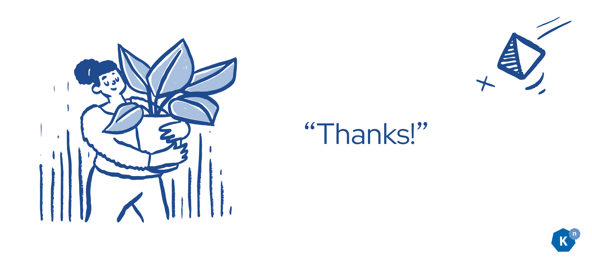

# Getting Started in Open Source with Knative Part 0: Introduction and Overview

**Authors: [Calum Murray](https://www.linkedin.com/in/calum-ra-murray/) Software Engineering Intern @ [Red Hat](https://www.redhat.com/en), and [Leo Li](https://www.linkedin.com/in/haocheng-leo/) Software Engineering Intern @ [Red Hat](https://www.redhat.com/en)**

## What is this blog series?

This blog series is a collection of posts aimed at helping new contributors get started with contributing code to Knative. So, if you are a new contributor
or are considering becoming a contributor, welcome! Also, if you are an existing contributor and interested in learning more about how some of the fundamental
concepts of Knative work, we hope that you will also learn something from these posts.

### Posts in this series

1. [Introduction and Overview (this post!)](/blog/articles/getting-started-blog-p0)
2. [Introduction to Open Source](/blog/articles/getting-started-blog-p1)
3. [Environment setup for Knative](/blog/articles/getting-started-blog-p2)
4. [Making API changes](/blog/articles/getting-started-blog-p3)
5. Controllers (coming soon)
6. Testing (coming soon)
7. Binding with other languages (coming soon)

## Why are we writing this blog series?

In the month prior to writing this blog post, we started our internship at Red Hat and began working on Knative. As such, we have just spent the past month
learning all about how Knative works and making our first contributions to the project. We understand many of the pain points that new contributors face because
we just faced them ourselves. Our hope is that by creating this blog series we can alleviate some of these pain points for the contributors who come after 
us.

With that in mind, let's discuss what pain points we have been experiencing. The first is that Knative is a very large project, with many massive repositories.
As a new contributor it can be very difficult to know how to navigate the codebase to find where to make your change. There is also a lot of "magic" in the 
Knative codebase, where you have to name functions in certain ways and/or there is code generation. This makes it really hard to understand where you should 
make your changes until you have spent enough time making changes to understand it. There are also some pretty intensive test suites which can be very confusing
to new contributors, so even if you manage to make your change, it can still be a struggle to test it.

We want to alleviate these pain points for new contributors like you, so that it is easier for any new developers to join us. We want to speed up your learning
process, reduce your confusion, and make sure that you enjoy getting started contributing to this amazing community and project. So, let's dive in and get
started!

## How can you get the most from this blog series?

At this point, you're probably wondering (at least we hope you are) how you can get the most out of these blogs? Well, it's actually pretty simple! All you 
have to do is actively learn as you follow along, ask the community questions when you get stuck, and stick with it! Let's talk a little bit more about how you
can do this.

### Active Learning

Whenever there are code samples, actually type it out yourself and try to understand each line of code. We know that copying and pasting would be faster, and
definitely easier in the short term, but you might miss out on some of the understanding that way.

If, as you are reading the articles you ever have any questions, look it up online! There are a plethora of amazing resources out there to help you and being
able to find them is a valuable skill in and of itself. We will do our best to provide you with a curated list of articles to go and learn more with each post
in this series to provide a starting point to your research, although we encourage you to read beyond what we provide.

### Ask the community

But what if you get stuck or have a question, you've researched it yourself, and you still don't have an answer? Well, that's when the Knative community comes
into the picture. The community is very supportive and happy to help, you if you have any questions: don't be shy, ask on slack! Depending on the topic, you
may want to ask it via Slack in [knative-eventing](https://cloud-native.slack.com/archives/C04LMU33V1S), [knative-functions](https://cloud-native.slack.com/archives/C04LKEZUXEE),
[knative-serving](https://cloud-native.slack.com/archives/C04LMU0AX60), or some other `knative-*` channel. If you are unsure, you can always default to asking
in [knative-contributors](https://cloud-native.slack.com/archives/C04LN0620E8). There are also weekly or bi-weekly working group meetings, so if for example you
have a question about a topic related to eventing you could also attend the eventing working group meeting and ask it there. We all want you to succeed, so don't
hesitate to reach out.

### Stick with it

Finally, please stick with it! We know that it can be intimidating to get started, and it can be discouraging to try and make a change and get stuck. But if
you stick with us through this blog series, we promise you that it will be easier. Also, once you get started working on your first issues/PRs, feel free
to refer back to these blog posts to remember how things work. Your patience and persistence will pay off in the long run, so don't give up!

We hope that you've enjoyed this first post, and we look forward to seeing you in [the next one](/blog/articles/getting-started-blog-p1)!

