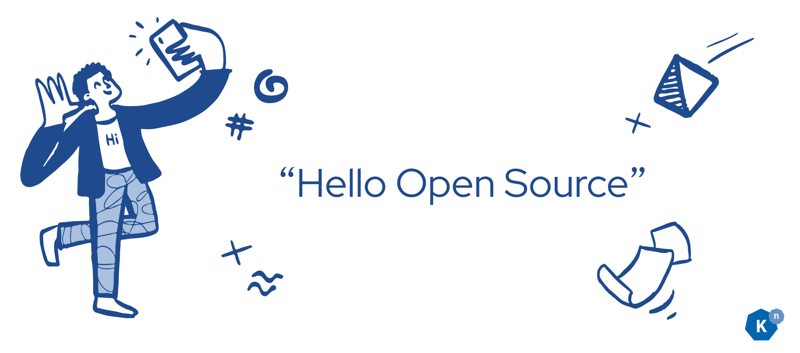
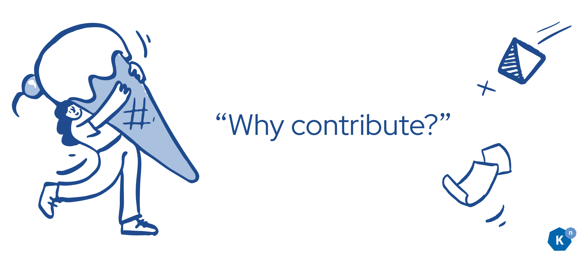
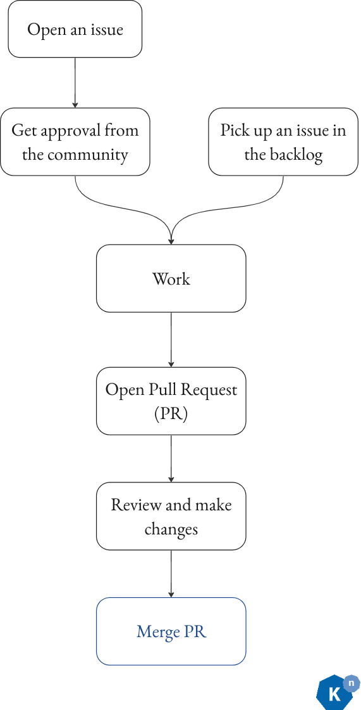
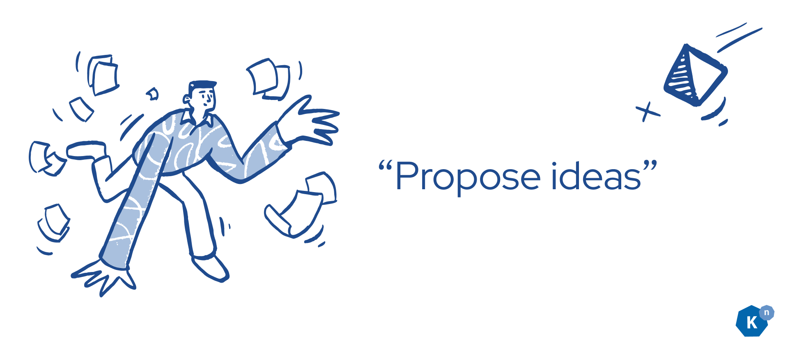
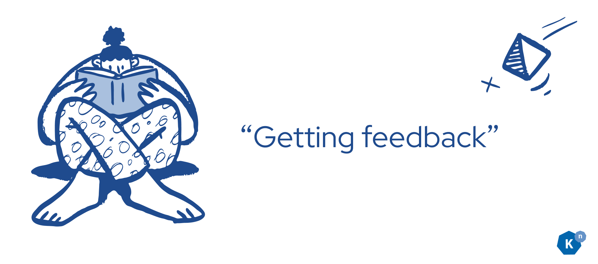

# Getting Started in Open Source with Knative Part 1: Introduction to Open Source

**Authors: [Calum Murray](https://www.linkedin.com/in/calum-ra-murray/) Software Engineering Intern @ [Red Hat](https://www.redhat.com/en), and [Leo Li](https://www.linkedin.com/in/haocheng-leo/) Software Engineering Intern @ [Red Hat](https://www.redhat.com/en)**

Welcome back to this introductory blog series! In this article we are going to be providing an introduction to open source: what it is, why you should care, and how you can participate.

If you already have lots of open source experience, you should be able to completely skip this post and jump to the next one, where we will go over how to set up your development
environment for working on __Knative__. But if you're new to open source, interested in learning more, or want a refresher, then we look forward to discussing the what, why, and 
how of open source with you!

## What is Open Source?

So, what is open source? The key concept behind open source is that all of the source code is publicly available: anyone can read it, change it, improve on it, and distribute it 
as they see fit [[1]](https://www.redhat.com/en/topics/open-source/what-is-open-source){:target="_blank"}.

Similar to open source software, there is also free software (free in terms of the user's freedoms - think free speech, not free food), which differs primarily from open source by having a less commercial focus [[2]](https://writefreesoftware.org/learn){:target="_blank"}.
While there are important philosophical differences between open source software and free software, we are not going to go into those in this article as this is intended as a more
practical guide.

There is a lot of popular open source software which you have probably used before, regardless of if you knew it was open source. For example, chances are most of your browser is 
open source! If you are on Firefox, then your browser ([minus the DRM code](https://www.theguardian.com/technology/2014/may/14/firefox-closed-source-drm-video-browser-cory-doctorow){:target="_blank"})
is open source. If you are on a Chromium-based browser like Google Chrome or Microsoft Edge then as the name implies your browser is based on the open source project Chromium, but
there are proprietary components to your browser as well.

Additionally, even if you don't personally use the Linux operating system, you probably have at least heard of the popular OS. If you're on MacOS, then your operating system is related
to the free and open source project FreeBSD, even though there is a lot of proprietary (non open-source) software build into MacOS as well. Hence, there is a good chance that your
operating system has at least some open source code in it!

Furthermore, since you are reading this article, you have probably programmed before. This likely means that you have used open source software, as most programming languages such
as Python, Go, Rust, and Java are open source.

Open source is a large, popular, and innovative way to build and share software. Importantly, it is also a process which __you__ can participate in!

## Why should you participate?

Now that we know what open source software is, as well as some examples of open source software you have probably encountered, why should you participate in open source? Well, there
are lots of different scenarios in which you may want to participate, so let's discuss a few of them and the benefits you will obtain by participating.

A very common scenario is that you are the user of some software and would like to add a feature or fix a bug which is bothering you. Thus, you might contribute code to the project by 
incorporating that new feature or by fixing the bug, or you might contribute to the project simply by requesting the feature or reporting the bug (that's right - reporting a bug is
a way to contribute!). Another common scenario is that you believe in a software project and want to become a part of the community and work to improve the software in a more long term
fashion. Yet another common situation is that you want to further your career by working with other talented people in a public way, networking and building your skills.

Regardless of why you choose to participate in an open source project or community, many of the benefits will be the same. Primarily, they will be:

1. The opportunity to be part of a vibrant community actively working together to make the best software possible.

2. The opportunity to get to know different technologies and be on the bleeding edge of innovation. Many innovations start in open source projects.

3. You will be able to see your contributions impacting a large project with potentially very many users (for example one of the Knative repos has around 10M downloads), which can
feel very rewarding.

With that being said, the fact that you are reading this means that you likely already want to participate in an open source project (hopefully **Knative**!), so let's dive into some
of the different ways you can contribute.

## Types of Contributions

There are many types of contributions which you can make to open source projects, and generally speaking, contributions are always welcome! Keep in mind that __different communities
will have different guidelines__ on how to contribute and on what, if any, types of contributions they are accepting. Be sure to check with the community first before starting to 
contribute to make sure that you are positively contributing, and not wasting your time and theirs. For a specific project, you can generally find contribution guidelines either in
the `README.md` file or in the `CONTRIBUTING.md` file in the repository, although it may also be somewhere on the project's website. When in doubt, ask the community! With that caveat,
let's discuss some common ways to contribute.

### Opening Issues

One great way to contribute is to open "issues" on GitHub/GitLab, or whatever other platform the community is using. For example, Knative uses GitHub to keep track of issues. An
issue could be a bug, or a feature request. So, if there is a bug that is bothering you with some open source project you use, open an issue and report it! Similarly, if there
is a feature you would like, go ahead and open an issue asking for it. There is no guarantee that the maintainers of the project will fix the issue for you, but they will generally
try to. This is a great way to contribute to a project as it allows the community to better understand what users like you are thinking about the project, and what problems you
have with it.

### Triage Issues

Many open source projects get tons of issues, creating a lot of work for the maintainers to triage them. But the good thing is that this is a great way for you to start participating
in a project, and the maintainers will really appreciate all that you do.

To help triage issues, you can try to reproduce bug reports to ensure that it really is a bug and to help verify whatever fix is made for the bug. You can also read through feature
requests and proposals, ask questions, and give your feedback on what you like/don't like about them, and whether or not you think the feature would improve the project.

### Write Documentation

Another fantastic way to contribute to an open source project is to contribute to the documentation of the project. For example, if you want to contribute to Knative, you could
try to contribute a fix to one of the [open documentation issues](https://github.com/knative/docs/issues){:target="_blank"}. As software evolves, the documentation tends to lag behind. In order
to make the project more usable, it is crucial that people actively contribute to keeping the documentation up to date. This is also a very good way to learn more about how
the project works at a technical level, as explaining concepts can improve your understanding of them.

### Attend Community Events and Meetings

Medium and large projects (and some small ones too) tend to have meetings and community events. This is a great opportunity to meet more people in the community and share ideas.
For example, in Knative there are weekly and bi-weekly meetings of the [working groups](https://github.com/knative/community/blob/main/working-groups/WORKING-GROUPS.md){:target="_blank"}, where 
various contributors will discuss what they are working on and will request feedback on features they are proposing. We would love to have you at these meetings, and they are
a great way to find out more about what is going on in the community and what direction the project is taking. To find out more about when the working group meetings take place
in Knative, check out the [community calendar](https://calendar.google.com/calendar/u/0/embed?src=knative.team_9q83bg07qs5b9rrslp5jor4l6s@group.calendar.google.com&ctz=America/Los_Angeles){:target="_blank"}.

### Reviewing PRs

A more technically-oriented contribution is reviewing [pull requests (PRs)](https://docs.github.com/en/pull-requests/collaborating-with-pull-requests/proposing-changes-to-your-work-with-pull-requests/about-pull-requests){:target="_blank"}. 
These are also called Merge Requests (MRs) on GitLab. If you haven't heard of a PR before, it is essentially a way for someone to request that a set of changes
be made to the code for a project. As such, it is essential that these are carefully reviewed to make sure that they are correct and work properly. While it is likely difficult
to fully understand everything that is going on in the code if you haven't contributed much code to the project, you can still leave comments and questions about the code
in an attempt to improve the overall quality of the changes. However, if you really don't understand the code, it is likely more useful for you to verify that the changes work
If everything works, leave a comment to that effect. Otherwise, leave a comment for the author of the PR letting them know that they need to fix something.

### Contributing Code

Probably the most technically-oriented type of contribution you can make is to contribute code. This is what the rest of this blog post and the rest of the blog series will be focusing
on as there is a lot that goes into it! But don't be intimidated, give it some time and you will soon feel comfortable making code changes and contributing them back to the community.

## How to Contribute Code

Before we dive into the details of how to contribute code, let's spend a bit of time looking at the big picture of how the process works. The first step of contributing is having
something you want to change. Maybe it's a new feature, maybe it's a bug fix, or maybe it's something else. Once you know what you want to work on, it is a good idea to check in
with the community/project maintainers to ensure that they want you to make the change you want to make. If they are on board with your proposed change, it's time to start coding!
You'll make a new branch on your fork of the repo, and write some code. When your code works, you will open a PR with your changes. After you address these changes and have your PR
approved by the reviewer, your work will be done and your code will be merged! (Merging means combing your changes with the main code for the codebase, so that everyone is able to 
use them). This flow can be seen in the diagram below.

Now, if you are not familiar with this process, it probably feels very confusing. So, to demystify it further, let's break down each part and discuss them in detail.

### Propose a Change

The first step of the process is to propose a change. This step is very important if you want to add a new feature as the community may not actually want the feature you want, or
may want it to work differently than how you envision it. In both cases, if you start coding before proposing the feature, you will be wasting a lot of your time. Different communities
have different practices for proposing and accepting changes, so try and find out how your community of interest does this (this can often be found in the `CONTRIBUTING.md`, by looking
around the repo and seeing what others are doing, or on the project website). For example, in Knative, we propose new features and report bugs with GitHub Issues, and we approve them
by adding the `triage/accepted` label. Additionally, for large features we require a feature proposal document to be created alongside the issue. However, for very small features like 
fixing the developer documentation, you can also skip this step and just make your change by creating a PR. 

Before you propose a new feature or report a bug, try __searching__ whatever platform the community uses to keep track of issues for a duplicate. If one already exists and has been 
approved, great! You can move on and get started on the next step of the process. If it exists and __hasn't been approved__ yet, you can always __comment on the issue__ to indicate 
that you have also experienced this bug, or want this feature. Finally, if it __does not exist__ yet then you should __propose__ the feature or __report__ the bug. Try and include
as much detail in your proposal/bug report as possible, it will speed up the process. Regardless of whether your change was proposed before or you proposed it yourself, once it has
been approved you can move on to the next step!

### Coding your changes!

Once your proposal has been accepted, it's time to code your change. In this section we aren't going to spend much time on discussing how to write the code itself (but if you're
interested in how to write Knative code be sure to check out the rest of this blog series!). Instead, we will be focusing on all the processes you should follow around writing code.
Generally, the process you will go through to code your changes is:

1. Fork the project and clone it locally

2. Make a branch

3. Commit

4. Create a PR

5. Request reviews

6. Make changes upon request

7. PR is approved.

8. Your code gets merged!

Firstly, you should generally be working on a fork of the project. You can think of a fork as your own personal copy of the repository, where you have the permissions to make whatever
changes you want. This is different from the main project repository, where you likely don't have permissions to change the code. To create a fork on GitHub, you can follow 
[these instructions](https://docs.github.com/en/get-started/quickstart/fork-a-repo){:target="_blank"}. To create a fork on GitLab, you can follow [these instructions](https://docs.gitlab.com/ee/user/project/repository/forking_workflow.html){:target="_blank"}.
Some important terminology here is that the repository you forked is generally referred to as the "upstream" repository, and we will be referring to your fork as the "origin",
as that is normally how your local git remotes will be set up. To easily clone a forked repository and set up the git remotes properly, you can use the `git clonefork` command
which can be installed from [here](https://github.com/cali0707/git-utils){:target="_blank"}. Alternatively, you can use the [git clone](https://git-scm.com/docs/git-clone){:target="_blank"} and 
[git remote](https://git-scm.com/docs/git-remote){:target="_blank"} commands yourself to configure your local copy of your fork. Note that you will want to add a remote to the upstream repository,
and that this remote is commonly named "upstream". This remote will be used to keep your fork in sync with any changes to the upstream project. To clone it manually yourself, 
you can run `git clone <url_of_your_fork>`. Next, to add the upstream remote manually, you can
`cd` into the newly cloned repository, and run `git remote add upstream <url_of_upstream_repo> && git remote set-url --push upstream no_push`. To get the url of your fork and 
of the upstream remote, navigate to each repo and look for the button saying "Code" on GitHub, or "Clone" on GitLab. If you click on this button, you should see a URL which you can
copy.

Once you have a fork, have cloned it locally, and have set up your remotes properly you should checkout a new branch to make your changes on. If you are unsure what a branch is and 
how to make one, we recommend reading [this article](https://git-scm.com/book/en/v2/Git-Branching-Branches-in-a-Nutshell){:target="_blank"}. We also recommend that you make your changes on a separate
branch from your main branch, and keep your main branch in sync with the upstream main branch. This way, you will easily be able to get any future changes into your fork, as they will
share the same history on the main branch. To sync changes your fork's main branch with the upstream main branch, you can use the 
[GitHub UI](https://docs.github.com/en/pull-requests/collaborating-with-pull-requests/working-with-forks/syncing-a-fork){:target="_blank"}/[GitLab UI](https://docs.gitlab.com/ee/user/project/repository/forking_workflow.html#from-the-ui){:target="_blank"}
and pull those changes to your local main branch, or you can run `git checkout main && git pull upstream main` (assuming you haven't made any commits to your main branch), and 
then pushing your main branch to your origin. To easily sync your local main and your origin's main with upstream main, you can use the `git sync` command which can be installed
[here](https://github.com/cali0707/git-utils){:target="_blank"}.

Now that you are working on a branch in your own fork, it's time to code your changes! One important thing to keep in mind as you write your code is the code style of the project.
If all variables are in camelCase, then your variable names should be in camelCase. If there is a common way to handle errors, then you should handle your errors in the same way.
If there are lots of unit tests, then you should unit test your changes (more on tests in Knative in a later blog post). If someone else would be unable to distinguish the code
you wrote from the rest of the code, then you have done a good job following the project's style. A useful list of things to keep in mind as you work on your code is:

1. Variable, function, and class naming conventions

2. Code formatting/automatic formatter the project is using

3. Is there a commit message convention?

4. File naming conventions

5. Package import rules

6. Package installment policy (check if there is one or if you can install whatever you need)

When you feel like you have made some progress or that your changes are done, be sure to make a commit. For more information on making commits, read [here](https://www.atlassian.com/git/tutorials/saving-changes/git-commit){:target="_blank"}.
Git commits need a message, so try and provide something as this will make it easier for others to understand your changes. For example, "worked on bug fix" __would not be a great
commit message__, while "added try catch block to prevent crash" would be better as it __describes what you changed__.

### Making a PR/MR

There are two scenarios where you would likely want to open a PR/MR. The first is that you feel your changes are complete and 
are ready to be merged into the project. The second is that you have made some progress but are not finished yet, and would like to get some early feedback or assistance on your changes.
In both cases, you will want to go through the basic flow to create a PR or MR. If you are using GitHub and are unsure of how to do this, you can follow the instructions
[here](https://docs.github.com/en/pull-requests/collaborating-with-pull-requests/proposing-changes-to-your-work-with-pull-requests/creating-a-pull-request-from-a-fork){:target="_blank"}.
If you are using GitLab and are unsure of how to do this, you can follow the instructions [here](https://docs.gitlab.com/ee/user/project/repository/forking_workflow.html#merge-changes-back-upstream){:target="_blank"}.

When creating your PR/MR it is important to provide the context of why you are making the changes, what you changes, and how people can test your changes. It is good practice to 
include a link to the issue the PR/MR is addressing, and to give a brief description of the changes you made. Additionally, your PR/MR should have a brief and descriptive title
to make it clearer to reviewers what it contains.

If your changes are incomplete, you will want to mark the PR/MR as a __draft__, to indicate to reviewers that your work is not complete. Instructions for GitHub are 
[here](https://docs.github.com/en/pull-requests/collaborating-with-pull-requests/proposing-changes-to-your-work-with-pull-requests/changing-the-stage-of-a-pull-request#converting-a-pull-request-to-a-draft){:target="_blank"}, 
and instructions for GitLab are [here](https://docs.gitlab.com/ee/user/project/merge_requests/drafts.html#mark-merge-requests-as-drafts){:target="_blank"}. You may also
want to title your PR/MR as "[WIP]: \<descriptive title>" (with WIP for "work in progress"). If you have any questions about your changes, this draft PR/MR is a great place 
to ask them as whoever answers
you will have the context of everything you have done so far. Once you feel your changes are complete/ready, you can convert your PR/MR from its draft status to being ready.
Instructions for GitHub can be found [here](https://docs.github.com/en/pull-requests/collaborating-with-pull-requests/proposing-changes-to-your-work-with-pull-requests/changing-the-stage-of-a-pull-request#marking-a-pull-request-as-ready-for-review){:target="_blank"},
and instructions for GitLab can be found [here](https://docs.gitlab.com/ee/user/project/merge_requests/drafts.html#mark-merge-requests-as-ready){:target="_blank"}.

Whether your PR/MR is a draft or is ready for review, don't think that you are finished yet! There is a very good chance that you will spend a fair amount of time in the review
process, improving your code until it is ready to be merged into the project. Let's discuss this review process next.

### PR/MR Review Process

Once you have a PR/MR which is ready, one or more people will review your changes and provide feedback. If this is one of your first contributions to the project, expect lots of
feedback! It is then up to you to make changes to address those comments. To do this, all you need to do is make a new commit on the same branch you made the PR from, and push the
changes to your origin.

While it may be frustrating when reviewers suggest changes to what you perceive as functioning code, remember their goal is to enhance the overall quality of the project. 
They provide their feedback with the intention of helping you refine and advance your coding skills! Instead of taking the feedback personally, try and look at it as a learning
opportunity. If there's a reason preventing you from implementing a requested change, don't hesitate to respond to their comment explaining why you believe the 
suggestion may not be feasible. However, unless such circumstances exist, make an effort to incorporate all their proposed changes. This approach will foster a productive 
and collaborative code review process.

Another thing to keep in mind is that many projects will have __automated tests__, which will run on your PR to make sure that everything is still working after your changes.
If the tests seem to be failing, try and investigate why and see if you can fix them. If you are unsure why a test is failing, you can always leave a commend on your PR indicating
that and ask for help. Sometimes, tests can behave inconsistently, and are therefore called "flaky" tests. If you are confident that the test failures are not a result of your
code changes, it may be worth re-running the tests.

Once the tests on your PR have passed and your changes have been approved by the reviewer(s), your code will be merged into the main branch upstream by a project maintainer.
Congratulations! You just contributed code to the project and made an impact on the project and community!

## Conclusion
As you've hopefully seen in this article, there are many great open source projects out there to contribute to. So, if you're interested, pick one and contribute! There are 
loads of ways to contribute, and your contributions will be appreciated so long as the project is taking contributions. While contributing (especially contributing code) can be 
a complex process, it is also a very rewarding experience. So, we hope to see you out there contributing to open source and Knative! 

We hope that you enjoyed this article and feel more comfortable contributing to open source now. We also hope to see you in [the next one](/blog/articles/getting-started-blog-p2)!

P.S. If you are interested in getting started contributing to open source, be sure to checkout out [this CNCF article](https://contribute.cncf.io/contributors/getting-started/){:target="_blank"},
as it provides a great starting point.

