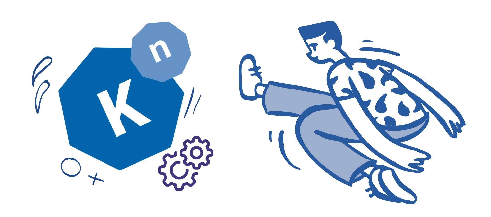
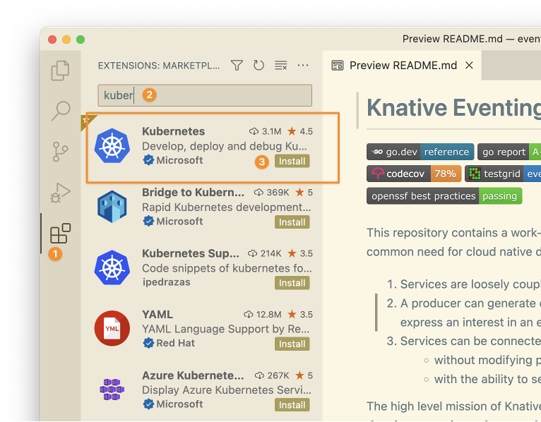
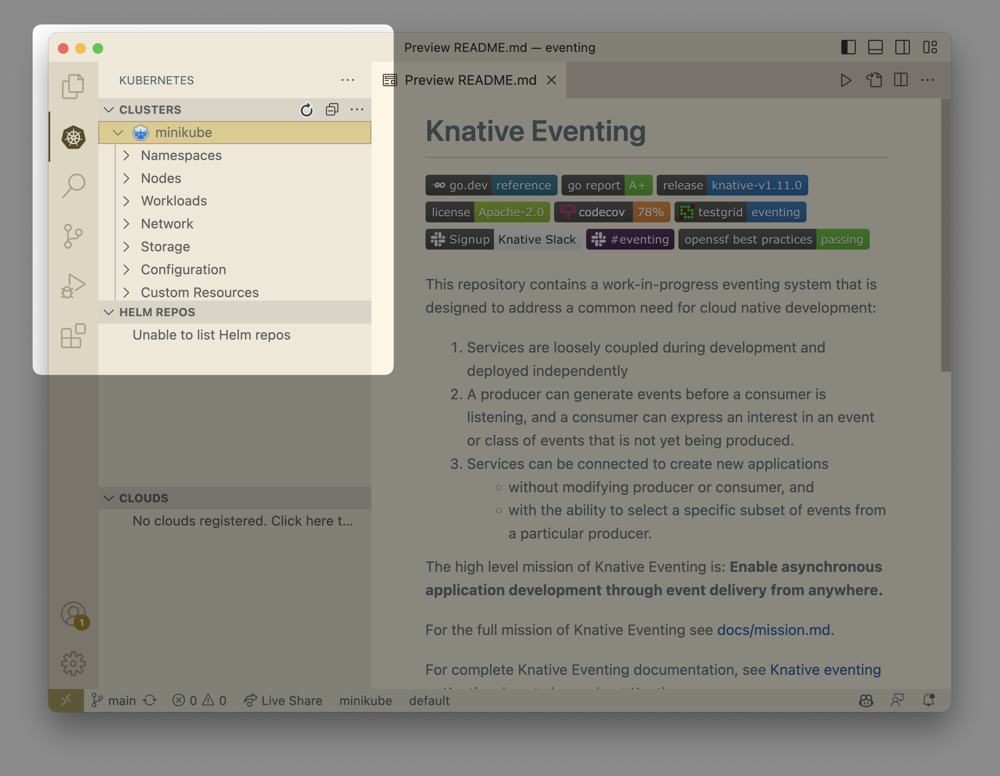
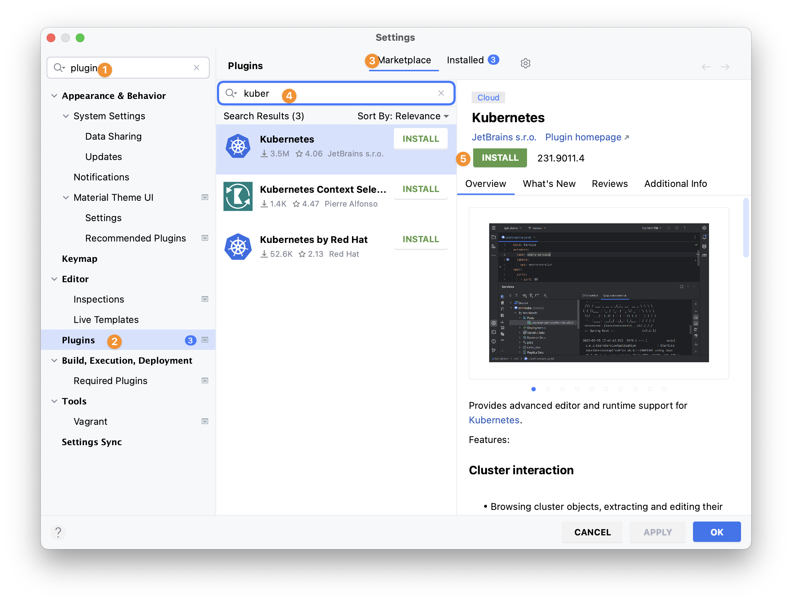
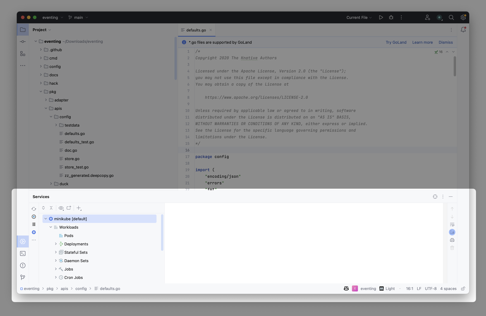
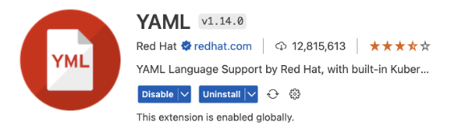
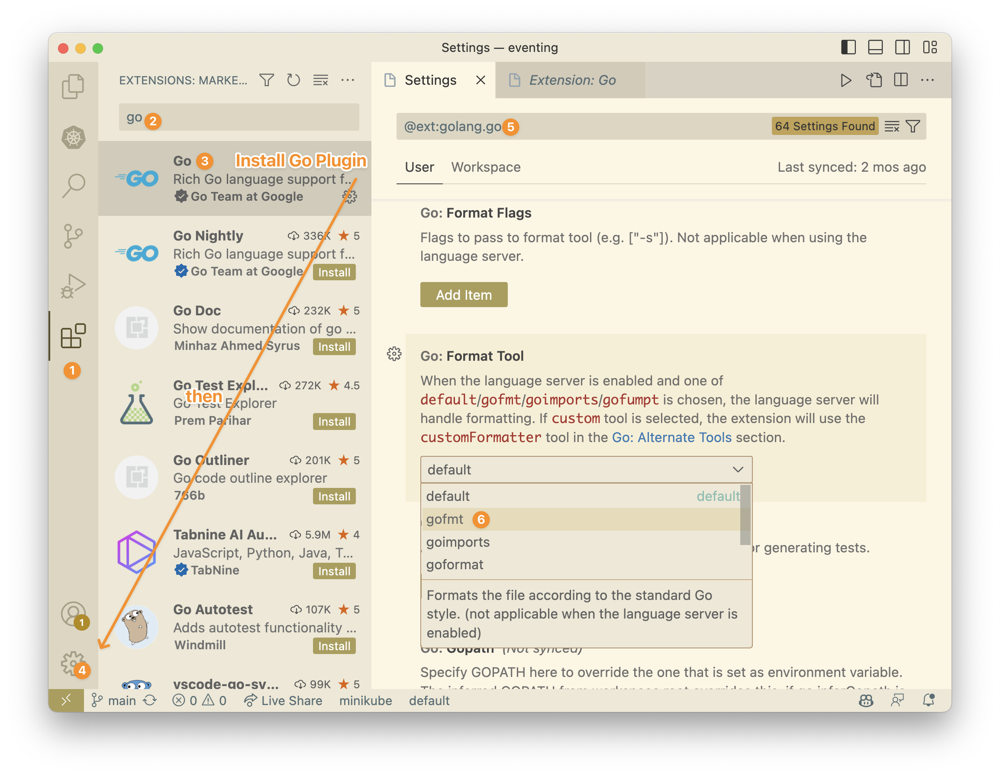
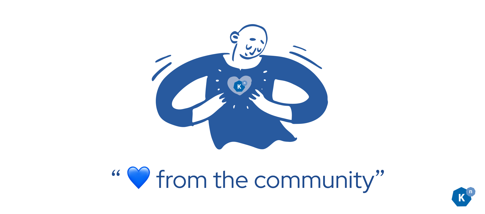
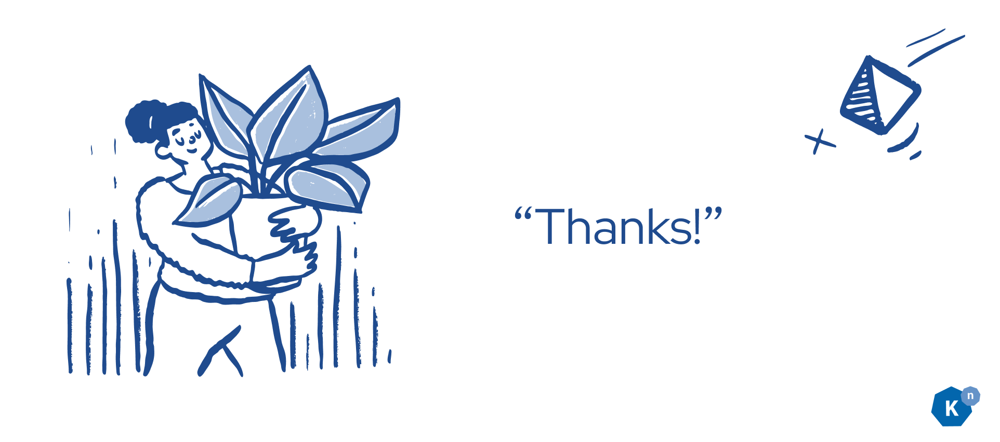

# Getting Started in Open Source with Knative Part 2: Environment Setup 

**Authors: [Calum Murray](https://www.linkedin.com/in/calum-ra-murray/) Software Engineering Intern @ [Red Hat](https://www.redhat.com/en), and [Leo Li](https://www.linkedin.com/in/haocheng-leo/) Software Engineering Intern @ [Red Hat](https://www.redhat.com/en)**

Hi, and welcome back to this introductory blog series! If you want an overview of the full blog series, please check out the [first article](/blog/articles/getting-started-blog-p0){:target="_blank"}.
In this article we will be discussing __how to set up your development environment__ for Knative.
A development environment is a place where you can modify and examine code without affecting the currently released code. For setting up your Knative development
environment, we are splitting the setup of the development environment into the local setup (i.e. things you set up on your own computer), and the external setup 
(i.e. things you set up that aren't on your own computer).

*G. Cresnar Premium, Gear Icon, https://www.flaticon.com/free-icon/settings_563541?term=gear&page=1&position=4&origin=search&related_id=563541*

## Local Setup

The first place you are going to be working on your code is locally on your computer, so let's also begin with your local setup. If you feel like **you already
know how to set up your local system, or that you already have a working local setup**, jump to the external setup section first - there is no need to read these
two sections in order!

### Prerequisites

There are a few prerequisites which you will need to have on your computer before you can start adding the rest of the components that your local environment needs.
before continuing with your local setup, please ensure that you __have all of these prerequisites installed__ on your computer.

#### Bash

Your computer will need to have Bash installed in order to run all of the installation/setup scripts the other local components will need. Chances are that your computer will have Bash (Linux and Mac should, however you may want to upgrade your Bash version on Mac). If you are on **Windows**, you will need to [install Bash](https://itsfoss.com/install-bash-on-windows/){:target="_blank"}.
Alternatively, Windows users can use [WSL](https://learn.microsoft.com/en-us/windows/wsl/install){:target="_blank"}.

#### Git

In order to clone repositories or download various tools, you will need to have Git on your computer. If you want to check if Git is installed, run `git --version`
in a terminal window. To install Git, follow the [instructions here](https://git-scm.com/book/en/v2/Getting-Started-Installing-Git){:target="_blank"}.

SSH keys are utilized to authenticate your identity with third-party code repository service providers, such as GitHub or GitLab, without the need for you to enter
your credentials every time you execute a pull, push, or clone command. This key-based authentication method enhances both security and convenience. If you haven't
set up your SSH key for GitHub or GitLab yet, we __highly recommend__ that you do so. To set up your SSH key with GitHub, follow
[these instructions](https://docs.github.com/en/authentication/connecting-to-github-with-ssh/adding-a-new-ssh-key-to-your-github-account){:target="_blank"}, and to set up your
SSH key with GitLab, follow [these instructions](https://docs.gitlab.com/ee/user/ssh.html#add-an-ssh-key-to-your-gitlab-account){:target="_blank"}.

#### Golang (Go)

Most parts of Knative are developed in the Go programming language, so you will need to have this language installed to be able to develop Knative. There are some
parts of Knative written in other languages, but we will be discussing those in __Post 7__ of this blog series (coming soon!). To install the go programming language,
follow the instructions [in this article](https://go.dev/doc/install){:target="_blank"}.

#### An Editor 

In order to edit the code, you will need to have an editor installed. One of the most popular and free editor used these days is [VSCode](https://code.visualstudio.com/){:target="_blank"}, 
although the paid JetBrains editors such as [GoLand](https://www.jetbrains.com/go/){:target="_blank"}, and [IntelliJ IDEA](https://www.jetbrains.com/idea/){:target="_blank"} are also very powerful. It's worth noting that there is a community edition of IntelliJ IDEA which is free and quite powerful.
Some also prefer to go old school and use [Vim](https://www.vim.org/){:target="_blank"}, [Emacs](https://www.gnu.org/software/emacs/){:target="_blank"}, or the newer fork of Vim, [Neovim](https://neovim.io/){:target="_blank"}
(which actually has all the language support that VSCode has if you are willing to configure it yourself). While your choise of editor doesn't impact the quality of code
which you will produce, it is crucial that you choose one and become comfortable working in it as much of your productivity will come from your ability to use your editor.

### Running Knative Locally

Now that you have verified that you have all the prerequisites, let's get started setting up your local system to run Knative!

#### Docker/Podman Setup

Knative runs in a Kubernetes Cluster, which means it runs as a set of Containers. You can think of a container as something which both contains your code and all the
dependencies needed to run your code, as well as something which runs your code with those packaged dependencies. The two most common tools used to build and run containers
are __Docker__ and __Podman__, so we will discuss setting both up here. However, do note that we think that __using Docker__ is easier, and as such, we recommend that you use Docker.

##### Option 1: Setting up Docker

The first step to setting up Docker is to install it. The easiest way to do this is to [install Docker Desktop](https://docs.docker.com/get-docker/){:target="_blank"}, although you only need
the Docker Engine for Knative so you can also just [install the Docker Engine](https://docs.docker.com/engine/install/){:target="_blank"}. Note: if you plan on just installing the Docker Engine,
make sure that you complete the [post-install steps](https://docs.docker.com/engine/install/linux-postinstall/){:target="_blank"}.

Once you have Docker installed on your system, you will need to log in to a container registry. There are multiple different registries which you can use.
Firstly, you can use a Docker account to sign into Docker hub. To create one, you can [sign up for one here](https://hub.docker.com/signup){:target="_blank"}. Once you have an account, 
all you need to do is type `docker login`, and follow the instructions. Another option is to use a registry on [Quay.io](https://quay.io/){:target="_blank"}, or to 
[create a local registry](https://www.allisonthackston.com/articles/local-docker-registry.html){:target="_blank"}. If you use either of these approaches, or some other registry,
all you need to do is login with `docker login <registry_url>`, and then follow the prompts in your terminal. For example, to login to a local registry, all you need to do is run 
`docker login localhost:8080`, and to log in to [Quay](https://quay.io){:target="_blank"} all you need to do is run `docker login quay.io`.

##### Option 2: Setting up Podman

If you want to use Podman instead of Docker, you're in luck - they have compatible CLIs! So, all you have to do is [install Podman](https://podman.io/docs/installation){:target="_blank"}
and then alias docker to podman. To create this alias you must:

- If you are using bash, add `alias docker=podman` to your `.bashrc` file.

- If you are using zsh, add `alias docker=podman` to your `.zshrc` file.

- If you are using fish, add `alias docker=podman` to your `config.fish` file.

Similar to setting up Docker, once you have Podman installed onto your system aand your alias set up, you will need to have a docker registry account and run `docker login`.
However, you will need to provide which registry to log in to. So, you will need to run `docker login docker.io`. Once again, note that we recommend using Docker instead of
Podman.

#### Minikube/KinD Setup

Now that you have a container engine on your computer in either Docker or Podman, you are ready to create a local Kubernetes cluster to run Knative in! There are a lot
of different local Kubernetes versions available, but we have found that minikube tends to work the best. To install minikube, follow the steps in their 
[getting started guide](https://minikube.sigs.k8s.io/docs/start/){:target="_blank"} up until you get to the "Deploy applications" section.

When debugging or reproducing bugs, you will often want to make a new minikube cluster. To do this, you can delete your current cluster with `minikube delete`, and then
run `minikube start` to create a new cluster. Note: `minikube start` will resume/update an existing cluster should one exist, so __be sure to delete your cluster first__
if you are trying to get a new one. Minikube will select a preferred driver automatically according to your operating system and system configuration. If you want to specify
which driver minikube should use, you can use the `--driver` argument when starting the cluster. For example, if you want to use the Docker driver, you can run 
`minikube start --driver=docker`.

Another good option to use to run Kubernetes locally is [KinD](https://kind.sigs.k8s.io/){:target="_blank"}. If you want to install KinD, just follow the installation instructions on the home page
of their website. To create a cluster in KinD, all you have to do is run `kind create cluster`. Similarly, to delete a cluster, you can run `kind delete cluster`. Note: KinD
runs on top of Docker/Podman, so you will need to have one of those installed and running on your system for KinD to work.

#### ko, kubectl

Once you have a Kubernetes cluster up by running minikube, you will probably want to interact with it! The way you interact with your cluster is through the Command Line
Interface ([CLI](https://minikube.sigs.k8s.io/docs/start/){:target="_blank"}) tool kubectl. You can install kubectl [here](https://kubernetes.io/docs/tasks/tools/){:target="_blank"}, or you can add an alias
to the installation of kubectl which comes with minkube by adding `alias kubectl="minikube kubectl --"` to the appropriate config file for your shell. 

You can use kubectl to get all resources of a certain type by running `kubectl get <resource_type> -A`. For example, if you wanted to get all pods in your cluster you
could run `kubectl get pods -A`. To filter by namespace, you can use the `-n` flag. As an example, you could get all of the pods in the `knative-eventing` namespace
by running `kubectl get pods -n knative-eventing`. If you want to apply resources to your cluster (for example to install Knative, create a Service, or maybe a Broker), 
you can run `kubectl apply -f <filename_or_directory>`. If you want to recursively apply all the contents of a directory and it's subdirectories, you can use the `-R` flag:
`kubectl apply -Rf <directory>`.

When you are developing Knative, you will often use kubectl but you will also use a similar tool called `ko`. `ko` is a package that handles building all of the Go container
images based off the config files being applied, and is what we use to build Knative. To install ko, [follow these steps](https://ko.build/install/){:target="_blank"}.

If you want to build Knative (or for that matter something else written in go with appropriate yaml config files), all you need to do is run
`ko apply -f <filename_or_directory>`, and it will build everything referenced in the file or directory and apply those objects into your cluster. Note that the filename 
or directory you are providing to ko is not a go filename but rather a yaml file - in this sense ko operates the same way as kubectl by applying yaml files. Additionally,
it can be used recursively in __exactly the same way__ as kubectl with the `-R` flag.

#### Installing Knative

Knative runs as a set of Custom Resources, Controllers, and Pods in your cluster. That is to say, it is Kubernetes native. As such, all you need to run Knative locally is
a local Kubernetes cluster (e.g. minikube or KinD), and a way to build the source code into containers and apply the kubernetes resources using those images (ko). After running
`minikube start` to ensure that you have a cluster running, you can install Knative into your cluster by following the steps laid out in [the documentation](https://knative.dev/docs/install/){:target="_blank"},
by using ko to apply the `config` directory of one of the repos, or you can use the fabulous set of scripts in the git repo [kn-box](https://github.com/matzew/kn-box){:target="_blank"}. 
Regardless of the approach you choose, all you need to do is apply some yaml files or run some bash scripts and you will have Knative running locally!

Now if you want to run Knative code that you have edited locally, you will have to use ko. As mentioned earlier, you can often do this by running `ko apply -Rf config/` 
to build and apply the whole project. However, you should always consult the `CONTRIBUTING.md` and `DEVELOPMENT.md` files in the repo you are working, as they will have
more specific instructions.

At this point, you should have a local Kubernetes cluster which has Knative running on it. This is a great opportunity to learn more about how to use Knative!
You can very easily follow along with the Tutorials on the [Knative](https://knative.dev/docs/getting-started/){:target="_blank"} 
and [KubeByExample](https://kubebyexample.com/learning-paths/developing-knative-kubernetes/knative-overview){:target="_blank"} websites in your own cluster.

#### Running Tests

Knative has a lot of tests, running from unit/build tests to integration tests. Generally speaking, unit/build tests are verifiying that the code compiles and that
each individual component is working correctly. On the other hand, the integration tests are verifying that the different components all work together. In general,
we __do not recommend__ running the integration tests locally as they take a lot of time and resources to run. Instead, we suggest that you push your changes directly
to GitHub once your unit tests are passing, and run the integration tests there.

Each repository will have instructions on how to run their unit tests, so look in the `CONTRIBUTING.md` and `DEVELOPMENT.md` files to find out how those work. If
they are go tests (chances are that they are), then you can also run the tests on subdirectories or specific files by running `go test -v -race -count=1 <filename_or_directory>`.
This is very handy as it reduces the feedback loop as you make changes.

### Setting up your Editor

Now that you have a local environment where you can run and test your changes to Knative, let's set up an environment where you can make your changes! To start, let's install
some useful plugins for your IDE.

#### Useful IDE plugins

The plugins we are sharing here are the ones which we have found most helpful, although there are many more useful plugins out there to explore! If you find anything which
you think might interest other commmunity members, share it with us [on Slack](https://cloud-native.slack.com/archives/C04LN0620E8){:target="_blank"}.

##### Kubernetes

The Kubernetes Plugin is a comprehensive tool for developers, providing a complete solution for building and troubleshooting applications in a Kubernetes environment.
You can easily interact and navigate Kubernetes resources such as logs for Pods with an intuitive explorer tree of Kubernetes resources.

If you are using VSCode, here is the way to set up your [Kubernetes plugin](https://marketplace.visualstudio.com/items?itemName=ms-kubernetes-tools.vscode-kubernetes-tools&ssr=false#overview){:target="_blank"}:

After you have installed the plugin, you will be able to see it here:

If you are using Jetbrains IDEs, here is how to install the [Kubernetes plugin](https://plugins.jetbrains.com/plugin/10485-kubernetes){:target="_blank"}:

After you have installed the plugin, you will be able to see it here:

##### Language Support

VSCode is a versatile text editor, designed to support many programming languages though the Language Server Protocol. By contrast, JetBrains IDEs are language-specific -
GoLand for Go, Pycharm for Python, and so on. In order for VSCode to provide IDE-style support for a language, you will have to install the required plugin(s) for the language.
Similarly in JetBrains, you can often install a plugin for a particular language even if the IDE doesn't support that language, although sometimes you will have to pay for the
appropriate license. Since VSCode needs plugins to have IDE features for a language, we recommend that you install the following plugins:

##### Code Formatting

Go code has a built in style guide and formatter, so naturally you can configure this with both VSCode and JetBrains IDEs. For VSCode, you can follow the following steps:

For JetBrains, you can find more details on how to set it up in [this article](https://www.jetbrains.com/help/idea/integration-with-go-tools.html#gofmt){:target="_blank"}.

## External Setup

Now that you have a working local setup, there are some external things which you will have to set up as well. These can be grouped by how to join the community, how to claim
issues, and how to make a PR.

### Community

As you are working on your code, you will probably want to discuss your changes with others and ask questions. Knative uses __Slack__ as the primary means of communication,
along with __a mailing list__. You can find links to these communication channels [here](https://knative.dev/docs/community/#communication-channels){:target="_blank"}. There are also weekly 
and bi-weekly working group meetings which you can join on zoom where we have discussions. To find the community calendar (which includes the working group meeting times and
links), as well as the link to the slack and the mailing list, you can [read this article](https://knative.dev/docs/community/#meetings){:target="_blank"}.

### Claiming an Issue

Now that you have a working local set up, you probably want to tackle an issue! To claim an issue, go to the "Issues" tab of the repository you want to contribute to,
and then look through the issues. If this is one of your first contributions to that repository, you should look for issues labelled "good-first-issue". To filter the
issues by a particular label, follow the steps [outlined here](https://docs.github.com/en/github-ae@latest/issues/tracking-your-work-with-issues/filtering-and-searching-issues-and-pull-requests#filtering-issues-and-pull-requests-by-labels){:target="_blank"}.
If there are no issues labelled "good-first-issue", you can always ask on [Slack](https://cloud-native.slack.com/archives/C04LN0620E8){:target="_blank"} if there are any good issues for you.
Additionally, if the issues labelled "good-first-issue" are all taken then you can try commenting on them and seeing if they are still actively being worked on. Once
you have an issue you would like to work on, comment "/assign" and the Prow bot will assign it to you (more on Prow in a bit!).

### Pull Requests

Eventually, once you have coded your changes, you will get to a point where you want to open a Pull Request. If you are unfamiliar with this process, check out the previous
article in this series! Once you open a PR on a Knative repository, you will likely notice that there are bots commenting on it!

If this is your first ever PR to Knative, there will be a CLA bot which makes sure that you have signed the CLA. The other bots are there to make managing PRs and tests easier.
As you only need to deal with the CLA once, we will cover that first, and then talk about how to interact with Prow to manage your PR.

#### CLA

So what is a CLA? CLA stands for Contributor License Agreement, and the title does a pretty good job explaining what it is. It is an agreement where you, the contributor, 
grant various rights to the Cloud Native Computing Foundation (CNCF). We are not going to go into the details of what is in that agreement here, as you should __read it yourself before signing__.
However, we will tell you an example of why communities like Knative require one. Sometimes, projects wish to relicense the code contained in them. As you hold the copyright to the
code you contribute, this means that the project will have to ask every person who every contributed if they wish to relicense, which can be difficult.
You can find the CNCF CLA [here](https://github.com/cncf/cla){:target="_blank"}.

Knative __required signing the CLA before we can accept your contributions__, so you will have to sign it before your PR can be merged. Note that there are two versions of the CLA:
a corporate version and an individual version. If you are contributing as an employee of a company, you will need to sign the corporate version, otherwise the individual version
is the right version for you! To sign the CLA, all you need to do is follow the steps in the comment posted to your PR by the CLA bot.

#### Interacting with Prow

[Prow](https://docs.prow.k8s.io/docs/){:target="_blank"} is a Kubernetes-based bot which is used in many CNCF projects to manage issues and PRs. In Knative, it is generally Prow which merges the PRs - not other contributors or maintainers!
To determine which PRs to merge, Prow is given sets of criteria. These are generally a set of labels, as well as that the required tests all passed. In Knative, the two labels
which your PR needs in order to get merged are "lgtm" and "approved". Anyone can add the "lgtm" by commenting "/lgtm" on a PR, but only approvers can add the "approved" label.
Additionally, if you have a "do-not-merge/hold" (which you add by commenting "/hold"), or a "do-not-merge/work-in-progess" label (which you get by making a draft PR), the bot
will not merge your changes. 

In order for tests to pass on your PR, they will need to be run. By default, however, they are not run! In order for them to run, a member of the knative or knative-sandbox organization
will have to comment "/ok-to-test" (which organization they must be a member of depends on which organization your repository is under). The "/ok-to-test" command adds the "ok-to-test"
label to your PR. Generally speaking, whoever reviews your PR will do this, but if they haven't you can always ask them why they haven't. If you join the knative or knative-sandbox
organizations, you will no longer need to have the ok-to-test label applied to your PRs - prow will run the tests automatically! So, once you have made a few contributions,
join the organizations!

As we mentioned earlier, to assign an issue to yourself, you can comment "/assign", and Prow will assign the issue to you. You can also do "/assign @username", and Prow will assign
the issue to the user with username. You can also use the command with PRs to assign them to specific users.

Something you will probably want to do on your PR is re run the tests if one of them fails and you think it was a flake. To do this, just comment "/retest" to rerun all tests,
or "/retest-required" to just retest all failed and required tests.

One last command that you will find useful is "/cc @username", which requests a review from the user with username. You can put multiple users into this command and request
more than one review in one go (e.g. "/cc @user1 @user2").

To find out about all the commands that Knative's instance of Prow supports, as well as their usage, you can read the [Prow commands page](https://prow.knative.dev/command-help){:target="_blank"}.

