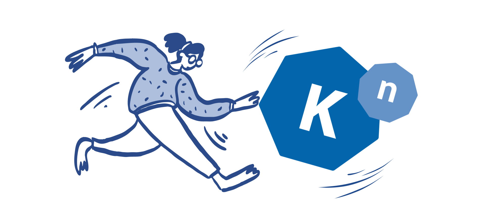
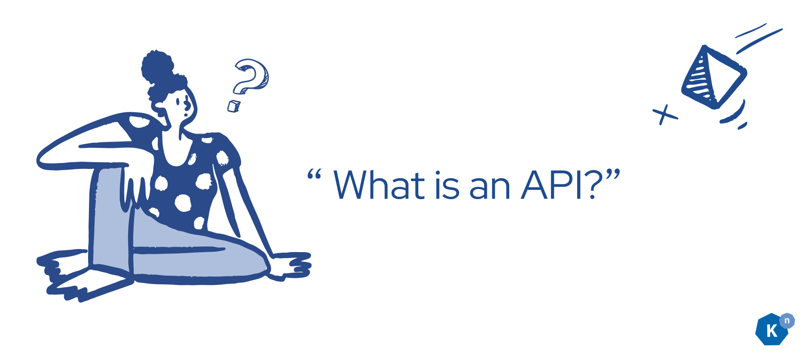
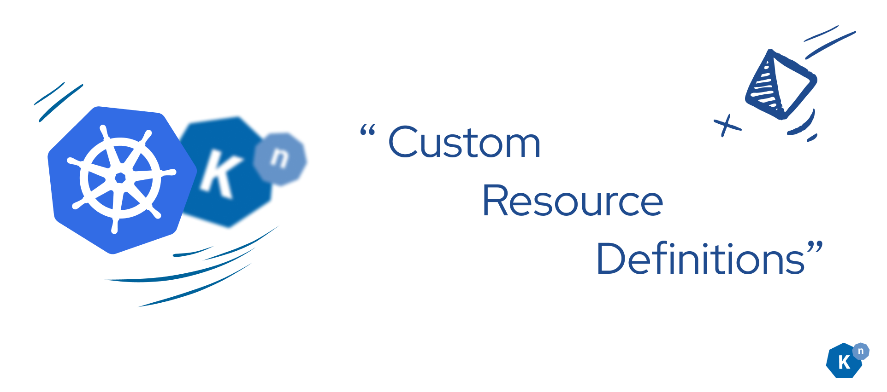
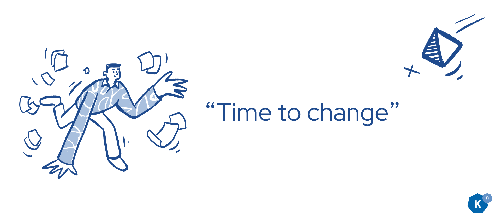
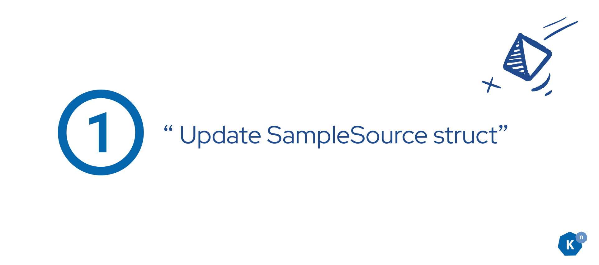
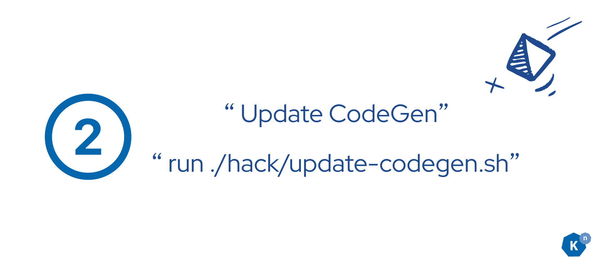
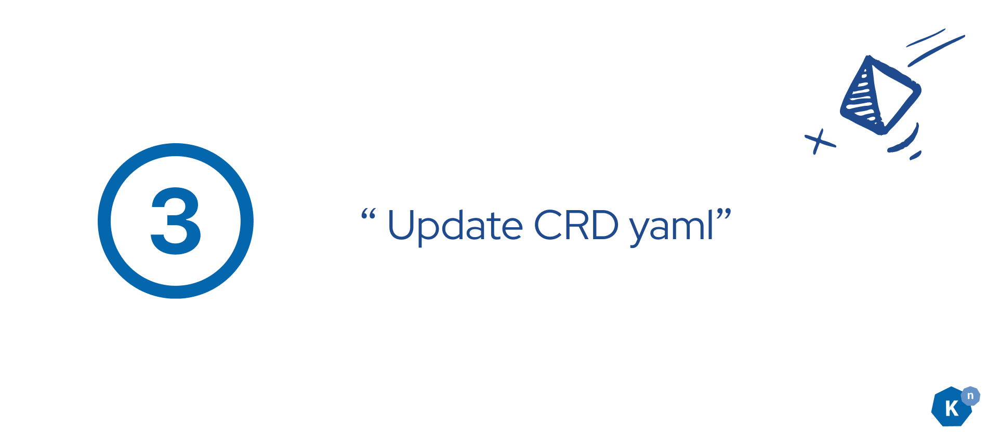
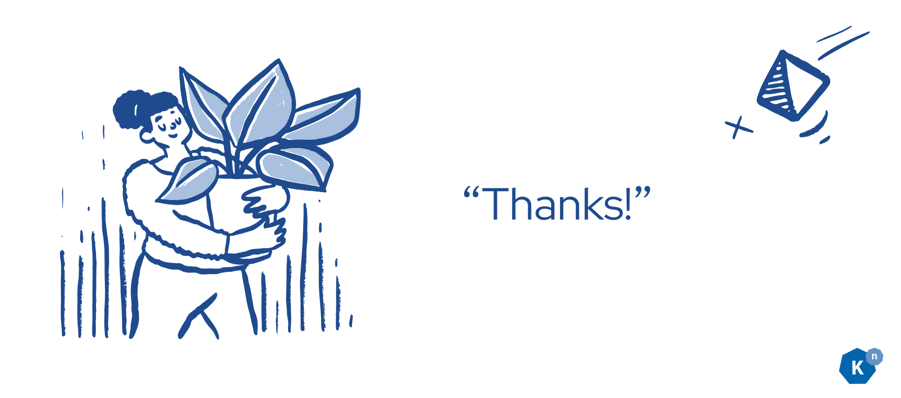

# Getting Started in Open Source with Knative Part 3: API Changes

**Authors: [Calum Murray](https://www.linkedin.com/in/calum-ra-murray/) Software Engineering Intern @ [Red Hat](https://www.redhat.com/en), and [Leo Li](https://www.linkedin.com/in/haocheng-leo/) Software Engineering Intern @ [Red Hat](https://www.redhat.com/en)**



Hello and welcome back to the blog series! In this blog post we will start making actual code changes to some Knative code. Specifically, we will be learning what an API is in Knative, and how we can change them. To facilitate this and the future coding focused blog posts, we will be building a simple event source based on the Knative sample source code. Our source will function similarly to the sample source and send an event at an interval, except it will allow you to create a text template which will be populated with variables on every event that is sent. By the end of this blog post you should be able to understand what APIs are in Knative, and have modified the sample source API to support our new feature (text templates).

## What is an API?

An API is an “Application Programming Interface”. You can think of it as a contract, where an application provides an interface to users which the users can use to programmatically specify what they want the application to do for them

In Knative, APIs take the form of [Kubernetes CustomResourceDefinitions (CRDs)](https://kubernetes.io/docs/concepts/extend-kubernetes/api-extension/custom-resources/#custom-resources){:target="_blank"}. These are the definitions of what resources Knative can provide in your cluster. For example, if you want an event broker for your event driven application you are building, you might want to use the Knative Eventing Broker CRD. Users interact with this API by creating instances of the Custom Resource in their cluster. You can think of this in the same way as an Object is an instance of a Class: a Custom Resource is an instance of a Custom Resource Definition.



Once Kubernetes is aware of the CRD (for example, by kubectl apply -f mycrd.yaml), users can interact with the custom resources as if they were normal kubernetes resources. For example, if I wanted to get all the brokers in namespace my-namespace, I could run kubectl get brokers -n my-namespace. This is a really powerful concept, and is a large part of the philosophy of Knative: we provide Kubernetes Native resources to users so that they can more easily build applications on Kubernetes. In Knative we provide APIs to users by using the core Kubernetes API of [CustomResourceDefinitions](https://kubernetes.io/docs/concepts/extend-kubernetes/api-extension/custom-resources/#custom-resources){:target="_blank"} so that we can realize our philosophy of being Kubernetes Native.

## How can we change an API?


Now that we know what APIs are (generally, and in the context of Knative), we are ready to explore how we can make changes to them. When we want to update an API there are three steps that you need to take.


Update the struct for the object. In our case, we want to update the SampleSource struct. In Knative, these are often found in `pkg/apis/<groupname>/<version>/<resourcename>_types.go`. Looking at this struct, we can see that there is a structure to it that all resources generally follow:


```
v1/
├── apiserver_conversion.go
├── apiserver_conversion_test.go
├── apiserver_defaults.go
├── apiserver_defaults_test.go
├── apiserver_lifecycle.go
```

```shell
// +genclient
// +genreconciler
// +k8s:deepcopy-gen:interfaces=k8s.io/apimachinery/pkg/runtime.Object
type SampleSource struct {
    metav1.TypeMeta `json:",inline"`
    // +optional
    metav1.ObjectMeta `json:"metadata,omitempty"`

    // Spec holds the desired state of the SampleSource (from the client).
    Spec SampleSourceSpec `json:"spec"`

    // Status communicates the observed state of the SampleSource (from the controller).
    // +optional
    Status SampleSourceStatus `json:"status,omitempty"`
}
```

Looking at this code, we can see that there is a `metav1.TypeMeta` embedded struct, a `metav1.ObjectMeta` embedded struct, and then a `Spec` and a `Status` embedded struct. This is how Knative objects (and most k8s resources) are structured. The TypeMeta and ObjectMeta provide metadata about the type and the object, and generally all you need to know about them is that the struct needs to include them. The Spec and the Status are the structs that you will actually be modifying. The `Spec` is where all the options we give the users of Knative will live while the `Status` is where all the information we give to users about the status of a specific object is stored.

Now that we have an understanding of how the struct works, let’s make our actual changes. Try to add a message template field into the sample source so that users can configure that message in each event. Once you’ve given this a try yourself, continue reading to see how we did it! In general, try to attempt each coding step yourself before reading the “solutions”. We will remind you about this as you continue through the blog posts.


```go
// SampleSourceSpec holds the desired state of the SampleSource (from the client).
type SampleSourceSpec struct {
    // inherits duck/v1 SourceSpec, which currently provides:
    // * Sink - a reference to an object that will resolve to a domain name or
    //   a URI directly to use as the sink.
    // * CloudEventOverrides - defines overrides to control the output format
    //   and modifications of the event sent to the sink.
    duckv1.SourceSpec `json:",inline"`

    // ServiceAccountName holds the name of the Kubernetes service account
    // as which the underlying K8s resources should be run. If unspecified
    // this will default to the "default" service account for the namespace
    // in which the SampleSource exists.
    // +optional
    ServiceAccountName string `json:"serviceAccountName,omitempty"`

    // Interval is the time interval between events.
    //
    // The string format is a sequence of decimal numbers, each with optional
    // fraction and a unit suffix, such as "300ms", "-1.5h" or "2h45m". Valid time
    // units are "ns", "us" (or "µs"), "ms", "s", "m", "h". If unspecified
    // this will default to "10s".
    Interval string `json:"interval"`

    // MessageTemplate is the text/template which is used for every event sent.
    //
    // The string format is any valid go text/template template string where
    // the fields are any variables set in the config map
    MessageTemplate string `json:"messageTemplate"`
}

```

All we added was the MessageTemplate string to the `Spec`. Note the JSON tag - this is very important! Without a JSON tag, this field will not be read out of a JSON object when the controller receives info about it from the API Server, and the value will not be written to the JSON we send back to the API Server, so it would not be stored in etcd.


After updating the struct, we normally want to update the [codegen](https://www.redhat.com/en/blog/kubernetes-deep-dive-code-generation-customresources){:target="_blank"}. Knative uses custom code generators to automatically implement parts of the reconciler (more on that in coming blog posts), as well as [deep copy](https://stackoverflow.com/questions/184710/what-is-the-difference-between-a-deep-copy-and-a-shallow-copy){:target="_blank"} functions for the structs and auto-generated API documentation. In our case, we want to update the DeepCopy function for the SampleSourceSpec struct. To update the generated code in Knative, you just need to run ./hack/update-codegen.sh. There may be specific versions of dependencies you need to run this in a given repository, so always check the DEVELOPMENT.md file when setting up your repository for development.


After updating the struct, you need to also update the CRD yaml file. For us, the CRD we are editing looks like;

```yaml
apiVersion: apiextensions.k8s.io/v1
kind: CustomResourceDefinition
metadata:
  labels:
	samples.knative.dev/release: devel
	eventing.knative.dev/source: "true"
	knative.dev/crd-install: "true"
  annotations:
	registry.knative.dev/eventTypes: |
  	[
    	{ "type": "dev.knative.sample" }
  	]
  name: samplesources.samples.knative.dev
spec:
  group: samples.knative.dev
  versions:
	- &version
  	name: v1alpha1
  	served: true
  	storage: true
  	subresources:
    	status: {}
  	schema:
    	openAPIV3Schema:
      	          type: object
          properties:
            spec:
              type: object
              properties:
                interval:
                  type: string
                messageTemplate:
                  type: string
                serviceAccountName:
                  type: string
                sink:
                  type: object
                  properties:
                    ref:
                      type: object
                      properties:
                        apiVersion:
                          type: string
                        kind:
                          type: string
                        name:
                          type: string
            status:
              type: object
              properties:
                status:
                  type: string
                sinkUri:
                  type: string
```

By following these steps, you have successfully modified the SampleSource API to support a new feature: text templates. This change allows users to provide a text template which we will use in future blog posts to populate variables for each event sent by the source. This demonstrates the power and flexibility of Knative's API system and how you can extend it to meet your specific needs.

In the next blog post, we will continue with our project and learn how to modify the controller for our sample source. This way, when users use our new API option, it will actually change something in the system!

We look forward to seeing you in the next blog post! In the meantime, if you have any questions, reach out in #knative-contributors, and we will be happy to help.


