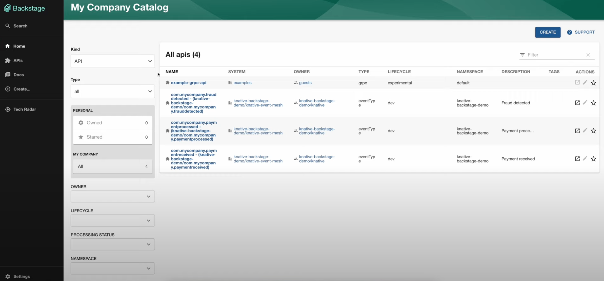

# Knative and Backstage

**Author: Ali Ok, Principal Software Engineer @ Red Hat**

## What's the vision?

[Backstage](https://backstage.io/){:target="_blank"} is a platform for building developer portals. It provides a unified way to manage and visualize the different resources that developers use in their daily work. 

While Backstage is not designed as a next generation Kubernetes Dashboard, it can visualize and partially manage Knative resources. These resources would be read-only and focused on what's relevant to developers.

## Plugins and backends

The plugins are the frontend part of the Backstage plugin. They are responsible for rendering the UI and communicating with the backend. The backend is responsible for talking to the Kubernetes API server and providing the necessary information to the frontend. Currently, we only have one plugin and it requires a backend to work. We think that most of the plugins we might provide in the future will require a backend-for-frontend to work.

## The Event Mesh plugin

[The Event Mesh plugin](https://github.com/knative-extensions/backstage-plugins){:target="_blank"} is a Backstage plugin that allows you to view and manage Knative Eventing resources. The plugin talks to a special backend that runs in the Kubernetes cluster and communicates with the Kubernetes API server. 

This plugin leverages Backstage's [entity provider](https://backstage.io/docs/features/software-catalog/external-integrations/#custom-entity-providers){:target="_blank"} and [entity processor](https://backstage.io/docs/features/software-catalog/external-integrations/#custom-processors){:target="_blank"} concept. The entity provider is responsible for fetching the resources from the backend and the entity processor is responsible for processing the resources and making them available to the frontend. The provider is the part that talks to the custom backend.

The plugin fetches Knative EventType, Broker, and Trigger resources from the backend. Instead of directly fetching the raw Kubernetes resources, it gathers a more user-friendly representation of the data. This means certain fields are excluded, some are combined for clarity, and others are transformed to be easier to understand within this interface.

*Knative EventTypes shown as APIs in Backstage*

Knative Triggers can be pointing at any [Addressable](https://knative.dev/docs/concepts/duck-typing/#addressable){:target="_blank"} or at even a URL directly. Since Backstage side won't know how to handle these, the plugin will only show the trigger's subscriber if it is already registered in Backstage. For this relation, we use the [`backstage.io/kubernetes-id`](https://backstage.io/docs/features/kubernetes/configuration#surfacing-your-kubernetes-components-as-part-of-an-entity){:target="_blank"} annotation in the Backstage entity and the Kubernetes resource.

How the matching works is documented with diagrams in the [Event Mesh plugin README file](https://github.com/knative-extensions/backstage-plugins?tab=readme-ov-file#event-mesh-plugin-1){:target="_blank"}.

What's really cool about this integration is that Backstage's ability to show graphs. For example, you can see the relationships between EventTypes, Brokers, and Trigger subscribers in a graph.

*Graphs in Backstage*

## Demo and quick start

If you would like to see the plugin in action, you can [install](https://github.com/knative-extensions/backstage-plugins?tab=readme-ov-file#running-the-backstage-plugin){:target="_blank"} the backend in your Kubernetes cluster and the plugin in your Backstage instance.

However, for a quicker look at the plugin, you can check out the [demo video](https://www.youtube.com/watch?v=4h1j1v8KrY0){:target="_blank"}.
The demo video is recorded with the quick start available in Ali Ok's [demo repository](https://github.com/aliok/knative-backstage-demo){:target="_blank"}.

<iframe width="560" height="315" src="https://www.youtube.com/embed/4h1j1v8KrY0?si=tzUmjcrYOfCy6E1H" title="YouTube video player" frameborder="0" allow="accelerometer; autoplay; clipboard-write; encrypted-media; gyroscope; picture-in-picture; web-share" allowfullscreen></iframe>

## Contributions welcome

We are looking for contributors to help us improve the plugin and the backend. If you are interested in contributing, please check out the [README file](https://github.com/knative-extensions/backstage-plugins){:target="_blank"} of the plugins repository. How to start the backend, how to install the plugin, and how to modify the plugin are all documented there.

There are a few issues that are marked as good first issues and we are looking for help with them. If you are interested in contributing, please check out the [good first issues](https://github.com/knative-extensions/backstage-plugins/issues?q=is%3Aissue+is%3Aopen+label%3A%22good+first+issue%22){:target="_blank"}.

## What's next

We are exploring the possibility of adding more functionality to integrate Backstage with Knative. One aspect here is reusing the [Knative Functions](https://knative.dev/docs/functions/){:target="_blank"} templates as [Backstage templates](https://backstage.io/docs/features/software-templates/adding-templates){:target="_blank"}. This would allow developers to create new Knative Functions from Backstage and manage them from there, while having the compatibility with the [Func CLI](https://knative.dev/docs/functions/install-func/){:target="_blank"}.

## Contact

If you have any questions or feedback, please feel free to reach out to us. You can find us in the [CNCF Slack](https://communityinviter.com/apps/cloud-native/cncf){:target="_blank"} in the [#knative](https://cloud-native.slack.com/archives/C04LGHDR9K7){:target="_blank"} channel.
