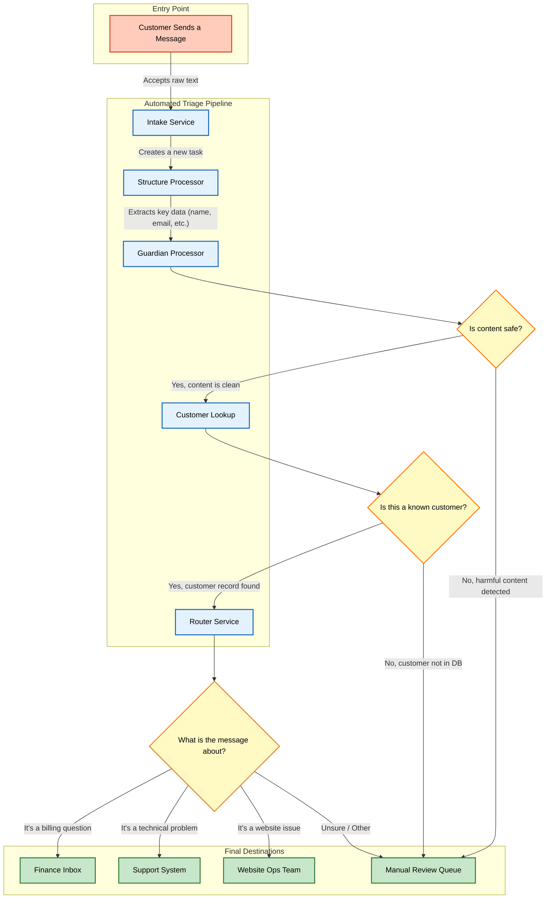

# Building a Resilient AI Triage System with Event-Driven Agents and Knative

**Author: Ali Ok, Principal Software Engineer @ Red Hat**

The rise of Large Language Models (LLMs) has unlocked incredible possibilities. We're moving beyond simple chatbots to build sophisticated systems of AI "agents" that can collaborate to perform complex tasks. But this new paradigm presents a significant architectural challenge: How do you reliably orchestrate a fleet of specialized agents in a way that is resilient, scalable, and easy to extend?

The answer lies in a robust Event-Driven Architecture (EDA). And the key to implementing EDA effectively on Kubernetes is Knative.

In this post, we'll explore an AI-powered message triage system I built to demonstrate this exact pattern. This system ingests unstructured customer messages, uses a series of AI agents to process and enrich them, and routes them to the correct destination, all managed through a flexible event-driven choreography.

You can find the full source code for the project on [GitHub](https://github.com/keventmesh/agentic-ai-demo) and a complete video walkthrough [here](https://www.youtube.com/watch?v=bfWvvdQmAe8).

### The Pitfalls of Tightly Coupled Systems

When building a multi-step process, the simplest approach is often direct communication: Service A calls Service B, which then calls Service C. This creates a brittle, tightly-coupled chain. If Service B is down, the entire process fails. Adding a new step between A and B requires modifying Service A's code.

An event-driven approach is the solution, but it comes with its own complexities. Managing message broker clients, connection logic, and topic routing within each service adds significant boilerplate and operational overhead. We need a way to get the benefits of EDA without the burden.

### An Event-Driven Choreography

Instead of a rigid, centrally-managed process, our system uses a "choreography," where autonomous agents react to events without direct knowledge of one another.

Here is the high-level business process for our triage system:


*High-Level Business Process Flowchart*

A customer message kicks off the pipeline. Each step is handled by a dedicated agent:

1.  **Intake Service:** Accepts the raw message and creates an initial event.
2.  **Structure Processor:** An AI agent that uses an LLM to extract structured data (like name, email, and reason for contact).
3.  **Guardian Processor:** A safety agent that checks the content for harmful language.
4.  **Customer Lookup:** An enrichment service that checks a database for a known customer.
5.  **Router Service:** The final AI agent, which classifies the message's intent to determine the correct destination (e.g., Finance, Support, etc.).

If any step fails or an agent is unsure, the message is routed to a human for manual review, creating a crucial **human-in-the-loop** capability.

### The Knative EDA Advantage: Why This Architecture Works

Knative provides the ideal foundation for this event-driven choreography, turning architectural theory into practice.


Here’s how Knative delivers the core benefits of EDA:

#### 1. True Decoupling via the Broker

At the heart of our system is the Knative Eventing's broker. All events are sent to this central hub. This completely decouples our agents. The `structure-processor`, for example, consumes a `com.example.triage.intake.new` event and produces a `com.example.triage.structured` event. **It has no idea who produced its input or who will consume its output.** This decoupling is the cornerstone of a resilient and flexible system.

#### 2. Declarative Routing Makes the System Evolvable

How does the broker know where to send events? This is handled by **Knative Triggers**. A Trigger is a simple object that creates a subscription, filtering events based on their attributes (like `type`) and directing them to a subscriber.

This is a game-changer for extensibility. Imagine we want to add a new "Translation Agent" after the intake step. We simply deploy the new agent and create a new Trigger for it. No existing services need to be modified or even redeployed. This makes the architecture incredibly easy to evolve over time.

#### 3. Resilience and Independent Scaling

Because our agents are decoupled, they can fail and scale independently. If the `router-service` is temporarily down, the broker can hold onto its events until it's back online (depending on configuration). Furthermore, if we get a sudden flood of messages needing routing, only the `router-service` needs to scale up. Knative Serving automates this process, ensuring each part of the system has the resources it needs without impacting others.

### The Developer Experience: Simple Code, Powerful Platform

The most immediate benefit of Knative's EDA abstraction is how simple the agent code becomes. Developers are freed from the mechanics of eventing and can focus purely on business logic.

Here's a look at the core of our `structure-processor` agent, built with Python and Flask:

```python
# [Code Snippet from svc_structure_processor/app.py]

@app.route('/', methods=['POST'])
def handle_event():
    """
    Receives an event, processes it, and replies with a new event
    in the HTTP response.
    """
    # 1. Get the incoming event payload
    incoming_payload = request.get_json()
    incoming_wrapper = OuterWrapper(**incoming_payload)

    # 2. Call the LLM to get structured data (the agent's core logic)
    processed_wrapper = processor.process(incoming_wrapper)

    # 3. Construct the headers for the *new* CloudEvent
    response_headers = { "Ce-Type": "com.example.triage.structured", ... }

    # 4. Return the new payload and headers in the HTTP response
    response_payload = processed_wrapper.model_dump(mode='json')
    return jsonify(response_payload), 200, response_headers
```

Notice what's missing? **There are no Kafka clients or broker-specific libraries.** The agent simply receives an HTTP POST and replies with an HTTP 200. Knative handles the magic of converting that request/reply into a resilient, event-driven flow.

This simple code is connected to the event mesh with an equally simple Trigger:

```yaml
# [Code Snippet from svc_structure_processor/config/200-trigger.yaml]

apiVersion: eventing.knative.dev/v1
kind: Trigger
metadata:
  name: svc-structure-processor
spec:
  broker: default
  filter:
    attributes:
      type: com.example.triage.intake.new # <-- The event to listen for
  subscriber:
    ref:
      kind: Service
      name: svc-structure-processor # <-- The service to send it to
```

This clean separation of concerns is the essence of a powerful platform.

### Try It Yourself!

The event-driven agent pattern is a powerful blueprint for building the next generation of intelligent, automated systems. Knative provides the ideal foundation, offering the resilience, flexibility, and developer simplicity needed to bring these ideas to life.

I encourage you to explore the project and see it for yourself. While the demo video shows OpenShift console, the demo can be run on any Kubernetes cluster with Knative installed.

*   **Watch the full demo on YouTube:** [https://www.youtube.com/watch?v=bfWvvdQmAe8](https://www.youtube.com/watch?v=bfWvvdQmAe8)
*   **Get the code on GitHub:** [https://github.com/keventmesh/agentic-ai-demo](https://github.com/keventmesh/agentic-ai-demo)

If you have any questions or feedback, please feel free to reach out to us. You can find us in the [CNCF Slack](https://communityinviter.com/apps/cloud-native/cncf){:target="_blank"} in the [#knative](https://cloud-native.slack.com/archives/C04LGHDR9K7){:target="_blank"} channel.

