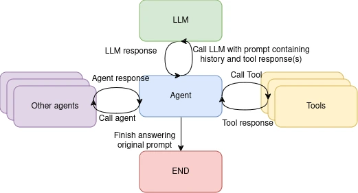

# LLM Agents with Knative: An Overview

**Author: [Calum Murray](https://www.linkedin.com/in/calum-ra-murray/), Software Engineering Intern @ Red Hat**

LLMs are a transformative technology, enabling new forms of interactions between users and software systems.
But how can we make sure that the LLM gives correct answers to users? Can we use LLMs as more than just a
question answering/summarization tool and have them take actions on our behalf?

LLM Agents and Tool Calling are some emerging patterns in the space that allow for LLMs to interact with
other tools and models, solving much of the problem of correctness and giving LLMs the power to take actions
for users. With all of these benefits, we have been looking in the Knative community for ways that we can
enable you to build LLM agent systems more easily and in a method that is more in line with how you build
the rest of your system: declarative and cloud native. In this blog post we are going to first go over some
background on what exactly an LLM Agent is and how LLMs can call tools, and then we will discuss where we
picture Knative fitting into this paradigm.

## What is an Agent?

In AI, an agent is defined as a system that is able to take in information about its environment and use
that information to make decisions and take actions to accomplish a goal. In the context of LLMs, an Agent
is a system with an LLM at its core that is able to make decisions on what actions to take as it works to
answer the prompt it received. The most common actions LLM agents can be built to take are: sending text
or other media to the user, calling a tool to help answer the user, and calling another agent to help answer
the user. Generally speaking, an LLM agent will also have a system prompt explaining what its role is and
giving it some rules over when to call tools and/or reply to the user. For most Agents, the control flow
can be shown as follows:



One of the key properties of an LLM Agent over some other form of agent is that the decisions on whether
to call more tools, to call the LLM again, to call another agent, or to finish processing is made by the LLM
- not some other form of logic (hand coded or AI/ML based). So, while the above diagram shows the LLM and the
Agent as two separate entities, they are generally the same entity. Whenever a tool or agent call completes,
that information is sent to the LLM and it makes a decision on what to do with that information. Sometimes the
LLM will decide to call itself again - for example, we have observed this happen when the LLM wants to send some
text to the user before continuing to call other agents or tools.

## How do LLMs call Tools?

All that is needed for an LLM to call a tool is some way for the LLM to communicate which tool it wants to call,
as well as what arguments (if any) it wants to provide to the tool. As the LLM output is just a sequence of tokens
there needs to be some kind of external system that can parse this information from the output, so the LLM needs
to output structured or semi-structured data in a consistent way to call a tool. There are multiple different APIs
on how to do this, and it currently somewhat depends on the exact model you are using (as they have been trained
to handle this in different ways). For the purposes of this blog, we are going to be specifically looking at the
[OpenAI Chat API](https://platform.openai.com/docs/api-reference/chat/create) for doing this, however the concepts
are generally the same for other models.

In the OpenAI Chat API, you are asked to pass in a list of tools that the LLM is able to use. The key information
you have to provide is the `name` of the tool, as well as any `parameters` that the tool might accept. For each
parameter, information about the type of the parameter, what it is used for, and its name must also be provided
so that the LLM is able to call the tool as accurately as possible. As an example, the following JSON object is a
valid tool:

```json
{
    "type": "function",
    "function": {
        "name": "get_current_weather",
        "description": "Get the current weather in a given location",
        "parameters": {
            "type": "object",
            "properties": {
                "location": {
                    "type": "string",
                    "description": "The city and state, e.g. San Francisco, CA",
                },
                "unit": {"type": "string", "enum": ["celsius", "fahrenheit"]},
            },
            "required": ["location"],
        },
    },
}
```

This JSON object would be included in any calls to the OpenAI Chat API where the LLM may want to choose to call
the `get_current_weather` function. If it was not included, the LLM would not be aware of the tool and would not
be able to call it.

When the LLM is called with a set of tools, it is able to make a decision on whether or not to call any tools,
and which tool(s) to call with which parameters. The way to check if the model wants to make any tool calls is
to look at the `tool_calls` property of the response message. For example, in python you would do:

```python
response_message = response.choices[0].message
tool_calls = response_message.tool_calls
```

From there, you would have an array of tools to be called as well as the arguments to pass to each tool. So,
to call the tool you have to call some function or class method with the arguments the LLM chose to provide.

## Using Knative for LLM Tool Calling

While investigating how LLMs call tools, we noticed that many tools are simple API wrappers: they take the
parameters provided by the LLM and map them into some form of API call. We also noticed that because the LLM
only knows about the name of the tool and what parameters it can accept, any tools that were not an API wrapper
could very easily be turned into one (for example by placing the logic for the tool into a Knative Function
which builds as a Linux Container, deploying it as a Knative Service). But why is this important?

When all the tools just are an API wrapper, all that is needed to define any tool in the system is:

1. The name of the tool
2. A description of the tool
3. The parameters the tool accepts
4. How to map the parameters into the API of the tool

Notice that everything in the above list is just _metadata_ about the tool, and that using these four pieces
of metadata we are able to define _any_ tool we want the LLM to be able to call. This is an extremely important
result, as it allows us to generalize the tool calling and extract the definitions of the tools from the code
that calls the tools. In other words, we can write the code for calling a tool based on the LLM message once,
and use the metadata about the tools in our system to handle the specifics of each individual tool.

In Knative we already have a CustomResource for recording this metadata: EventTypes! EventTypes were originally
created to model the types of CloudEvents that existed in a Knative Eventing system, so that developers working
on Event Consumers could easily figure out what was available to them and how to consume that. However, that
same information can be used to describe what a Service expects to receive (in this case as a tool call from an
LLM). The EventTypes can be used without any changes to describe what tools are available an LLM Agent, as well
as how to call them.

As an example, let’s say I have a service that returns the current weather for a location. I could represent
the contract of what this service expects in an EventType as:

```yaml
apiVersion: eventing.knative.dev/v1beta2
kind: EventType
metadata:
  name: get.current.weather
spec:
  reference:
    apiVersion: serving.knative.dev/v1
    kind: Service
    name: get-current-weather
  description: "Get the current weather in a given location."
  schemaData: '{"location":{"type":"string","description":"The city and state, e.g. San Francisco, CA"},"unit":{"type":"string","description":"One of [celsius, farenheit]"}}'
  type: "get.current.weather"
```

The description of the EventType can be directly mapped to the tool description expected by the LLM, the name can be taken
from the name of the EventType resource (but note: OpenAI models require that tools have names using only a-z, A-Z, 0-9,
underscores and dashes, with a maximum length of 64 so we may have to do some sanitization of the name). For the parameters
of the function, we can get those by parsing the `schemaData` of the EventType.

As we saw above, the EventType resource contains all the information to tell the LLM how to call the Service. To call the
tool with the message from the LLM containing the tool call, all we need to do is use the `schemaData` as well as the `type`
field in the EventType to construct a CloudEvent with the correct data which will get sent to the correct service. To send
it to the service we can either:

1. Resolve the reference from the spec to a URI and call that directly
2. Use a Knative Broker to handle the dispatch of all tool calls to the correct Knative Service

Given the many advantages of using Brokers (such as Delivery retries, persistent message technologies like Apache Kafka
to back the broker, etc.) we chose to use a Broker to dispatch all tool calls to the correct Service. In order to get a
response back with the result of the tool call (instead of just the broker acknowledging that the event was received),
we added a deployment that sits in front of the broker that provides Request-Reply semantics. We plan on adding this
deployment through a new CustomResource - check out the [issue here](https://github.com/knative/eventing/issues/7912)
for more information as well as for how it works.

In this way, all you need to do for your LLM Agent to learn how to call one of your services is to:

1. Create a trigger from your broker to your service using a filter selecting a specific type of event
2. Create an EventType with the same `type` that uses the `schemaData` to describe the API of your service

## Wrapping up

In this blog post, we have covered what LLM agents are, how LLMs can call tools, and how Knative can be used to simplify
tool calling using metadata. If you are interested in how to build an LLM agent system that uses Knative to simplify
tool calling and discovery, as well as our vision for how this technology should evolve going forwards, keep your eyes
out for our next blog on this topic which is coming soon! If you have any questions on this topic, we invite you to engage
with us on the Knative channels in the [CNCF slack instance](https://slack.cncf.io).
