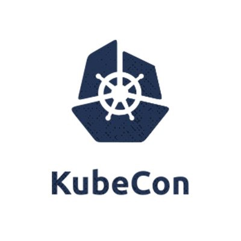

# How to catch news about Knative project during KubeCon + CloudNativeCon NA 2023

Attention cloud-native enthusiasts! If you are in Chicago and want to learn about the Knative project and how it can help you accelerate your journey to adopt Kubernetes, scale AI-Ready Microservices, write event-driven apps, and leverage Serverless in your enterprise - then catch the following sessions on knative and visit us at Knative Kiosk during KubeCon + CloudNativeCon NA 2023 
## AppDeveloperCon November 6 2023
**Monday, November 6 • 10:25am:** Shaping Tomorrow's Technology: Navigating Cloud-Native, Serverless, and Polyglot Programming - Naina Singh & Shaaf Syed, Red Hat

**Monday, November 6 • 2:40pm:** AI-Ready Microservice Architecture - Ali Ok & Pierangelo Di Pilato, Red Hat

## KubeCon + CloudNativeCom
**Tuesday, November 7 • 3:25pm:** Adopting Server Side Apply in Knative - a Case Study - Dave Protasowski, VMware  

**Thursday, November 9 • 2:55pm:** Real-World Knative: Success Stories from Production Environments - Naina Singh, Red Hat; Norris Sam Osarenkhoe, SVA; Andrew Senetar, CoreWeave; Adolfo García Veyia, Chainguard; Ricardo Rocha, CERN  

## Knative Kiosk
Knative Project will have a half day kiosk in the Expo area during the Conference. We are looking forward to seeing you in Chicago during our session and at the Knative kiosk #P5-A in the expo area.
If you cannot attend the KubeConNA 23, don't worry, you can join the conversations in the #knative channel at CNCF Slack. Say Hi to us today on the CNCF Slack [CNCF Slack](https://communityinviter.com/apps/cloud-native/cncf)
