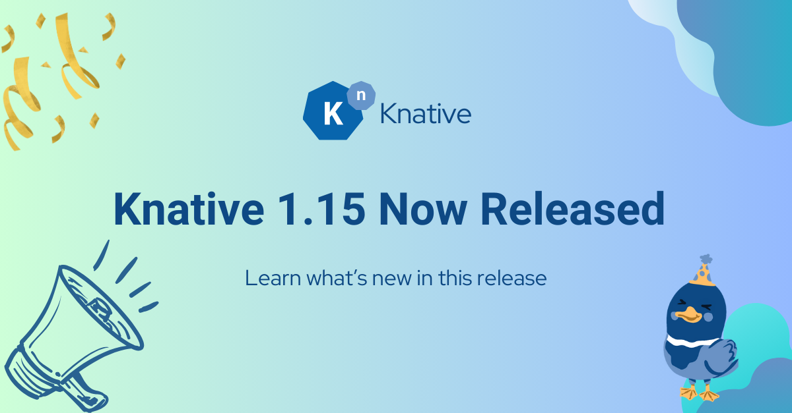
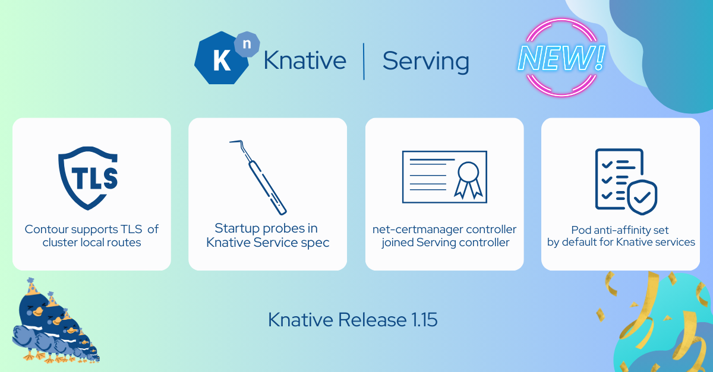
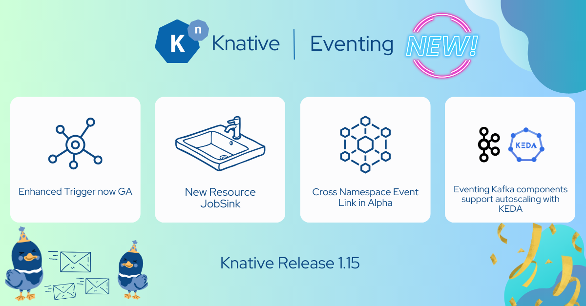
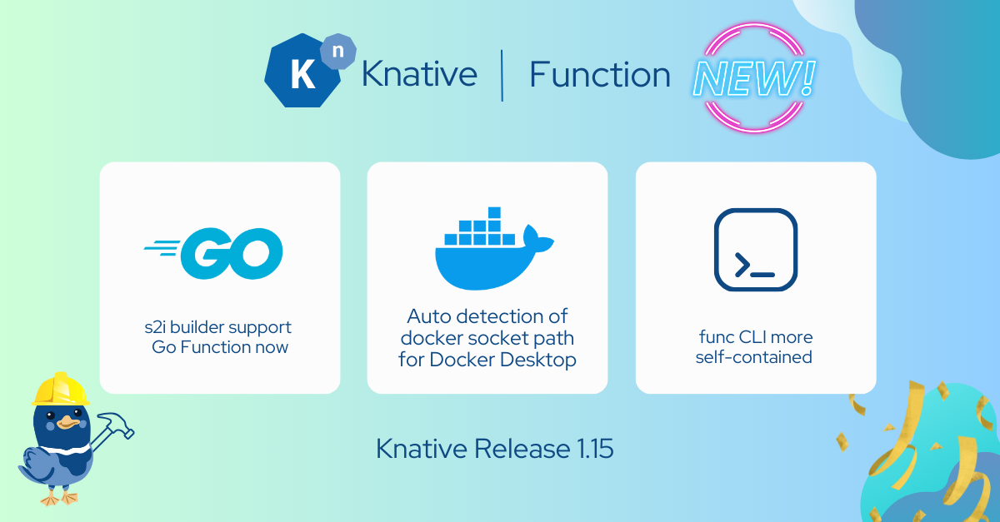

# Announcing Knative 1.15 Release

A new version of Knative is now available across multiple components. Follow the instructions in [Installing Knative](https://knative.dev/docs/install/) to install the components you require.

This release brings significant improvements and new features to the core Knative Serving and Eventing components, as well as enhancements to the Client, Functions, and Operator components.

## Table of Contents
- [Learning](#learning)
- [Serving](#serving)
- [Eventing](#eventing)
- [Functions](#functions)
- [kn CLI](#client)
- [Knative Operator](#operator)

### Learning

#### 💫 New Features & Changes
- New beginner-friendly E2E bookstore tutorial is now released. ([Link to tutorial](https://knative.dev/docs/bookstore/page-0/welcome-knative-bookstore-tutorial/), [docs/#5880](https://github.com/knative/docs/issues/5880), [@Leo6Leo](https://github.com/Leo6Leo))

### Serving

**Release Notes:** [Knative Serving 1.15](https://github.com/knative/serving/releases/tag/knative-v1.15.0)
#### 💫 New Features & Changes
- Added a new job that runs after upgrades via kubectl to clean up old resources ([#15312](https://github.com/knative/serving/pull/15312), [@skonto](https://github.com/skonto))
- Added anti-affinity rules to the activator deployment ([#15233](https://github.com/knative/serving/pull/15233), [@izabelacg](https://github.com/izabelacg))
- Adjusted liveness probe to account for stale leases, preventing webhook crashloop ([#15256](https://github.com/knative/serving/pull/15256), [@mukulgit123](https://github.com/mukulgit123))
- Allowed IPv6 address for sslip.io in default-domain Job ([#15328](https://github.com/knative/serving/pull/15328), [@tcnghia](https://github.com/tcnghia))
- Contour now supports TLS encryption of cluster local routes ([#15378](https://github.com/knative/serving/pull/15378), [@dprotaso](https://github.com/dprotaso))
- Knative Service now supports setting startup probes in the spec (note: this increases cold-start time) ([#15309](https://github.com/knative/serving/pull/15309), [@ReToCode](https://github.com/ReToCode))
- Pod anti-affinity rules are set by default for all Knative services (can be deactivated) ([#15250](https://github.com/knative/serving/pull/15250), [@izabelacg](https://github.com/izabelacg))
- Pod runtime-class-names can be set to run Services with specified labels and available RuntimeClass ([#15271](https://github.com/knative/serving/pull/15271), [@BobyMCbobs](https://github.com/BobyMCbobs))
- The net-certmanager controller is now part of the Serving core and Serving controller ([#15066](https://github.com/knative/serving/pull/15066), [@skonto](https://github.com/skonto))

#### 🐞 Bug Fixes
- Fixed cluster.local Routes not reconciling when external-tls is enabled ([#15234](https://github.com/knative/serving/pull/15234), [@dprotaso](https://github.com/dprotaso))
- `kubectl get revision` no longer shows an empty column for `K8S Service Name` ([#15260](https://github.com/knative/serving/pull/15260), [@dprotaso](https://github.com/dprotaso))

### Eventing

**Release Notes:** [Knative Eventing 1.15](https://github.com/knative/eventing/releases/tag/knative-v1.15.0)

#### 💫 New Features & Changes
- `transport-encryption` is now a Beta feature ([#7915](https://github.com/knative/eventing/pull/7915), [@pierDipi](https://github.com/pierDipi))
- Added prototype for MQTT source ([#7919](https://github.com/knative/eventing/pull/7919), [@ctmphuongg](https://github.com/ctmphuongg))
- Added EventPolicy Reconciler & Webhook ([#8024](https://github.com/knative/eventing/pull/8024), [#8091](https://github.com/knative/eventing/pull/8091) [@dharmjit](https://github.com/dharmjit))
- Added JobSink resource to trigger long-running background jobs when events occur ([#7954](https://github.com/knative/eventing/pull/7954), [@pierDipi](https://github.com/pierDipi))
- EventTypes no longer need a reference to be set on them ([#8087](https://github.com/knative/eventing/pull/8087), [@Cali0707](https://github.com/Cali0707))
- Knative Eventing now supports the CESQL v1 specification (note: breaking changes from v0.1) ([#8103](https://github.com/knative/eventing/pull/8103), [@Cali0707](https://github.com/Cali0707))
- Sequences now update subscriptions instead of recreating them, where possible ([#7948](https://github.com/knative/eventing/pull/7948), [@Cali0707](https://github.com/Cali0707))
- The filters field in APIServerSource is now alpha and disabled by default ([#7799](https://github.com/knative/eventing/pull/7799), [@rh-hemartin](https://github.com/rh-hemartin))
- The new-trigger-filters feature flag was removed; the feature is now enabled and GA ([#8067](https://github.com/knative/eventing/pull/8067), [@Cali0707](https://github.com/Cali0707))
- Updated eventtype CRD to include .spec.reference.address ([#7935](https://github.com/knative/eventing/pull/7935), [@creydr](https://github.com/creydr))

#### 🐞 Bug Fixes
- EventType v1beta3 resources no longer have a default broker reference set ([#8079](https://github.com/knative/eventing/pull/8079), [@Cali0707](https://github.com/Cali0707))
- The IMC dispatcher metrics now correctly record metrics once per event with a single request scheme ([#7870](https://github.com/knative/eventing/pull/7870), [@Cali0707](https://github.com/Cali0707))
- Avoided fatal errors for unknown feature flags that may be added in future releases ([#8051](https://github.com/knative/eventing/pull/8051), [@pierDipi](https://github.com/pierDipi))
- Exposed OIDC identities of underlying Subscriptions in Sequence and Parallel ([#7902](https://github.com/knative/eventing/pull/7902), [@creydr](https://github.com/creydr))

### Functions

**Release Notes:** [Knative func 1.15](https://github.com/knative/func/releases/tag/knative-v1.15.0)

#### 💫 New Features & Changes
- The S2I builder now supports Go functions with new instance-based method signatures and lifecycle methods ([#2203](https://github.com/knative/func/pull/2203), [@lkingland](https://github.com/lkingland))
- Embedded Tekton task definitions in the binary ([#2396](https://github.com/knative/func/pull/2396), [@matejvasek](https://github.com/matejvasek))

#### 🐞 Bug Fixes
- Fixed Function namespace resolution in some edge cases ([#2187](https://github.com/knative/func/pull/2187), [@lkingland](https://github.com/lkingland))
- Fixed --registry-insecure flag in deploy command ([#2335](https://github.com/knative/func/pull/2335), [@norbjd](https://github.com/norbjd))
- Fixed Pipelines as Code setup failure under unprivileged user ([#2341](https://github.com/knative/func/pull/2341), [@matejvasek](https://github.com/matejvasek))
- Fixed buildpack build failure caused by wrong socket mount-point when using Docker Desktop ([#2350](https://github.com/knative/func/pull/2350), [@matejvasek](https://github.com/matejvasek))
- Fixed pipelines as code build -- build via git hook in tekton ([#2314](https://github.com/knative/func/pull/2314), [@matejvasek](https://github.com/matejvasek))
- Fixed failure in GHA caused by missing cargo bin ([#2440](https://github.com/knative/func/pull/2440), [@matejvasek](https://github.com/matejvasek))

#### Documentation
- Clarified --registry-insecure flag description ([#2348](https://github.com/knative/func/pull/2348), [@norbjd](https://github.com/norbjd))
- Fixed the docs for build section ([#2368](https://github.com/knative/func/pull/2368), [@swastik959](https://github.com/swastik959))

#### Other Changes
- Updated images from ubi8 to ubi9 ([#2328](https://github.com/knative/func/pull/2328), [@matejvasek](https://github.com/matejvasek))
- Fixed error message ([#2372](https://github.com/knative/func/pull/2372), [@swastik959](https://github.com/swastik959))

### Client
**Release Notes:** [Knative Client 1.15](https://github.com/knative/client/releases/tag/knative-v1.15.0)

#### 💫 New Features & Changes
- Added option flags to define nodeSelector, nodeAffinity, and toleration on Knative Service ([#1924](https://github.com/knative/client/pull/1924), [@Shashankft9](https://github.com/Shashankft9))

#### Other Changes
- Added release note template ([#1956](https://github.com/knative/client/pull/1956), [@dsimansk](https://github.com/dsimansk))
- Removed release notes template in favor of global one ([#1957](https://github.com/knative/client/pull/1957), [@dsimansk](https://github.com/dsimansk))

### Operator
**Release Notes:** [Knative Operator 1.15](https://github.com/knative/operator/releases/tag/knative-v1.15.0)

#### 🐞 Bug Fixes
- Fixed bug preventing liveness probes from being overridden to no probe ([#1823](https://github.com/knative/operator/pull/1823), [@mbaynton](https://github.com/mbaynton))

## Thank you, contributors
**Release Leads:**

- [@ReToCode](https://github.com/ReToCode)
- [@skonto](https://github.com/skonto)
- [@Cali0707](https://github.com/Cali0707)
- [@Leo6Leo](https://github.com/Leo6Leo)
- [@dsimansk](https://github.com/dsimansk)

## Learn more
- [Knative docs](https://knative.dev/docs/)
- [Quickstart tutorial](https://knative.dev/docs/getting-started/)
- [Bookstore E2E tutorial](https://knative.dev/docs/bookstore/page-0/welcome-knative-bookstore-tutorial/)
- [Samples](https://knative.dev/docs/samples/)
- [Knative Working Groups](https://knative.dev/community/contributing/working-groups/)
- [Knative User Mailing List](https://groups.google.com/g/knative-users)
- [Knative Development Mailing List](https://groups.google.com/g/knative-dev)
- [Knative on Twitter @KnativeProject](https://twitter.com/KnativeProject)
- [Knative on StackOverflow](https://stackoverflow.com/questions/tagged/knative)
- [#knative on CNCF Slack](https://slack.knative.dev/)
- [Knative on YouTube](https://www.youtube.com/c/KnativeProject)