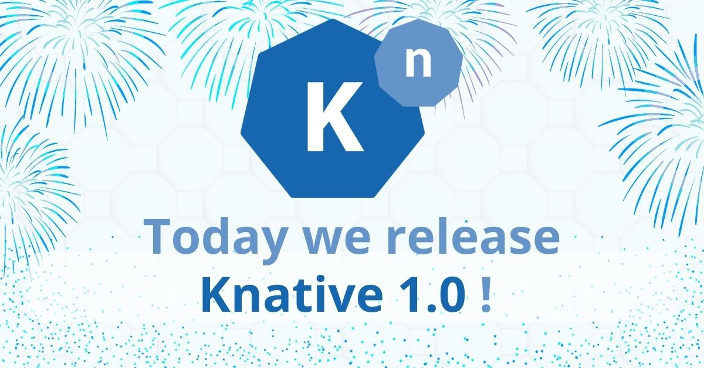

# Details on the 1.0 release of Knative

**Authors: [Carlos Santana](https://twitter.com/csantanapr) (IBM), [Omer Bensaadon](https://twitter.com/omer_bensaadon) (VMware), [Maria Cruz](https://twitter.com/marianarra_) (Google)**

Today we release Knative 1.0, reaching an important milestone made possible thanks to the contributions and collaboration of over 600 developers. The Knative project was released by Google in July 2018, and it was developed in close partnership with VMWare, IBM, Red Hat, and SAP. Over the last 3 years, Knative has become [the most widely-installed serverless layer on Kubernetes.](https://www.cncf.io/wp-content/uploads/2020/11/CNCF_Survey_Report_2020.pdf)

## What's new

In case you haven't been following Knative's development closely, there have been a lot of changes since our initial release in July 2018.

In addition to a myriad of bug fixes, stability and performance enhancements, our community has shipped the following improvements, in approximately chronological order:

* Support for multiple HTTP routing layers (including Istio, Contour, Kourier and Ambassador)
* Support for multiple storage layers for Eventing concepts with common Subscription methods (including Kafka, GCP PubSub, and RabbitMQ)
* A “duck type” abstraction to allow processing arbitrary Kubernetes resources that have common fields (like status.conditions and status.address).
* A [command-line client](https://knative.dev/docs/client/install-kn/) with support for additional feature plugins
* A regular 6-weekly release process
* Support for HTTP/2, gRPC, and WebSockets
* Brokers and Triggers, to simplify publishing and subscribing to events while decoupling producers and consumers
* Support for Eventing components delivering to non-Knative components, including off-cluster components or specific URLs on a host
* Support for automatic provisioning of TLS certificates (either via DNS or HTTP01 challenges)
* Custom delivery options for event destinations, including retries and dead-letter queues for undeliverable messages
* Event tracing support for both Brokers and Channels, for improved debugging
* [The Tekton project](https://tekton.dev/), spawned from Knative Build
* Parallel and Sequence components, to codify certain composite eventing workflows
* Documentation for Event Sources and how to contribute them, currently covering about 40 different event sources
* "Hitless” upgrades with no dropped requests between minor version releases
* Redesign of API shapes for Serving to match the PodTemplateSpec used by Deployment, CronJob, etc, to simplify usage for Kubernetes-aware users
* Support for injecting event destination addresses into PodTemplateSpec shaped objects
* Support for horizontal pod autoscaling based on concurrency or RPS
* High availability of control plane components using leader election slices
* An operator, to help administrators install Knative
* A quickstart, for developers to try Knative locally
* Simplified management and publication of Services using DomainMapping

## What does it mean to be 1.0?

Knative is composed of many components that are versioned together.  Those components have different levels of maturity, ranging from "experimental" to "already GA" (Generally Available).  We still want to keep the versions in sync, and so have decided to move all components to version 1.0.  GA levels are marked for components individually.

### Why move all the components to 1.0 at once?

Two reasons: one user-facing, and one contributor-facing. The big, user-facing reason is that it gives users a single number to hang on to when understanding what they've installed and what works together. The smaller, contributor-facing reason is that all our infrastructure is designed to manage a single version number, and updating it to support multiple version numbers doesn't seem like a good use of time given the first point.

### Isn't a component being both "1.0" and "Beta" confusing?

Unless we wait for everything related to Knative to be done, we'll always have some components or features that are in an alpha or beta state. While this sometimes happens along a component boundary, it can also happen within a component, so the version number can't be a sole indicator of "GA or not". (This happens to other projects like Kubernetes as well, and to specific features in Serving or Eventing.)

Going forward, one of the things the project will be clear about is the maturity level of various components or features, and moving features along the path to either GA or retirement.

## Learn more
Knative steering committee member Ville Aikas is [the guest on the Kubernetes Podcast from Google this week](https://kubernetespodcast.com/episode/166-knative-1.0/), telling the story of the creation of the project and its journey to 1.0.  You can also join [the Knative community meetup on November 17,](https://calendar.google.com/calendar/u/0/r/eventedit/NnAycjJyZmdlMTF1b2FuOGJzZjZ1dXA0aTZfMjAyMTExMjRUMTczMDAwWiBrbmF0aXZlLnRlYW1fOXE4M2JnMDdxczViOXJyc2xwNWpvcjRsNnNAZw?tab=mc) where Ville will talk about the latest changes to the project.

## Get involved
Newcomers to the Knative community are always welcome! [Join the Knative Slack space](https://slack.knative.dev/) to ask questions and troubleshoot issues as you get acquainted with the project. Finally, find all the [project documentation](https://knative.dev/docs/) on the Knative website and [contribute to the project on GitHub](https://github.com/knative).

## Thank you to our contributors!
Achieving this milestone has truly been a community effort — we’d be remiss not to thank some of the people who helped us get here.
Thanks to…

* The companies supporting Knative, including
    * Google (who also sponsor our website and testing infrastructure, and produce the community meetup every month)
    * IBM
    * Red Hat
    * SAP
    * TriggerMesh
    * VMware
    * [and many more!](https://knative.teststats.cncf.io/d/5/companies-table?orgId=1&var-period_name=Last%20decade&var-metric=contributions)
* The members of our [Technical Oversight Committee](https://github.com/knative/community/blob/main/TECH-OVERSIGHT-COMMITTEE.md), [Steering Committee](https://github.com/knative/community/blob/main/STEERING-COMMITTEE.md) and [Trademark Committee](https://github.com/knative/community/blob/main/TRADEMARK-COMMITTEE.md)
* All Knative contributors, past and present
