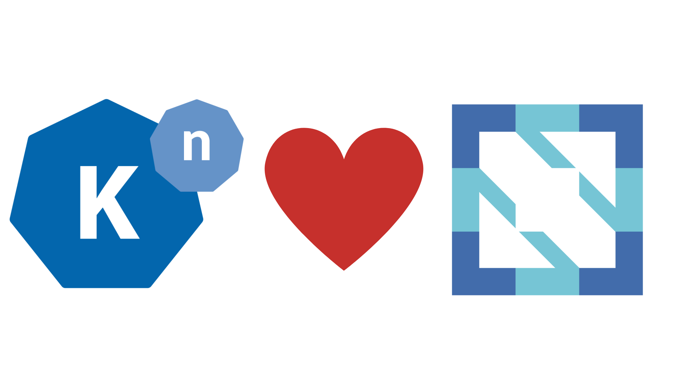

With the support of the Knative Steering and Trademark committees, [Google just announced its intention to donate the Knative project to the Cloud Native Computing Foundation (CNCF)](https://opensource.googleblog.com/2021/11/Knative-applies-to-become-CNCF-incubating-project.html). We are very excited about this news! The Knative project has come a long way since 2018, [hitting the big 1.0 milestone](https://knative.dev/blog/articles/knative-1.0/) just a few weeks ago. The [application to become a CNCF incubating project](https://github.com/cncf/toc/pull/762) is the next big milestone for Knative, and we’re thrilled to kickstart the process!

Knative community members are excited about this! Read on to find quotes from project contributors:

<h3>Eric Brewer, VP of Infrastructure & Google Fellow, stated: <em style="color:#0071c7;">“Google, along with our partners, is excited for Knative to reach the 1.0 milestone, especially with such broad support. We'd like to thank the many contributors that made this possible and look forward to its next phase as part of the CNCF.”</em></h3>

<h3><em style="color:#0071c7;">"We are thrilled about the plan to donate Knative to the CNCF,"</em> said Red Hat engineer and kn-func-plugin project cofounder Lance Ball. <em style="color:#0071c7;">"As contributors across the Knative landscape, and as innovators in the Knative ecosystem, we are excited to shepherd the project through this new phase in its evolution, and we look forward to the new opportunities for the growth of the project."</em></h3>

<h3>Contributor since 2017 and TOC member Dave Protasowski (from VMware) says, <em style="color:#0071c7;">“Since our launch in 2018 the Knative community has been working towards vendor-neutral governance for the project and its trademarks. If accepted by the CNCF, this is an exciting next step in our journey and one that I hope will foster more growth within the community.”</em></h3>

<h3><em style="color:#0071c7;">“I’m enormously happy to see the proposal to donate Knative to the CNCF”</em>, said Knative Security Working Group Lead and TOC Member Julz Friedman (from IBM), <em style="color:#0071c7;">“Knative has prospered immensely, spawning whole other successful projects such as Tekton (originally Knative Build), adding new extensions, and forming the basis for products and services from vendors across the Cloud Native landscape. This is the perfect time for it to join the CNCF community”.</em></h3>

<h3><em style="color:#0071c7;">“At TriggerMesh we are pleased by Google’s intent to donate Knative to the CNCF, and we look forward to continuing our open source contributions. Having reached GA status and with a solid community of developers, now is the perfect time to join forces with the overall Cloud Native community that exists at the CNCF”</em>, TriggerMesh co-founder Sebastien Goasgen stated.</h3>

<h3>Ville Aïkas, Steering Committee member and project founder, stated: <em style="color:#0071c7;">“I'm so very thrilled that Knative is being donated to CNCF. Since the project’s inception, we wanted to build a large community of contributors representing a diverse set of interests. I can't think of a better place for Knative to continue its journey after getting to a 1.0 release!”</em></h3>

## What is next?

We have opened a [pull request](https://github.com/cncf/toc/pull/762) to join the CNCF as an incubating project. Google and the Knative community will work with the CNCF and their Technical Oversight Committee (TOC) to meet [the incubation stage requirements](https://github.com/cncf/toc/tree/main/process#project-graduation-process-sandbox-to-incubating), and to make sure the due diligence process goes smoothly. Due diligence usually takes the CNCF TOC two to three months.

If Knative gets accepted to the CNCF, the project’s assets will be transferred to the CNCF, including CI/CD infrastructure, the project trademark and website, and other collaboration tools.

To ensure a smooth transition, there will be some temporary changes to governance:

-   April Kyle Nassi will remain on the Steering Committee to help coordinate the transition of infrastructure.

-   Spencer Dillard will remain on the Trademark Committee to coordinate transfer of trademark and supervise the bootstrapping of a CNCF Knative conformance program.

These changes will be time-limited to 1 year.

We want to thank Google for all their contributions to Knative and its community, and for their continued support during this transition.

Thanks,

Knative Steering and Trademark Committees
