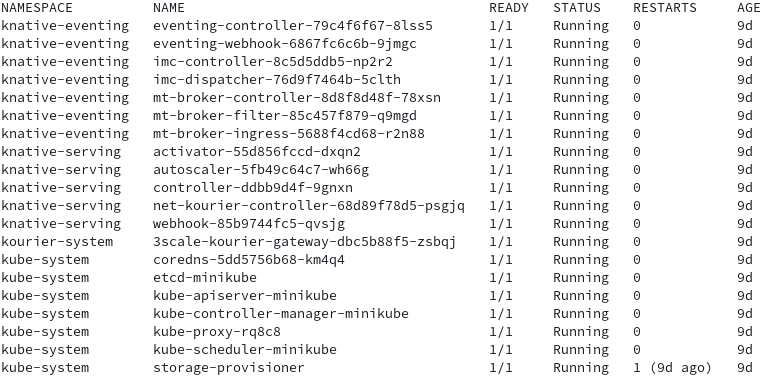
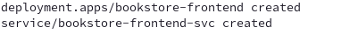
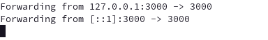
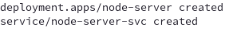
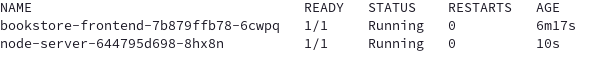
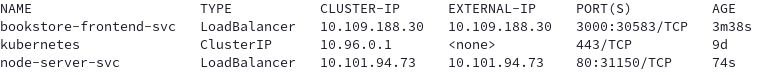

# Environment Setup


In this page, we will be discussing how to set up your environment, and make sure to run up the UI front end and the Book Review Service’s node server.

## **What does the final deliverable for this section look like?**

- You have a running Kubernetes (k8s) cluster on your local machine, with Knative installed.
- You have your front end application deployed as Kubernetes deployment with port-forwarding to localhost:3000
- You have your Node.js application deployed as Kubernetes deployment with port-forwarding to localhost:8080

We will be fulfilling each requirement with the order above.

## **File Structure**


The code for the sample app is in `docs/code-samples/eventing/bookstore-sample-app`

Under `bookstore-sample-app` folder, there are 2 folders:

* **/solution**: this folder contains all the yaml files, and the code you needed. Check it when you get stuck.

* **/start**: this folder contains the necessary files for you to get started. Write all the configuration files yourself following the tutorial!


!!! tip
    Kuack suggests you to start from **/start**, write all the configuration files as you go over the tutorial, and check solutions when you get stuck.

## **Shortcut**


Running `docs/code-samples/eventing/bookstore-sample-app/start/setup.sh` will automatically complete all tasks in this section.

!!! warning

    However, if you are not familiar with the process, we recommend reviewing the steps below.

## **Instructions**

### **Task 1: Set Up a Running Kubernetes Cluster with Knative Installed**


Please follow the instructions [here](https://knative.dev/docs/install/) to spin up your cluster with Knative installed!

???+ success "Verify"

    You should see the pods in the `knative-eventing` and `knative-serving` namespaces running before proceeding.

    

#### **Extra Step for Minikube Users:**


Attention! In case you're not using the Knative Quick Start, set up the tunnel manually to connect to services of type `LoadBalancer`:

Run the following command and keep the terminal open:

```shell
minikube tunnel
```

???+ success "Verify"
    If there aren't any error messages, it means you have set up the tunnel successfully.

### **Task 2: Running the Bookstore Web App**


The Next.js frontend app is located in the `docs/code-samples/eventing/bookstore-sample-app/start/frontend` folder.

Ensure that port 3000 on your local machine is not being used by another application.

#### **Deploy the Frontend App**

You can either [build the image locally](https://docs.docker.com/get-started/02_our_app/) or use our pre-built image. If you are using the pre-built image, you can proceed to the next step.

When ready, run the following command to deploy the frontend app:

```shell
kubectl apply -f code-samples/eventing/bookstore-sample-app/start/frontend/config/100-front-end-deployment.yaml
```

This will create the Deployment and expose it with a Service of type LoadBalancer to receive external traffic:



```shell
kubectl get pods
```

You will see that your front end pod is running.


#### **Port Forwarding (Optional under condition)**


You might need to set up port forwarding to access the app from your local machine.

Check if port forwarding is necessary by running:

```shell
kubectl get services -A
```


If the `EXTERNAL-IP` for your frontend service is `127.0.0.1`, port forwarding is not needed.

If port forwarding is required, open a new terminal and run:

```shell
kubectl port-forward svc/bookstore-frontend-svc 3000:3000
```



Don’t close the terminal when port-forwarding is established.

???+ success "Verify"

    Visit [http://localhost:3000](http://localhost:3000) in your browser. The UI page should appear!

    

### **Task 3: Running the Book Review Service**


The Node.js server is located in the `docs/code-samples/eventing/bookstore-sample-app/start/node-server` folder.

Ensure that port 8080 on your local machine is not being used by another application.

#### **Deploy the Book Review Service: Node.js Server**

You can either [build the image locally](https://docs.docker.com/get-started/02_our_app/) or use our pre-built image. If you are using the pre-built image, you can proceed to the next step.

When ready, run the following command to deploy the Node.js server:

```shell
kubectl apply -f config/100-deployment.yaml
```

This command will pull the image and deploy it to your cluster as a Deployment. It will also expose it as a LoadBalancer to receive external traffic.



```shell
kubectl get pods
```

You will see that your Node.js server (node-server) pod is running.



#### **Port Forwarding (optional under condition)**


You might need to set up port forwarding to access the app from your local machine.

Check if port forwarding is necessary by running:

```shell
kubectl get services -A
```



If the `EXTERNAL-IP` for your Node.js service is `127.0.0.1`, port forwarding is not needed.

If port forwarding is required, open a new terminal and run:

```shell
kubectl port-forward svc/node-server-svc 8080:80
```


Don’t close the terminal when port-forwarding is established.

???+ success "Verify"

    Visit [http://localhost:8080](http://localhost:8080) in your browser. The Node.js service should be up and running.

    And in your front end page, you should see the status turns green and say “Connected to node server”.

    

## **Troubleshooting**
If you encounter any issues during the setup process, refer to the troubleshooting section in the documentation or check the logs of your Kubernetes pods for more details.
???+ bug "Troubleshooting"

    To check the logs, use the following command:

    ```shell
    kubectl logs <pod-name>
    ```

    Replace `<pod-name>` with the name of the pod you want to check.

## **Next Step**


You have successfully set up the cluster with Knative installed, and running your front end app and node server. You are all set to start learning. Your journey begins from here.

[Go to Lesson 1 - Send Review Comment to Broker :fontawesome-solid-paper-plane:](../../bookstore/page-1/pg1-review-svc-1.md){ .md-button .md-button--primary }