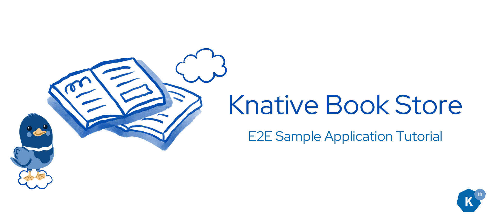
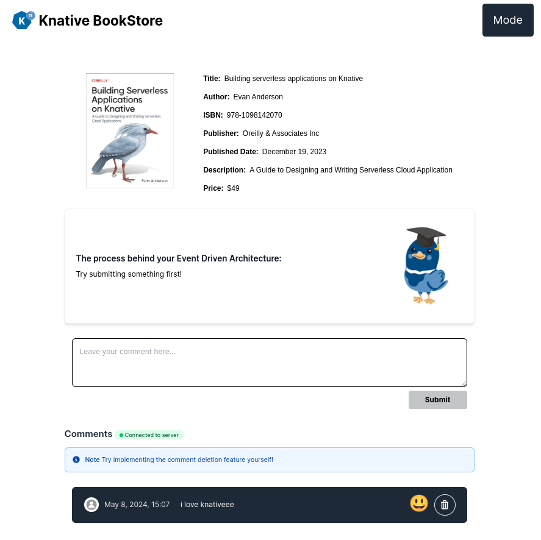
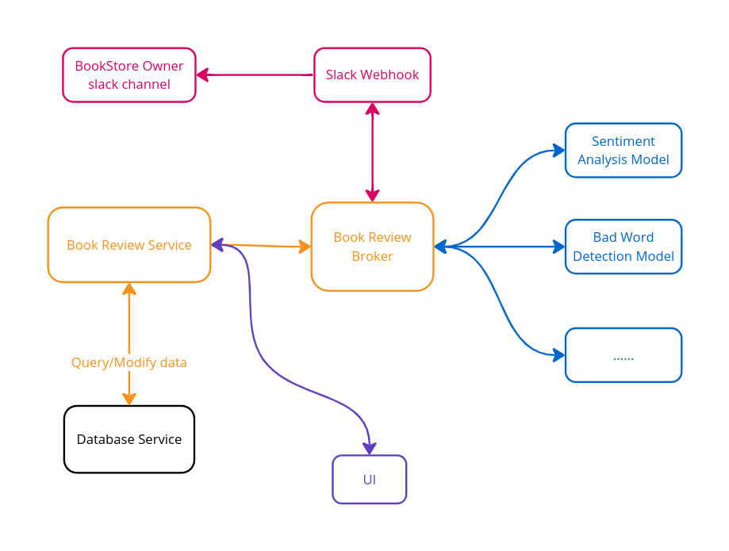
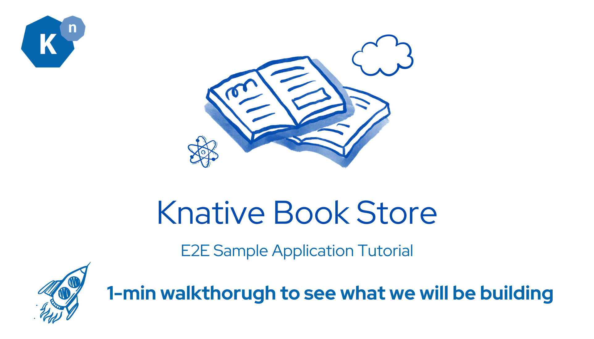
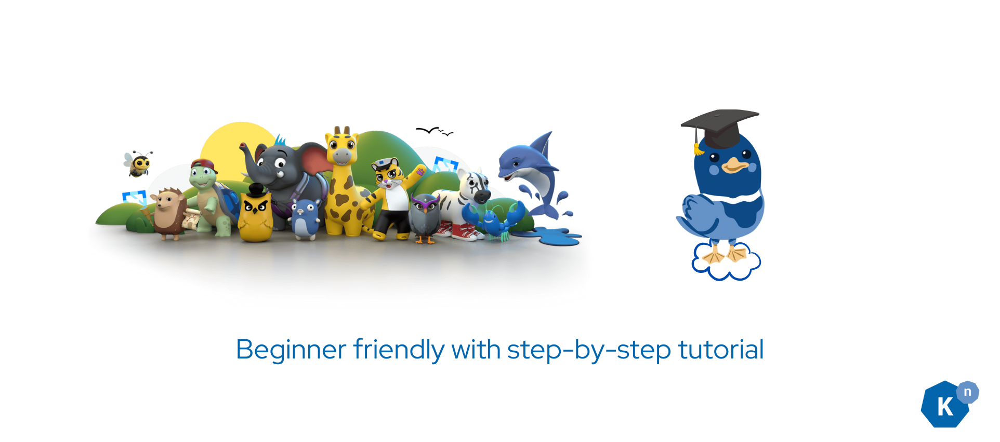
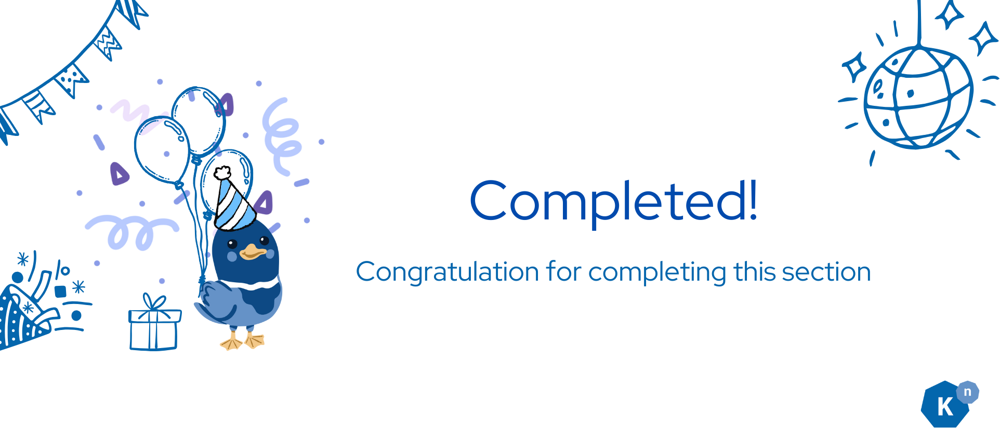

# Welcome: Knative Book Store Tutorial



**Welcome to Knative's End-to-End Sample Application Tutorial!**

- Are you completely new to Knative and unsure where to start?
- Are you considering converting your application to an event-driven architecture but don't know how?
- Are you curious to see what Knative can do in real life?
- Are you new to the cloud computing world and looking to get started with open source?


!!! success "You find the right place"

    If any of these resonate with you, you've found the perfect starting point.


In this tutorial, we will construct an online bookstore application. This interactive guide, suitable for beginners and experienced engineers alike, will take you through the steps of building, deploying, and monitoring an application using Knative's powerful features. For those familiar with the process, concise graphics are available to streamline your learning experience.

## **What are we building?**



Our App is an online bookstore that sells a single book. Customers can post comments about the book anonymously, with each comment displayed alongside an emoji reflecting the sentiment of the comment. Comments with inappropriate content are automatically filtered out, discarded, and logged in the backend.

As the bookstore owner, you'll receive notifications via Slack each time if a comment containing “bad word” is submitted.

## **Learning Goal**


You will learn Event-Driven Architecture (EDA) and how it contrasts with traditional application designs that use microservices and REST APIs. You'll learn:

- **The Fundamentals of EDA**: Explore the core principles of event-driven architecture and how it enhances responsiveness and scalability in applications.
- **Comparative Insights**: Understand the differences between EDA and traditional architectures, highlighting the benefits and use cases of each.
- **Practical Application**: Discover how to transition your existing applications to an event-driven model, utilizing the powerful features of Knative Eventing.


Knative is a powerful framework that operates on top of Kubernetes. This tutorial will guide you through:

- **Setting Up Your Cluster**: You'll start by spinning up your own Kubernetes cluster, which is the foundation for deploying and managing containers.
- **Exploring Knative**: Gain hands-on experience with key Knative concepts and components.
- **Some example use cases of Knative**.

By the end of this tutorial, you will not only understand these concepts but also feel comfortable implementing them, empowering you to build robust, scalable event-driven applications with Knative.

## **BookStore Architecture**



The bookstore application consists of a few components.

### User Interface

A frontend Next.js application that interacts with these services. It is a web page where users can select a book to view its details, ratings, and reviews.

### Database Service

An in-memory PostgreSQL instance on Kubernetes, storing all user comments.

### Book Reviews Service

A node.js web server that will perform the event forwarding, database operation, and handling the websocket connection.

### Notification Service

An Apache Camel-K pipe that connects our event-driven architecture with a third-party webhook: Slack. It receives the CloudEvent and sends it as a message to a Slack Workspace.

### ML Models Service

There are 2 Machine learning workflows that can conduct sentiment analysis on user’s review comment and hateful word sanity check. You will be using Knative Sequence to make sure they are executed in order.

### Book Store Broker

It acts as the central brain of our event-driven architecture. It connects all the microservices together, receives the event, and makes sure all the events are safely delivered to the correct destination.

### Bad Word Broker

It acts as the bridge between the book store broker and the slack sink, so we can send notification to your slack when a comment containing “bad word” is submitted.

## **Tutorial Page Structure**


From this flow chart, you can see what will be happening after the user clicks on the “Submit” button on the book store comment form.

We will be building the sample app in this order:

0. **Environment Setup**: Set up the environment for the tutorial. This includes installing the necessary tools and creating a Kubernetes cluster.

1. **Implement Book Review v1**: Pass reviews from the frontend to event-display via broker. This involves learning about Broker, SinkBinding, and CloudEvents event types.
   
2. **Deploy Sentiment Analysis Service**: Gain knowledge on deploying a sentiment analysis service using Knative Function.

3. **Deploy Bad Word Filter Service**: Learn how to deploy a bad word filter service using Knative Service and Sink.

4. **Use Sequence to Run ML Workflows**: Learn how to utilize Knative Sequence to ensure your machine learning workflows execute in order.

5. **Database Deployment**: Understand the deployment of an in-memory PostgreSQL instance using k8s deployment.

6. **Glue Everything Together**: Integrate all components by receiving "analyzed reviews" via Broker (using a trigger) and storing them into the database. This includes learning about Triggers, Filters, and Dead Letter Sinks (DLS).

7. **Connect with External Services/API**: Learn how to connect your application with external services and APIs using Knative Eventing and Apache Camel-K integration.

## **How to properly learn?**

### Preview the Final Bookstore: 1-Minute Demo Video

To help you visualize what you'll be creating, we've prepared a brief demo video. This two-minute preview showcases the final bookstore application, providing a clearer understanding of what you can expect to build.



[EditedV2 - Knative Bookstore Demo.mp4](https://drive.google.com/open?id=1nJGQOM9X1Wb5eKjdq-Iv-cQK97LYTscD&usp=drive_copy), Music used under [license](https://docs.google.com/document/d/125Wok7L5lzf1XnsM5HIM8SuZ1ty2NCbddKrEtM_Xebs/edit#heading=h.79x5qqa9u7gd)

<iframe src="https://drive.google.com/open?id=1nJGQOM9X1Wb5eKjdq-Iv-cQK97LYTscD&usp=drive_copy" style="border: 0" width="800" height="600" frameborder="0" scrolling="no"></iframe>

### Getting Started with the Setup Script


We recommend beginning by using our setup script to launch the bookstore application. This allows you to see what the final product will look like and gives you a chance to explore its features firsthand. Familiarizing yourself with the application upfront will make the learning process smoother and more intuitive. It is located at `solution/setup.sh`.

### Step-by-Step Guidance for Beginners



This tutorial is meticulously structured to be beginner-friendly, featuring detailed, step-by-step instructions for building the sample app. Simply follow the sequence we've laid out: each section builds upon the last, guiding you through the construction of the application. Should you encounter any hurdles, the Knative community is a fantastic resource for support. Don't hesitate to ask questions and seek advice there.

### Accelerated Learning Path for Advanced Users


If you find the tutorial too basic, or if it covers familiar territory, feel free to adjust your learning approach. Each section of the tutorial is accompanied by concise graphics that summarize key concepts. Advanced learners can choose to focus on these graphics to grasp the essentials faster, streamlining the learning experience without sacrificing depth or understanding.

## **Help**


Join the supportive Knative community via the Cloud Native Computing Foundation (CNCF) Slack, particularly the #knative channel. Before posting your questions, please search to see if they've already been answered. Your feedback on this tutorial is invaluable, so don't hesitate to reach out with suggestions or questions.

## **Next Step**


Clone the repo first
```sh
git clone https://github.com/knative/docs.git
```


!!! warning

    **IMPORTANT**: Please take some time to read the [Disclaimer](../disclaimer/README.md){:target="_blank"} before moving to the next page.



Let’s set up the environment first.

[Go to Environment Setup :fontawesome-solid-paper-plane:](../../bookstore/page-0.5/pg0.5-env-setup.md){ .md-button .md-button--primary }


