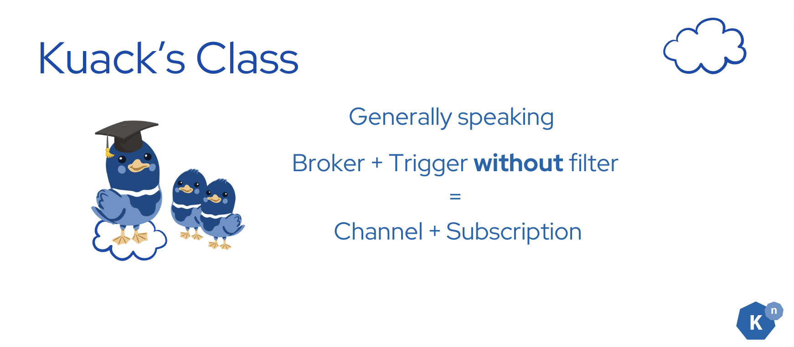

# Send Review Comment to Broker


The main dashboard of our bookstore features a comment section where readers can view comments from others and submit their own through a text input area. While the process appears straightforward - click a button, and the comment is posted - the underlying mechanism is powered by a robust event-driven architecture.

## **What Knative features will we learn about?**

- Knative Eventing Broker
- Knative Eventing Sink
- Knative SinkBinding

## **What does the deliverable look like?**


In simple words: after the user clicks on the submit button in the frontend, the comment will show up in the event-display service.

## **Implementation**

### **Step 0: Know the basics**


In the world of microservices and REST APIs, we often refer to requests as the primary method of communication between services. However, in an event-driven architecture, the smallest unit is an event. Knative Eventing adheres to the CloudEvents specification, making it essential to understand this concept before moving forward. Learn more about CloudEvents [here](https://cloudevents.io/){:target="_blank"} before proceeding!

### **Step 1: Understand Book Review Service**


The book review service is our Node.js API server, playing a crucial role in our event-driven architecture. It's essential to understand how it operates, as it receives events and processes them appropriately.


**Key Concepts: Broker and SinkBinding**

Before we dive into the code, let's clarify two important concepts:

- **Broker**: Acts as the central point in the event-driven architecture, routing events to the correct destinations.
- **SinkBinding**: This Knative Eventing component automatically injects the Broker's address into the environment variable `K_SINK`, ensuring that the Node.js server always has the correct address without manual updates.

You will get a deeper understanding along the way.


Let's examine the `node-server/index.js` file, starting with the `/add` function. When a user submits a comment through the frontend, it is first received by this endpoint.

```javascript
app.post('/add', async (req, res) => {
  try {
    const receivedEvent = HTTP.toEvent({headers: req.headers, body: req.body});
    const brokerURI = process.env.K_SINK;

    if (receivedEvent.type === 'new-review-comment') {
      const response = await fetch(brokerURI, {
        method: 'POST',
        headers: {
          'Content-Type': 'application/cloudevents+json',
          'ce-specversion': receivedEvent.specversion,
          'ce-type': receivedEvent.type,
          'ce-source': receivedEvent.source,
          'ce-id': receivedEvent.id,
        },
        body: JSON.stringify(receivedEvent.data),
      });
    }
  } catch (err) {
    console.error(err);
  }
});
```

**Receiving Events**: The `/add` endpoint receives events from the frontend. It uses CloudEvents' SDK to convert the incoming request into a CloudEvent object:

```javascript
const receivedEvent = HTTP.toEvent({headers: req.headers, body: req.body});
```

**Determining Broker Address**: The Broker's address is dynamically assigned in the cluster. The Node.js server retrieves this address from the environment variable `K_SINK`:

```javascript
const brokerURI = process.env.K_SINK;
```

You may wonder who told the environment variable about the address? That’s Knative SinkBinding.

**Event Filtering**: The service checks the event type. If it's a `new-review-comment`, it forwards the event to the Broker:

```javascript
if (receivedEvent.type === 'new-review-comment') {
  // logic that forwards the event, see below
}
```

**Forwarding Events Logic**: The event is forwarded to the Broker with the appropriate CloudEvent headers:

```javascript
const response = await fetch(brokerURI, {
  method: 'POST',
  headers: {
    'Content-Type': 'application/cloudevents+json',
    'ce-specversion': receivedEvent.specversion,
    'ce-type': receivedEvent.type,
    'ce-source': receivedEvent.source,
    'ce-id': receivedEvent.id,
  },
  body: JSON.stringify(receivedEvent.data),
});
```


**Exploring Other Functions**

The Node.js server contains other functions that follow a similar pattern, with detailed comments explaining their functionality:

- `/insert`: Receives CloudEvents and inserts the payload into the PostgreSQL database.
- `/comment`: Creates a WebSocket connection with the frontend to transport comments from the database.

### **Step 2: Create Broker**


The Broker acts as a router in your event-driven application, receiving events and routing them to the correct destination.


- 1: Create a new YAML file named `node-server/config/200-broker.yaml` and add the following content:

???+ abstract "_node-server/config/200-broker.yaml_"
    ```yaml
    apiVersion: eventing.knative.dev/v1
    kind: Broker
    metadata:
        name: bookstore-broker
    ```

- 2: Apply the YAML file:

```bash
kubectl apply -f node-server/config/200-broker.yaml
```

You will see the following output:
```
broker.eventing.knative.dev/bookstore-broker created
```

Alternatively, use the [Knative CLI `kn`](https://knative.dev/docs/client/#kn){:target="_blank"} to create the Broker:

```bash
kn broker create bookstore-broker
```

You will see the following output:
```
Broker 'bookstore-broker' successfully created in namespace 'default'.
```

???+ success "Verify"
    Running the following command to list the Brokers:
    ```bash
    kubectl get brokers
    ```

    
    You should see the Broker `bookstore-broker` with `READY` status as `True`.

    ```
    NAME               URL                                                                                 AGE     READY   REASON
    bookstore-broker   http://broker-ingress.knative-eventing.svc.cluster.local/default/bookstore-broker   7m30s   True    
    ```


???+ bug "Troubleshooting"

    If there are issues, use the following command to diagnose:

    ```bash
    kubectl describe broker bookstore-broker
    ```

### **Step 3: Create a SinkBinding between the Node.js server and Broker**


Hardcoding URLs to connect with Kubernetes services in your application can be limiting and inflexible. A SinkBinding dynamically injects the URL of the Kubernetes service into your application.

Learn more about SinkBinding [here](https://knative.dev/docs/eventing/custom-event-source/sinkbinding/){:target="_blank"} and the [spec schema](https://knative.dev/docs/eventing/custom-event-source/sinkbinding/reference/){:target="_blank"}!

**Create a SinkBinding:**

- 1: Create a new YAML file named `300-sinkbinding.yaml` in the `node-server/config` folder and add the following content:

???+ abstract "_node-server/config/300-sinkbinding.yaml_"
    ```yaml
    apiVersion: sources.knative.dev/v1
    kind: SinkBinding
    metadata:
      name: node-sinkbinding
    spec:
      subject:
        apiVersion: apps/v1
        kind: Deployment
        selector:
          matchLabels:
            app: node-server
      sink: # In this case, the sink is our Broker, which is the eventing service that will receive the events
        ref:
          apiVersion: eventing.knative.dev/v1
          kind: Broker
          name: bookstore-broker

    ```

- 2: Apply the YAML file:

```bash
kubectl apply -f node-server/config/300-sinkbinding.yaml
```

You will see the following output:
```
sinkbinding.sources.knative.dev/node-sinkbinding created
```

???+ success "Verify"
    Running the following command to list the sinkbindings:
    ```bash
    kubectl get sinkbindings

    ```
    You should see the sinkbinding `node-sinkbinding` with `READY` status as `True`.

    ```
    NAME               SINK                                                                                AGE     READY   REASON
    node-sinkbinding   http://broker-ingress.knative-eventing.svc.cluster.local/default/bookstore-broker   2m43s   True    

    ```
    

### **Step 4: Create event-display service**


Event display is a debugging tool in Knative Eventing that allows you to use it as a temporary destination (a.k.a sink) for your event to go.

**Create an Event Display Service:**

- 1: Create a new YAML file named `100-event-display.yaml` in the `node-server/config` folder and add the following content:

???+ abstract "_node-server/config/100-event-display.yaml_"

    ```yaml
    apiVersion: apps/v1
    kind: Deployment
    metadata:
      name: event-display
    spec:
      replicas: 1
      selector:
        matchLabels:
          app: event-display
      template:
        metadata:
          labels:
            app: event-display
        spec:
          containers:
            - name: event-display
              image: gcr.io/knative-releases/knative.dev/eventing-contrib/cmd/event_display
              ports:
                - containerPort: 8080
    
    ---
    apiVersion: v1
    kind: Service
    metadata:
      name: event-display
    spec:
      selector:
        app: event-display
      ports:
        - protocol: TCP
          port: 80
          targetPort: 8080
      type: ClusterIP

    ```

- 2: Apply the YAML file:

```bash
kubectl apply -f node-server/config/100-event-display.yaml
```

You will see the following output:
```
deployment.apps/event-display created
service/event-display created
```

???+ success "Verify"
    Running the following command to list the pods:
    ```bash
    kubectl get pods
    ```

    You should see the pod `event-display-XXXXXXX-XXXXX` in "Running" status.
    
    ```
    NAME                                  READY   STATUS    RESTARTS   AGE
    bookstore-frontend-7b879ffb78-9bln6   1/1     Running   0          91m
    event-display-55967c745d-bxrgh        1/1     Running   0          4m44s
    node-server-644795d698-r9zlr          1/1     Running   0          4m43s
    ```


### **Step 5: Create a Trigger that connects the Broker and event display**


A Trigger is able to forward the event to the correct destination based on the [CloudEvent's attributes](https://knative.dev/docs/eventing/#:~:text=Knative%20Eventing%20uses%20standard%20HTTP%20POST%20requests%20to%20send%20and%20receive%20events%20between%20event%20producers%20and%20sinks.%20These%20events%20conform%20to%20the%20CloudEvents%20specifications%2C%20which%20enables%20creating%2C%20parsing%2C%20sending%2C%20and%20receiving%20events%20in%20any%20programming%20language.){:target="_blank"}. It is the connector between the Broker and the event destination.

A Filter in the Trigger will **filter the events based on the filter condition**. You will specify your filter condition in the Trigger’s YAML file. **If no filter is specified, the Trigger will forward all the events that the Broker received.**



There is also a concept called [Channel](https://knative.dev/docs/eventing/channels/){:target="_blank"} in Knative, and generally speaking, you can treat Broker & Trigger without filter the same as Channel & Subscription.

Learn more about Broker & Trigger [here](https://knative.dev/docs/eventing/brokers/){:target="_blank"}!

**Create a Trigger:**


Here we are creating a Trigger that will send all the events to event-display.


- 1: Create a new YAML file named `200-log-trigger.yaml` and add the following content:

???+ abstract "_node-server/config/200-log-trigger.yaml_"
    ```yaml 
    # This Trigger subscribes to the Broker and will forward all the events that it received to event-display.
    apiVersion: eventing.knative.dev/v1
    kind: Trigger
    metadata:
      name: log-trigger
    spec:
      broker: bookstore-broker
      subscriber:
        ref:
          apiVersion: v1
          kind: Service
          name: event-display
    ```

- 2: Apply the YAML file:

```bash
kubectl apply -f node-server/config/200-log-trigger.yaml
```

You will see the following output:
```
trigger.eventing.knative.dev/log-trigger created
```

???+ success "Verify"
    Running the following command to list the Triggers:
    ```bash
    kubectl get triggers
    ```
    The Trigger `log-trigger` should have `READY` status as `True`.

    
    ```
    NAME                BROKER             SUBSCRIBER_URI                                                       AGE     READY   REASON
    log-trigger         bookstore-broker   http://event-display.default.svc.cluster.local                       6m2s    True    
    ```


### **Validate**


Open the logs of the event-display with the following command:

```bash
kubectl logs -l=app=event-display -f
```

???+ success "Verify"
    Type something in the comment box in the UI and click the submit button. The comment should appear in the event-display service with the following output:

    ```plaintext
    ☁️  cloudevents.Event
    Validation: valid
    Context Attributes,
    specversion: 1.0
    type: new-review-comment
    source: bookstore-eda
    id: unique-comment-id
    datacontenttype: application/json
    Extensions,
    knativearrivaltime: 2024-05-19T05:27:36.232562628Z
    Data,
    {
        "reviewText": "test"
    }
    ```

### **Next Step**


Please make sure you pass the Validate test before proceeding. 

[Go to Deploy ML workflow: Sentiment Analysis :fontawesome-solid-paper-plane:](../page-2/sentiment-analysis-service-for-bookstore-reviews.md){ .md-button .md-button--primary }
