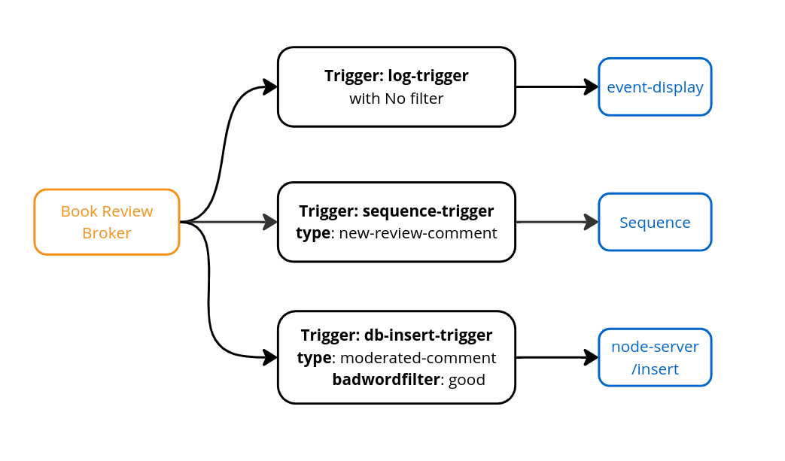
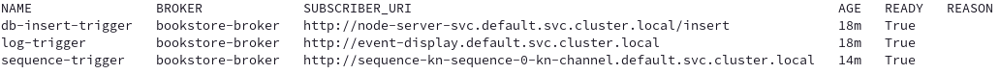

# **6 - Advanced Event Filtering**


## **What Knative features will we learn about?**

- Trigger and broker
- How Knative magically connects everything together

## **What does the final deliverable look like?**


- The "analyzed reviews" will be sent back to Broker (using a trigger) and they will be stored into a database.
- The comments that don’t contain bad words will show up in the UI, and the sentiment will be displayed as emoji.

## **Implementation**

### **Step 1: Create the trigger for database insertion**


Append the following Trigger configuration to the existing `200-broker.yaml` file in `node-server/config/200-broker.yaml` and then apply:

???+ abstract "Append to _node-server/config/200-broker.yaml_"
    ```yaml
    ---
    apiVersion: eventing.knative.dev/v1
    kind: Trigger
    metadata:
      name: db-insert-trigger
    spec:
      broker: bookstore-broker
      filter:
        # The Trigger will send events with the type `moderated-comment` and badwordfilter `good`
        attributes:
          type: moderated-comment
          badwordfilter: good
      subscriber:
        ref:
          apiVersion: v1
          kind: Service
          name: node-server-svc
        uri: /insert
    ```
After applying the configuration, you should see


So far, the triggers in your cluster should look like the following:



???+ success "Verify"
    Run the following command to check if the trigger is created successfully:

    ```shell
    kubectl get triggers
    ```

    You should see the trigger with the ready state as `True`.
    

## **Verification**


Now, it's magic time. Everything is connected automatically. Try interacting with the UI!

- **Normal Comments**: When you send a normal comment without any “bad word”, it will be displayed properly in the comment area.
- **“Bad Word” Comments**: Comments containing offensive or hateful speech will be filtered out and eventually it will be redirected to slack (we will cover in the next section).

Simple, isn't it? That's why Knative Eventing is so helpful! You only need to focus on developing each component, while Knative Eventing handles the connections and communication between services. Each service can focus on its responsibilities without worrying about message delivery.

## **Next Step**


You've built your event-driven architecture. Now it's time to connect it to external services to further enhance your bookstore application. In the next section, we will enable the bookstore to send notifications to your Slack workspace!

[Go to Connect Slack with Camel-K :fontawesome-solid-paper-plane:](../page-7/pg7-slack-camel.md){ .md-button .md-button--primary }