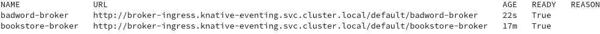
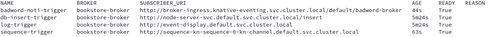

# **7 - Slack sink - Learning Knative Eventing & camel-K integration**


As a bookstore owner, you aim to receive instant notifications in a Slack channel whenever a customer submits a new review comment. By leveraging Knative Eventing and Apache Camel K, you can set up an event-driven service that automates these notifications, ensuring you're always informed.

## **What Knative features will we learn about?**

- Knative's ability to connect with third-party services, such as Slack, through event-driven integration using **Apache Camel K**.

## **What does the final deliverable look like?**

When a CloudEvent with the type `moderated-comment` and with `ce-bad-word-filter` set to “bad” is sent, it triggers a message to be sent in a designated Slack channel.

## **Install prerequisites**

### **Prerequisite 1: Install Camel CLI**


Install the Camel K CLI (`kamel`) on your local machine. You can find the installation instructions [here](https://www.google.com/url?q=https://camel.apache.org/camel-k/2.2.x/cli/cli.html&sa=D&source=editors&ust=1717684414711115&usg=AOvVaw2z9c0xz6C8MOQMvTaCPoyi).

Troubleshoot: If after installation you run `kamel version` and you get an error message, you may need to add the `kamel` binary to your system's PATH. You can do this by moving the `kamel` binary to a directory that is already in your PATH, or by adding the directory where `kamel` is located to your PATH.

```sh
$ export PATH=$PATH:<path-to-kamel-binary>
```

### **Prerequisite 2: Install Apache Camel-Kamelets**


Next, install Camel K on your cluster using the Camel K CLI:

```sh
$ kamel install --registry docker.io --organization <your-organization> --registry-auth-username <your-username> --registry-auth-password <your-password>
```

Replace the placeholders with your actual Docker registry information.

If you are using other container registries, you may need to read more [here](https://www.google.com/url?q=https://camel.apache.org/camel-k/2.2.x/installation/registry/registry.html&sa=D&source=editors&ust=1717684414712113&usg=AOvVaw1PCILfYDdduhvghZDOvWTE) for the installation.

You will see this message if the installation is successful:

```sh
📦 OLM is not available in the cluster. Fallback to regular installation.
🐪 Camel K installed in namespace default
```

### **Prerequisite 3: Create a Slack App and Generate an Incoming Webhook URL**


Follow the instructions [here](https://www.google.com/url?q=https://docs.google.com/document/d/1-5F8iwN5KmFkoRMGhc1M4LBDn-GLKfLDs05T6Z1U4BA/edit#heading=h.p9jilchkpfrw&sa=D&source=editors&ust=1717684414713414&usg=AOvVaw3IQZWlRDZxEltTOyrSne0r) on how to create the Slack workspace and generate an incoming webhook URL for your designated channel where notifications will be sent.

### **Prerequisite 4: Create a Secret that stores your slack credentials**


We are storing the webhook URL as a secret. Copy and paste your webhook URL into the file `application.properties` and then run the following command to create the secret:

```sh
kubectl create secret generic slack-credentials --from-file=application.properties
```

And make sure you create a secret in your cluster to store the value of the webhook URI.

## **Implementation**

### **Step 0: Learn about Pipe**


We use a feature called ["Pipe"](https://www.google.com/url?q=https://camel.apache.org/camel-k/2.3.x/apis/camel-k.html#_camel_apache_org_v1_Pipe&sa=D&source=editors&ust=1717684414714310&usg=AOvVaw3f5rvgKOHyBJtWKngf4goO) (a.k.a [KameletBinding](https://www.google.com/url?q=https://github.com/apache/camel-k/issues/2625&sa=D&source=editors&ust=1717684414714482&usg=AOvVaw2RO7o2ynykKuu6sTPwCPDO)) in Camel K to link event sources and destinations. Specifically, the Pipe connects events from our Broker, our source, to the Slack channel through a Slack sink [Kamelet](https://www.google.com/url?q=https://camel.apache.org/camel-k/2.3.x/kamelets/kamelets.html&sa=D&source=editors&ust=1717684414714656&usg=AOvVaw1vk5No9foZ4o3B6Mu7vCiJ), our destination.


From the sample YAML below, you can see we are telling the pipe to filter on the events that have type “moderated-comment”. Pipe will create a trigger under the hood and route your event to slack-sink.

```yaml
apiVersion: camel.apache.org/v1
kind: Pipe
metadata:
  name: pipe
spec:
  source:
    ref:
      kind: Broker
      apiVersion: eventing.knative.dev/v1
      name: badword-broker
    properties:
      type: moderated-comment
  sink:
    ...
```

If you hope to learn more about it, check out the article [here](https://www.google.com/url?q=https://knative.dev/blog/articles/knative-meets-apache-camel/&sa=D&source=editors&ust=1717684414716125&usg=AOvVaw3SQJgoo52ZLCUpYLHnmeNC)!

### **Step 1: Create the Broker that can route “bad word” comments to Slack**


In the current implementation using Apache Camel K, we **can only filter based on the CloudEvent's type**, such as moderated-comment. Filtering based on event extensions, such as `badwordfilter: good`, is not yet supported. This feature will be available in a future update of Apache Camel K. But we can still use an alternative way to achieve this!


Here, we will be connecting `book-review-broker` with a new broker called `badword-broker`. And we will be creating a trigger that helps us perform the filtering with the extension `badwordfilter: good`.

1. Append the following content to your `node-server/config/200-broker.yaml`:

    ```yaml
    ---
    apiVersion: eventing.knative.dev/v1
    kind: Broker
    metadata:
      name: badword-broker
    ```

2. Apply the YAML file:

    ```sh
    kubectl apply -f 200-broker.yaml
    ```


Alternatively, use the [Knative CLI `kn`](https://knative.dev/docs/client/#kn) to create the broker:

```sh
kn broker create badword-broker
```


**Verify:**

```sh
kubectl get brokers
```



**Troubleshooting:**

If there are issues, use the following command to diagnose:

```sh
kubectl describe broker badword-broker
```

### **Step 2: Create trigger that filters for bad word comments to badword-broker**


We are creating the trigger to process the events that have type moderated-comment, and the extension `badwordfilter: bad` and route them to badword-broker.

**Create a Trigger:**


1. Create a new YAML file named `node-server/config/badword-noti-trigger.yaml` and add the following content:

    ```yaml
    ---
    apiVersion: eventing.knative.dev/v1
    kind: Trigger
    metadata:
      name: badword-noti-trigger
    spec:
      broker: bookstore-broker
      filter:
        attributes: # Trigger will filter events based on BOTH the type and badwordfilter attribute
          type: moderated-comment # This is the filter that will be applied to the event, only events with the ce-type moderated-comment will be processed
          badwordfilter: bad # This is the filter that will be applied to the event, only events with the ce-extension badwordfilter: bad will be processed
      subscriber:
        ref:
          apiVersion: eventing.knative.dev/v1
          kind: Broker
          name: badword-broker
    ```

2. Apply the YAML file:

    ```sh
    kubectl apply -f badword-noti-trigger.yaml
    ```


**Verify:**

```sh
kubectl get triggers
```

The trigger `badword-noti-trigger` should have `READY` status as `True`.



### **Step 3: Build the Pipe**


