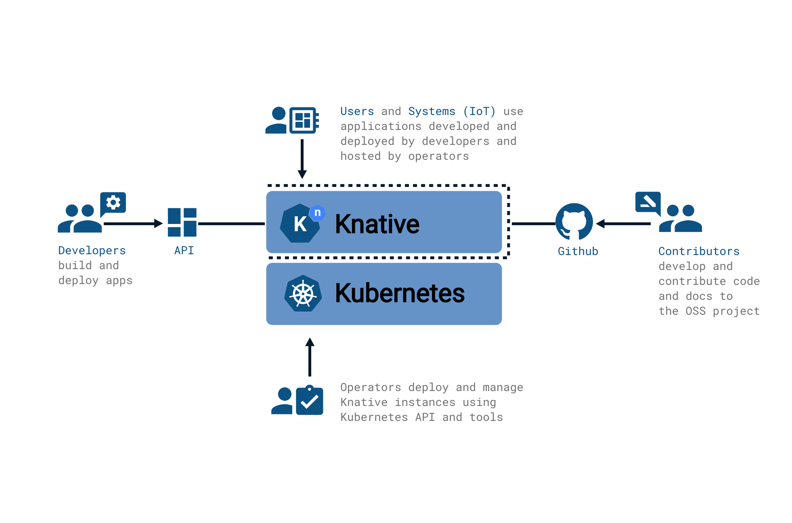

# How to Get Involved

<!-- TODO: what is community, what are the touchpoints -->

The Knative community consists of three different audiences:

* **Developers** write serverless and event-driven applications using the
  constructs surfaced by Knative.  They build containers and applications which
  leverage the concepts exposed by Knative to deliver services to end users and
  systems.

* **Operators** build and maintain Kubernetes platforms where Knative is
  installed.  They also manage the default settings for Knative on those
  clusters.

* [**Contributors**](./contributing.md) are the authors of the Knative
  components; they contribute and review source code, run the community
  meetings, document and publicize the project, and otherwise keep the project
  running.

Knative components are intended to operate well stand-alone, or integrated into
a larger platform offering by either an internal systems team or a cloud
provider.  You can see a [list of organizations that have adopted Knative in our
community repo](https://github.com/knative/community/tree/main/ADOPTERS.MD).

## Questions

For the fastest response, you can ask questions on the [`#knative`, `#knative-serving`,
`#knative-eventing`, or `#knative-functions` channels of the CNCF
Slack](https://slack.cncf.io/).

We also have a [Stack Overflow topic,
`knative`](https://stackoverflow.com/questions/tagged/knative) (as well as
`knative-serving`, `knative-eventing`, and `knative-functions`), and the
[knative-users](https://groups.google.com/forum/#!forum/knative-users) mailing
list if you prefer those formats.

## Bug Reports and Feature Requests

Knative is composed of many different components. We use GitHub Issues to track
bug reports and feature requests. While it's most helpful if you know the
specific component that the bug is happening in, we understand that it can be
difficult to tell sometimes. A clear bug report in the wrong component is much
better than a partial report in the right component, so feel free to file your issue in one of these three main repositories if you're not sure:

* [Serving](https://github.com/knative/serving/issues/new?template=bug-report.md)
* [Eventing](https://github.com/knative/eventing/issues/new?template=bug.md)
* [Functions](https://github.com/knative/func/issues/new)

A good bug report should include:

- What you were trying to do, and what happened
- What version of Knative and Kubernetes you are using (if using a cloud provider, indicate which one)
- Relevant resource yaml, HTTP requests, or log lines

## Community Meetups

This virtual event is designed for end users, a space for our community to meet,
get to know each other, and learn about uses and applications of Knative.

Catch up with past community meetups on our [YouTube channel](https://www.youtube.com/playlist?list=PLQjzPfIiEQLLyCyLBKLlwDLfE_A-P7nyg).

Stay tuned for new events by subscribing to the
[calendar](https://calendar.google.com/calendar/embed?src=knative.team_9q83bg07qs5b9rrslp5jor4l6s%40group.calendar.google.com&ctz=America%2FLos_Angeles) ([iCal export file](https://calendar.google.com/calendar/ical/knative.team_9q83bg07qs5b9rrslp5jor4l6s%40group.calendar.google.com/public/basic.ics))
and following us on [Twitter](https://twitter.com/KnativeProject).

## Communication Channels

Much of the community meets on [the CNCF Slack](https://slack.cncf.io/), using the following channels:

* [#knative](https://cloud-native.slack.com/archives/C04LGHDR9K7): General discussion about Knative usage

* [#knative-client](https://cloud-native.slack.com/archives/C04LY4SKBQR): Discussion about the Knative CLI client `kn`

* [#knative-conformance](https://cloud-native.slack.com/archives/C04LKFZ1UFL): Knative API standardization

* [#knative-contributors](https://cloud-native.slack.com/archives/C04LN0620E8): General discussion channel for folks contributing to the Knative project in any capacity

* [#knative-documentation](https://cloud-native.slack.com/archives/C04LY5G9ED7): Knative documentation and website user experience

* [#knative-eventing](https://cloud-native.slack.com/archives/C04LMU33V1S): Discussion for Knative Eventing

* [#knative-functions](https://cloud-native.slack.com/archives/C04LKEZUXEE): Discussion for Knative Functions

* [#knative-productivity](https://cloud-native.slack.com/archives/C04LY4M2G49): Discussion around Knative integration with test infrastructure, Prow and other tooling on GitHub

* [#knative-release](https://cloud-native.slack.com/archives/C04LY4Y3EHF): Coordinating and managing Knative releases

* [#knative-security](https://cloud-native.slack.com/archives/C04LGJ0D5FF): Discussion area for security issues affecting Knative components

* [#knative-serving](https://cloud-native.slack.com/archives/C04LMU0AX60): Discussion area for Knative Serving and related areas (networking / autoscaling)

We also have user
([`knative-users@googlegroups.com`](https://groups.google.com/forum/#!forum/knative-users))
and developer
([`knative-dev@googlegroups.com`](https://groups.google.com/forum/#!forum/knative-dev))
mailing lists for discussions, and for access to documents in the shared Google
Drive. Access to `knative-users@` is automatically approved; access to
`knative-dev@` is handled via a lightweight approval process -- it helps if you
provide a one-sentence description when requesting access.

We also use GitHub Issues and [GitHub
projects](https://github.com/orgs/knative/projects) for tracking longer-term
efforts, including each working group's roadmap, and the backlog for oversight
committees like the Technical Oversight Committee and the Steering Committee.

Feature design is generally done via Google Docs stored in a [shared Google
Drive](https://drive.google.com/drive/folders/0AM-QGZJ-HUA8Uk9PVA). Due to
limitations of shared drives, the default access control is that all documents
are *readable* by `knative-users@` and *commentable* and *editable* by
`knative-dev@`. Documents generally cannot be deleted without special
intervention.

## Meetings

Knative schedules all meetings on a [shared Google
calendar](https://calendar.google.com/calendar/embed?src=knative.team_9q83bg07qs5b9rrslp5jor4l6s%40group.calendar.google.com). Working
group leads and TOC/Steering members should have permissions to add events,
including one-off events for coordination if needed.

<iframe src="https://calendar.google.com/calendar/embed?src=knative.team_9q83bg07qs5b9rrslp5jor4l6s%40group.calendar.google.com" style="border: 0" width="800" height="600" frameborder="0" scrolling="no"></iframe>

If you're using Google Calendar, the above should work. If you're using some
other system (Apple Calendar or Outlook, for example), [here is an iCal export
of the community
calendar](https://calendar.google.com/calendar/ical/knative.team_9q83bg07qs5b9rrslp5jor4l6s%40group.calendar.google.com/public/basic.ics).

- [Follow these directions to import into Outlook Web](https://support.office.com/en-us/article/import-or-subscribe-to-a-calendar-in-outlook-on-the-web-503ffaf6-7b86-44fe-8dd6-8099d95f38df)
- [Follow these directions for desktop Outlook](https://support.office.com/en-us/article/See-your-Google-Calendar-in-Outlook-C1DAB514-0AD4-4811-824A-7D02C5E77126)
- [Follow the import directions to import into Apple Calendar](https://support.apple.com/guide/calendar/import-or-export-calendars-icl1023/mac)

## Getting More Involved as a Contributor

If you're interested in becoming a Knative contributor, you'll want to check out
our [contributor page](./contributing.md).  **Contributing is not an
expectation** -- everyone who uses Knative, talks about it, lurks on a mailing
list, or engages with the ideas is part of our community!  If you _do_ want to
get more deeply involved, you'll find that contributing to open source can be a
great career booster.

## Governance

Knative is part of the CNCF, and is governed by those rules, including the CNCF
Code of Conduct. Beyond that, we have a [page about our governance
rules](./governance.md).

## Code of Conduct

Knative follows the [CNCF Code of
Conduct](https://github.com/cncf/foundation/blob/master/code-of-conduct.md).
Reports of code of conduct violations may be sent to
code-of-conduct@knative.team or conduct@cncf.io.
