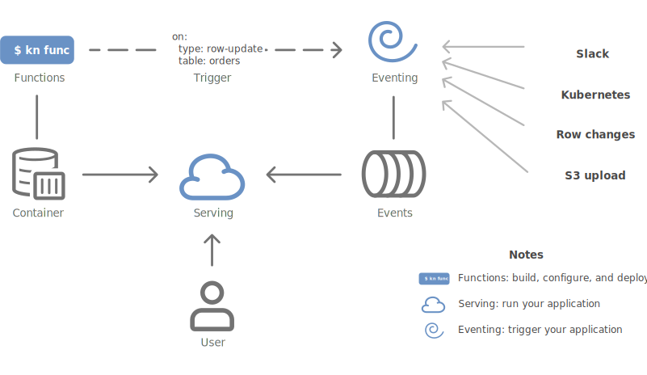

# Knative Technical Overview

This comprehensive overview explains what Knative is, what problems it solves, and how its components work together. Whether you're evaluating Knative for your use case or need background information to understand the rest of the documentation, this section provides the conceptual foundation you need.

## What is Knative?

Knative is a Kubernetes-based platform that provides a complete set of middleware components for building, deploying, and managing modern [serverless](https://en.wikipedia.org/wiki/Serverless_computing){target=_blank} workloads. Knative extends Kubernetes to provide higher-level abstractions that simplify the development and operation of cloud-native applications.

### Problems Knative Solves

Knative addresses several key challenges in modern application development and deployment:

**Application Deployment Complexity**: Traditional Kubernetes requires deep knowledge of pods, services, deployments, and ingress resources. These constructs provide a lot of flexibility and complexity that most applications don't need. Knative provides simpler abstractions that handle these details automatically.

**Serverless Operations**: Manual scaling, cold starts, and traffic routing are complex to implement. Knative provides automatic scaling from zero to thousands of instances, intelligent traffic routing, and efficient resource utilization.

**Event-Driven Architecture**: Building reliable event-driven systems requires complex infrastructure for event ingestion, routing, and delivery. Building event routing and delivery into your application limits your choice of event delivery and architecture; Knative provides standardized event processing capabilities across multiple event implementations using CloudEvents for delivery and Kubernetes for configuration.

**Developer Experience**: Moving from code to running applications involves multiple steps and tools. Knative Functions provide a streamlined and standardized developer experience for building and deploying stateless functions as standard containers. Build and test locally without Kubernetes, and avoid managing build details like Dockerfiles and Kubernetes resources until you need them.

**Platform Lock-in**: Cloud-specific serverless solutions create vendor lock-in. Knative runs on any Kubernetes cluster, providing portability across cloud providers and on-premises environments.

## Background Knowledge

While you didn't need any specific programming experience to get started with Knative, you'll pick up the following concepts along the way.  Knative will manage a lot of these in the background, so you can dive in deep when you're ready to learn.

- **Basic Kubernetes knowledge**: Understanding of pods, services, and deployments
- **Container concepts**: How to build and manage container images
- **HTTP/REST APIs**: Understanding of web service fundamentals
- **Basic YAML**: Ability to read and write Kubernetes resource definitions

For event-driven features, familiarity with:
- **Event-driven patterns**: Basic understanding of producers, consumers, and message routing
- **CloudEvents specification**: Helpful but not required (Knative handles the details)

## Architecture Overview

Knative consists of three main components that work together to provide a complete serverless platform:

{draggable=false}

**Knative Serving**: An HTTP-triggered autoscaling container runtime that manages the complete lifecycle of stateless HTTP services, including deployment, routing, and automatic scaling.

**Knative Eventing**: A CloudEvents-over-HTTP asynchronous routing layer that provides infrastructure for consuming and producing events, enabling loose coupling between event producers and consumers.

**Knative Functions**: A developer-focused function framework that leverages Serving and Eventing components to provide a simplified experience for building and deploying stateless functions.

These components can be used independently or together, allowing you to adopt Knative incrementally based on your needs.

## Knative Serving

--8<-- "about-serving.md"

### Key Serving Features

**Automatic Scaling**: Services automatically scale from zero to handle incoming traffic and scale back down when idle, optimizing resource usage and costs.

**Traffic Management**: Built-in support for blue-green deployments, canary releases, and traffic splitting between different revisions of your application.

**Networking**: Automatic ingress configuration with support for custom domains, TLS termination, and integration with service mesh technologies.

**Kubernetes Native**: Knative builds on the Kubernetes Pod abstraction, making it easy to access functionality like service accounts, accelerator access, and container sandboxing.

**Configuration Management**: Clean separation between application code and configuration, following twelve-factor app principles.

### Request Flow in Serving

{draggable=false}

When a request is made to a Knative Service:

1. **Ingress Layer**: The request enters through the configured networking layer (Kourier, Istio, or Contour)
2. **Routing Decision**: Based on current traffic patterns and scaling state, requests are routed either to the Activator or directly to application pods
3. **Scaling**: If no pods are running (scale-to-zero), the Activator queues the request and signals the Autoscaler to create pods
4. **Queue-Proxy**: All requests pass through the Queue-Proxy sidecar, which enforces concurrency limits and collects metrics
5. **Application**: The request reaches your application container

For detailed information, see the [request flow documentation](../serving/request-flow.md).

### GPU Resources and LLM Inference

Knative Serving can leverage Kubernetes pod capabilities to access specialized hardware resources like GPUs, making it an excellent platform for AI/ML inference workloads:

**GPU Resource Access**: Since Knative Services are implemented as Kubernetes pods, you can request GPU resources using standard Kubernetes resource specifications. This enables running inference models that require GPU acceleration while benefiting from Knative's automatic scaling and traffic management.

**LLM Inference Support**: Knative Serving provides an ideal foundation for Large Language Model (LLM) inference services, offering:

- **Automatic scaling** from zero to multiple GPU-enabled pods based on request demand
- **Traffic splitting** for A/B testing different model versions or configurations  
- **Resource efficiency** by scaling down expensive GPU resources when not in use
- **Standard HTTP interfaces** for model serving and inference endpoints

**KServe Integration**: For production LLM deployments, consider using [KServe](https://kserve.github.io/website/latest/), a Kubernetes-native model serving platform built on Knative Serving. KServe provides:

- Standardized inference protocols and multi-framework support
- Advanced features like model ensembling, explainability, and drift detection
- Optimized serving runtimes for popular ML frameworks (TensorFlow, PyTorch, ONNX, etc.)
- Built-in support for autoscaling GPU workloads and batching requests

Whether using Knative Serving directly for custom inference services or through KServe for standardized model serving, you get the benefits of Kubernetes-native resource management combined with serverless operational characteristics.

## Knative Eventing

--8<-- "about-eventing.md"

### Key Eventing Concepts

**Event Sources**: Components that generate events from external systems (databases, message queues, cloud services, etc.) and send them into the Knative event mesh.

**Brokers**: Event routers that receive events from sources and forward them to interested consumers based on CloudEvent attributes.

**Triggers**: Configuration objects that define which events should be delivered to which consumers, using filtering based on event metadata.

**Sinks**: Event consumers that receive and process events. These can be Knative Services, Kubernetes Services, or external endpoints.

**Channels**: Lower-level primitives for point-to-point event delivery between producers and consumers.

### Event Flow in Eventing

{draggable=false}

A typical event flow involves:

1. **Event Generation**: An event source detects a change or condition and creates a CloudEvent
2. **Event Ingestion**: The event is sent to a Broker via HTTP POST
3. **Event Routing**: The Broker evaluates Triggers to determine which consumers should receive the event
4. **Event Delivery**: The event is delivered to matching consumers as HTTP requests
5. **Event Processing**: Consumers process the event and optionally produce response events

### Eventing Use Cases

- **Data Pipeline Processing**: Transform and route data through multiple processing stages
- **Integration Patterns**: Connect disparate systems using event-driven communication
- **Workflow Orchestration**: Coordinate complex business processes across multiple services
- **Real-time Analytics**: Process streaming data for monitoring and alerting

## Knative Functions

--8<-- "about-functions.md"

### Functions Development Model

Knative Functions provide a simplified programming model that abstracts away infrastructure concerns:

**Function Signature**: Functions follow a simple signature pattern, receiving CloudEvents or HTTP requests and optionally returning responses.

**Built-in Templates**: Language-specific templates provide starting points for common function patterns and integrate with popular frameworks.

**Local Development**: Functions can be built, run, and tested locally before deployment to Kubernetes.

**Automatic Containerization**: The `func` CLI automatically builds container images from your function code without requiring Dockerfile expertise.

**Easy Deployment**: Function containers can be run anywhere you can run an HTTP application. `func` can also deploy your container to Knative Serving, where you can manage it with the `kn` CLI or standard Kubernetes YAML.

### Supported Languages and Runtimes

Functions support multiple programming languages through language packs:

- **Node.js**: Using popular frameworks like Express
- **Python**: With Flask and FastAPI support
- **Go**: Native Go HTTP handlers
- **Java**: Using Spring Boot and Quarkus
- **TypeScript**: Full TypeScript support with Node.js

You can also build your own language packs to customize the output container to your own specifications.

### Function Deployment and Lifecycle

<!-- TODO: Add function lifecycle diagram -->

1. **Development**: Write your function using language-specific templates
2. **Building**: The `func` CLI creates an optimized container image
3. **Deployment**: Functions are deployed as Knative Services with automatic scaling
4. **Invocation**: Functions can be triggered by HTTP requests or CloudEvents
5. **Management**: Update, delete, and monitor functions using familiar Kubernetes tools

## System Integration and Interoperability

### How Components Work Together

While each Knative component can be used independently, they're designed to work seamlessly together:

**Functions + Serving**: Functions are implemented as Knative Services, inheriting all serving capabilities like autoscaling and traffic management.

**Functions + Eventing**: Functions can be triggered by CloudEvents, enabling event-driven function execution and microservice orchestration.

**Serving + Eventing**: Services can act as event sources or sinks, participating in complex event-driven workflows.

### Integration with Kubernetes Ecosystem

Knative integrates with standard Kubernetes resources and third-party tools:

**Builds on Kubernetes**: Serving creates Pods (so you can use GPUs, service accounts, and other Kubernetes features), and Eventing can easily delivery events to Kubernetes services as well as Serving functions.

**Networking**: Integrates with cert-manager for certificate management. Optionally works with Istio, Envoy, and other service mesh technologies for advanced traffic management and security.

**Monitoring**: Integrates with Prometheus, Grafana, Jaeger, and other observability tools for metrics and monitoring.

**CI/CD**: Compatible with GitOps workflows, Tekton Pipelines, and other continuous deployment tools.

## Use Cases and When to Choose Knative

### Ideal Use Cases

**API Development**: Rapidly develop and deploy REST APIs with built-in scaling and traffic management.

**Event-Driven Applications**: Process events from various sources with reliable delivery and error handling.

**Inference Services**: Use Knative directly, or integrate with [KServe](https://kserve.github.io/website/latest/) to easily manage AI inference models.

**Microservices Architecture**: Build and deploy loosely coupled services with automatic scaling and service discovery.

**Integration Workflows**: Connect legacy systems and SaaS applications using event-driven patterns.

**Edge Computing**: Deploy lightweight functions and services closer to users or data sources.

**Development Environments**: Automatically scale down development environments when not in use; start them up again when requests arrive.

### Evaluation Criteria

Choose Knative when you need:

- **Kubernetes-native serverless** with no vendor lock-in
- **Automatic scaling** including scale-to-zero capabilities
- **Event-driven architecture** with standardized event processing
- **Developer productivity** improvements for cloud-native applications
- **Cost optimization** through efficient resource utilization
- **Flexibility** to use components independently based on your needs

Consider alternatives when:

- You need extremely low cold-start latency (sub-100ms)
- Your workloads require persistent state or long-running processes

## Next Steps

- **Installation**: Get started with [Knative installation](../install/README.md)
- **Quick Start**: Try the [Knative Quickstart](../getting-started/README.md) for hands-on experience
- **Serving Guide**: Learn more about [Knative Serving](../serving/README.md)
- **Eventing Guide**: Explore [Knative Eventing](../eventing/README.md) capabilities
- **Functions Guide**: Build your first [Knative Function](../functions/README.md)
- **Examples**: Browse [sample applications](../samples/README.md) and use cases
