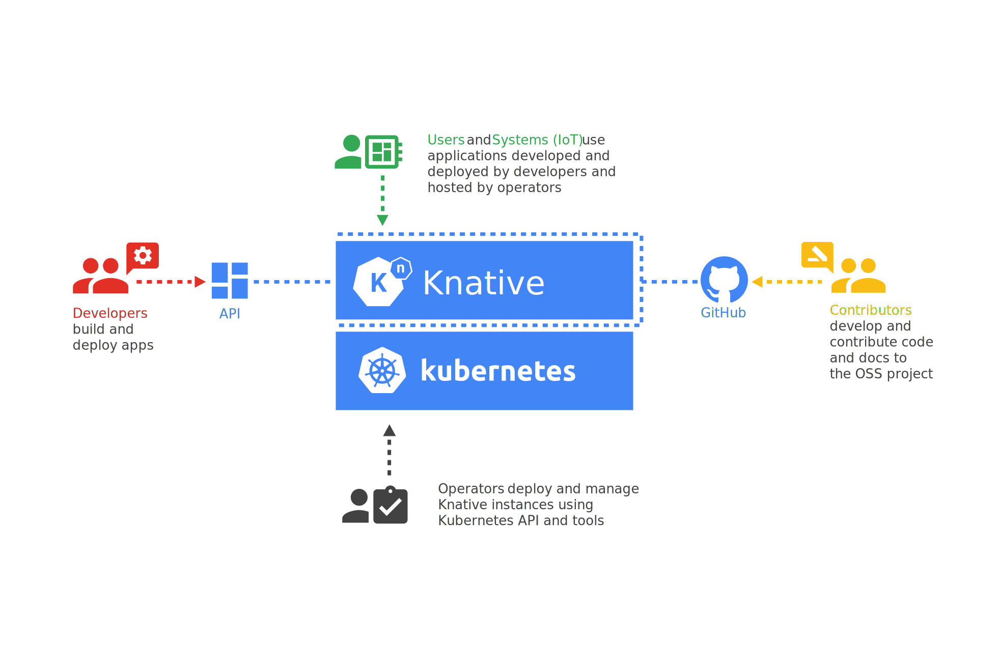

# About Knative

Knative is an open source project with an active development community.
The project was started by Google but has contributions from a growing number of industry-leading companies. With a clear project scope, lightweight governance model, and clean lines of
separation between pluggable components, the Knative project establishes an
efficient contributor workflow.

Knative is a diverse, open, and inclusive community.

Knative is designed for different personas:

Knative components offer developers Kubernetes-native APIs for deploying
serverless-style functions, applications, and containers to an auto-scaling
runtime.

To join the conversation, head over to the
[Knative users](https://groups.google.com/d/forum/knative-users) Google group.

Knative components are intended to be integrated into more polished products
that cloud service providers or in-house teams in large enterprises can then
operate.

Any enterprise or cloud provider can adopt Knative components into their own
systems and pass the benefits along to their customers.

## Community Meetup

This virtual event is designed for end users, a space for our community to meet,
get to know each other, and learn about uses and applications of Knative.

Catch up with past community meetups on our [YouTube channel](https://www.youtube.com/playlist?list=PLQjzPfIiEQLLyCyLBKLlwDLfE_A-P7nyg).

Stay tuned for new events by subscribing to the
[calendar](https://calendar.google.com/calendar/embed?src=knative.team_9q83bg07qs5b9rrslp5jor4l6s%40group.calendar.google.com&ctz=America%2FLos_Angeles) ([iCal export file](https://calendar.google.com/calendar/ical/knative.team_9q83bg07qs5b9rrslp5jor4l6s%40group.calendar.google.com/public/basic.ics))
and following us on [Twitter](https://twitter.com/KnativeProject).

## More ways to get involved

Even if there’s not an issue opened for it, we can always use more testing throughout the platform. Similarly, we can always use more docs, richer docs, insightful docs. Or maybe a cool blog post? And if you’re a web developer, we could use your help in spiffing up our public-facing web site.

[Bug reports](https://github.com/knative/serving/issues/new) and friction logs
from new developers are especially welcome.

## Knative authors

For a current list of the authors, see [Authors](https://github.com/knative/serving/blob/main/AUTHORS).

## Getting started

Before you can make a contribution to Knative, you must sign the CNCF [EasyCLA](https://easycla.lfx.linuxfoundation.org/) using the same email address you used to register for Github.

For more information, see [Contributor license agreements](https://github.com/knative/community/blob/main/CONTRIBUTING.md#contributor-license-agreements).

Read the [Knative contributor guide](https://github.com/knative/community/blob/main/CONTRIBUTING.md).

Read the [Code of conduct](https://github.com/knative/community/blob/main/CODE-OF-CONDUCT.md).

## Governance

- [Knative project values](https://github.com/knative/community/blob/main/VALUES.md):
shared goals and values for the community.

- [Knative team values](https://github.com/knative/community/blob/main/TEAM-VALUES.md):
the goals and values we hold as a team.

Knative has public and recorded monthly community meetings.
Each project has one or more working groups driving the project, and Knative has
a single technical oversight committee monitoring the overall project.

- [Governance](https://github.com/knative/community/blob/main/GOVERNANCE.md):
the Knative governance framework.

- [Community roles](https://github.com/knative/community/blob/main/ROLES.md):
describes the roles individuals can assume within the Knative community such as member, approver, or working group lead.

- [Working groups](https://github.com/knative/community/blob/main/working-groups/WORKING-GROUPS.md):
provides information about our various working groups.

- [Steering Committee (SC)](https://github.com/knative/community/blob/main/STEERING-COMMITTEE.md):
describes our steering committee.

- [Technical Oversight Committee (TOC)](https://github.com/knative/community/blob/main/TECH-OVERSIGHT-COMMITTEE.md):
describes our technical oversight committee.

- [Trademark Committee](https://github.com/knative/community/blob/main/TRADEMARK-COMMITTEE.md):
describes our trademark committee.

- [Annual reports](https://github.com/knative/community/tree/main/annual_reports):
lists previous annual reports.

## Processes

This section links to documents for common Knative community processes.

At the moment, these practices (except for the formation of Working Groups and Lazy Consensus) are recommendations that individual working groups can choose to adopt, rather than requirements.
Each working group should document their processes; either in their own repo or in a pointer to these docs.

- [Reviewing and Merging Pull Requests](https://github.com/knative/community/blob/main/REVIEWING.md):
how we manage pull requests.

- [Working group processes](https://github.com/knative/community/blob/main/mechanics/WORKING-GROUP-PROCESSES.md): how working groups operate.

- [SC election process](https://github.com/knative/community/blob/main/mechanics/SC.md):
elcection process for our steering committee.

- [TOC election process](https://github.com/knative/community/blob/main/mechanics/TOC.md):
election process for our technical oversight committee.

- [Repository Guidelines](https://github.com/knative/community/blob/main/REPOSITORY-GUIDELINES.md):
how we create and remove core repositories.

- [Sandbox repo process](https://github.com/knative/community/blob/main/mechanics/CREATING-A-SANDBOX-REPO.md):
how to create a repo in the [`knative-sandbox`](https://github.com/knative-sandbox) GitHub org.

- [Feature tracks](https://github.com/knative/community/blob/main/mechanics/FEATURE-TRACKS.md):
outlines the process for adding non-trivial features.

- [Golang policy](https://github.com/knative/community/blob/main/mechanics/GOLANG-POLICY.md):
principles regarding the Golang version Knative tests and releases with.

- [Release principles](https://github.com/knative/community/blob/main/mechanics/RELEASE-VERSIONING-PRINCIPLES.md#knative-release-principles):
release principles including information about support and feature phases.

- [Release schedule](https://github.com/knative/community/blob/main/mechanics/RELEASE-SCHEDULE.md):
Knative past and future release dates.

- [Sunsetting features](https://github.com/knative/community/blob/main/mechanics/SUNSETTING-FEATURES.md#knative-feature-sunsetting):
process to sunset features that are getting no apparent usage, but are time consuming to maintain.

## Community calendar

The [Knative community calendar](https://calendar.google.com/calendar/embed?src=knative.team_9q83bg07qs5b9rrslp5jor4l6s%40group.calendar.google.com) ([iCal export file](https://calendar.google.com/calendar/ical/knative.team_9q83bg07qs5b9rrslp5jor4l6s%40group.calendar.google.com/public/basic.ics))
contains events that provide the opportunity to learn more about Knative and meet other users and contributors. This includes Working Group, Steering Committee, and other community meetings.

Events don't have to be organized by the Knative project to be added to the calendar.
If you want to add an event to the calendar please send an email to
[knative-steering@googlegroups.com](mailto:knative-steering@googlegroups.com)
or post to the #community channel in the Knative [Slack](https://slack.knative.dev) workspace.

<iframe src="https://calendar.google.com/calendar/embed?src=knative.team_9q83bg07qs5b9rrslp5jor4l6s%40group.calendar.google.com&ctz=America%2FLos_Angeles" style="border: 0" width="800" height="600" frameborder="0" scrolling="no"></iframe>
