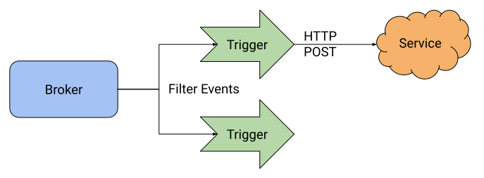
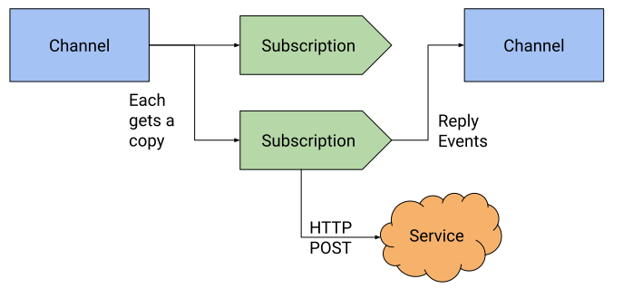

# Eventing

Knative Eventing provides tools for routing events from event sources to
targets. It builds on [CloudEvents](https://cloudevents.io) delivery over HTTP
by providing configuration and management of pluggable event-routing components.
Knative Eventing provides a few benefits over other messaging systems:

- Using CloudEvents, events can be produced either by microservices that publish
  directly to the Broker or Channel or via configurable Sources.
- Using Kubernetes for the management of the underlying resources enables
  applying existing management tools (Policy, GitOps, etc) to managing event
  delivery between components.

## Object Models

Knative Eventing provides two different models for handling events. Both of
these models route CloudEvents and are configured using Kubernetes custom
resource objects.

- **Broker and Trigger** provides an event routing mesh with per-Trigger event
  filtering capabilities.
- **Channel and Subscription** provides event routing between Channels using
  explicit reply routing in the Subscription.

When in doubt, we generally recommend the "Broker and Trigger" model unless you
need the specific reply capabilities of "Channel and Subscription".

### Broker and Trigger



Brokers and Triggers provide an "event mesh" model which allows component
sources and software systems to deliver events to a well-known endpoint (the
Broker) and then distribute them uniformly to consumers (via Triggers).
Generally, only a single Broker is needed per namespace, and many Triggers may
key off the same Broker. This delivers the following benefits:

- Consumers can register for specific types of events without needing to
  negotiate directly with event producers. (Decouples producing and consuming
  teams.)
- Event routing can be optimized by the underlying platform using the specified
  filter conditions.

### Channel and Subscription



Channels and Subscriptions provide a "event pipe" model which transforms and
routes events between Channels using Subscriptions. This model is appropriate
for event pipelines where events from one system need to be transformed and then
routed to another process. This pattern is appropriate when:

- Events should be explicitly routed from one component to another, rather than
  connecting data from multiple sources.
- Generally, producers will have a better notion of their downstream consumers,
  because they need to communicate the specific Channel that their consumer
  needs to create a Subscription on.

## Event Delivery

All Knative components use the
[CloudEvents HTTP protocol binding](https://github.com/cloudevents/spec/blob/v1.0.1/http-protocol-binding.md)
to exchange events. This is a fairly simple metadata-and-payload format,
typically represented in binary format using `CE-` prefixed HTTP headers, like
this example from the CloudEvents spec:

```http
POST /someresource HTTP/1.1
Host: webhook.example.com
ce-specversion: 1.0
ce-type: com.example.someevent
ce-time: 2018-04-05T03:56:24Z
ce-id: 1234-1234-1234
ce-source: /mycontext/subcontext
    .... further attributes ...
Content-Type: application/json; charset=utf-8
Content-Length: nnnn

{
    ... application data ...
}
```

Both Triggers and Subscriptions deliver events to the referenced Service
(`subscriber`) using HTTP POSTs. They also support routing events returned in
the reply to the POST:

- **Triggers** route replies back into the associated Broker for delivery to all
  Triggers attached to the Broker (including this Trigger -- it's possible to
  set up an infinite loop if you emit the same type of event you consume).
- **Subscriptions** have an explicit `reply` property that allows you to route
  the reply to another Channel, which enables building
  processor-channel-processor transformation pipelines.

A reply event is a CloudEvent delivered back to a Trigger or Subscription using
the HTTP Reply encoding, like this example from the CloudEvents spec:

```http
HTTP/1.1 200 OK
ce-specversion: 1.0
ce-type: com.example.someevent
ce-time: 2018-04-05T03:56:24Z
ce-id: 1234-1234-1234
ce-source: /mycontext/subcontext
    .... further attributes ...
Content-Type: application/json; charset=utf-8
Content-Length: nnnn

{
    ... application data ...
}
```
