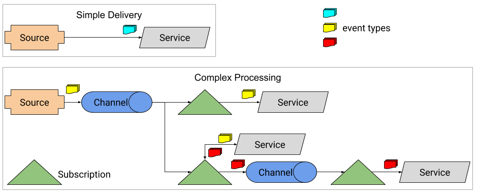
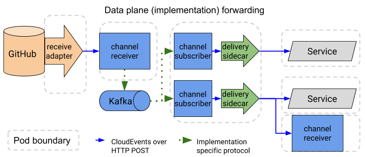

Knative Eventing is a system that is designed to address a common need for cloud
native development and provides composable primitives to enable late-binding
event sources and event consumers.

## Design overview

Knative Eventing is designed around the following goals:

1. Knative Eventing services are loosely coupled. These services can be
   developed and deployed independently on, and across a variety of platforms
   (for example Kubernetes, VMs, SaaS or FaaS).
1. Event producers and event sources are independent. Any producer (or source),
   can generate events before there are active event consumers that are
   listening. Any event consumer can express interest in an event or class of
   events, before there are producers that are creating those events.
1. Other services can be connected to the Eventing system. These services can
   perform the following functions:
   - Create new applications without modifying the event producer or event
     consumer.
   - Select and target specific subsets of the events from their producers.
1. Ensure cross-service interoperability. Knative Eventing is consistent with
   the
   [CloudEvents](https://github.com/cloudevents/spec/blob/master/spec.md#design-goals)
   specification that is developed by the
   [CNCF Serverless WG](https://lists.cncf.io/g/cncf-wg-serverless).

### Event consumers

To enable delivery to multiple types of Services, Knative Eventing defines two
generic interfaces that can be implemented by multiple Kubernetes resources:

1. **Addressable** objects are able to receive and acknowledge an event
   delivered over HTTP to an address defined in their `status.address.hostname`
   field. As a special case, the core
   [Kubernetes Service object](https://kubernetes.io/docs/reference/generated/kubernetes-api/v1.12/#service-v1-core)
   also fulfils the Addressable interface.
1. **Callable** objects are able to receive an event delivered over HTTP and
   transform the event, returning 0 or 1 new events in the HTTP response. These
   returned events may be further processed in the same way that events from an
   external event source are processed.

### Event channels and subscriptions

Knative Eventing also defines a single event forwarding and persistence layer,
called a
[**Channel**](https://github.com/knative/eventing/blob/master/pkg/apis/eventing/v1alpha1/channel_types.go#L36).
Messaging implementations may provide implementations of Channels via the
[ClusterChannelProvisioner](https://github.com/knative/eventing/blob/master/pkg/apis/eventing/v1alpha1/cluster_channel_provisioner_types.go#L35)
object. Events are delivered to Services or forwarded to other channels
(possibly of a different type) using
[Subscriptions](https://github.com/knative/eventing/blob/master/pkg/apis/eventing/v1alpha1/subscription_types.go#L35).
This allows message delivery in a cluster to vary based on requirements, so that
some events might be handled by an in-memory implementation while others would
be persisted using Apache Kafka or NATS Streaming.

### Future design goals

The focus for the next Eventing release will be to enable easy implementation of
event sources. Sources manage registration and delivery of events from external
systems using Kubernetes
[Custom Resources](https://kubernetes.io/docs/concepts/extend-kubernetes/api-extension/custom-resources/).
Learn more about Eventing development in the
[Eventing work group](../../contributing/WORKING-GROUPS/#events).

## Installation

Knative Eventing currently requires Knative Serving and Istio version 1.0 or
later installed.
[Follow the instructions to install on the platform of your choice](../../install/).

Many of the sources require making outbound connections to create the event subscription,
and if you have any functions that make use of any external (to cluster) services, you
must enable it also for them to work.
[Follow the instructions to configure outbound network access](../../serving/outbound-network-access/).

Install the core Knative Eventing (which provides an in-memory
ChannelProvisioner) and the core sources (which provides the Kubernetes Events,
GitHub, and "Container" Sources) with the following commands:

```bash
kubectl apply --filename https://github.com/knative/eventing/releases/download/v0.3.0/release.yaml
kubectl apply --filename https://github.com/knative/eventing-sources/releases/download/v0.3.0/release.yaml
```

In addition to the core sources, there are [other sources](sources/) that you can install.

This document will be updated as additional sources (which are custom resource
definitions and an associated controller) and channels
(ClusterChannelProvisioners and controllers) become available.

Check out the [Configuration](#configuration) section to learn more about
operating Knative Eventing.

## Architecture

The eventing infrastructure supports two forms of event delivery at the moment:

1. Direct delivery from a source to a single Service (an Addressable endpoint,
   including a Knative Service or a core Kubernetes Service). In this case, the
   Source is responsible for retrying or queueing events if the destination
   Service is not available.
1. Fan-out delivery from a source or Service response to multiple endpoints
   using
   [Channels](https://github.com/knative/eventing/blob/master/pkg/apis/eventing/v1alpha1/channel_types.go#L36)
   and
   [Subscriptions](https://github.com/knative/eventing/blob/master/pkg/apis/eventing/v1alpha1/subscription_types.go#L35).
   In this case, the Channel implementation ensures that messages are delivered
   to the requested destinations and should buffer the events if the destination
   Service is unavailable.



The actual message forwarding is implemented by multiple data plane components
which provide observability, persistence, and translation between different
messaging protocols.



<!-- TODO(evankanderson): add documentation for Kafka bus once it is available. -->

## Sources

Each source is a separate Kubernetes custom resource. This allows each type of
Source to define the arguments and parameters needed to instantiate a source.
Knative Eventing defines the following Sources in the
`sources.eventing.knative.dev` API group. Types below are declared in golang
format, but may be expressed as simple lists, etc in YAML. All Sources should be
part of the `sources` category, so you can list all existing Sources with
`kubectl get sources`. The currently-implemented Sources are described below:

_Want to implement your own source? Check out [the tutorial](samples/writing-a-source/)._

### KubernetesEventSource

The KubernetesEventSource fires a new event each time a
[Kubernetes Event](https://kubernetes.io/docs/reference/generated/kubernetes-api/v1.12/#event-v1-core)
is created or updated.

**Spec fields**:

- `namespace`: `string` The namespace to watch for events.
- `serviceAccountname`: `string` The name of the ServiceAccount used to connect
  to the Kubernetes apiserver.
- `sink`:
  [ObjectReference](https://kubernetes.io/docs/reference/generated/kubernetes-api/v1.12/#objectreference-v1-core)
  A reference to the object that should receive events.

### GitHubSource

The GitHubSource fires a new event for selected
[GitHub event types](https://developer.github.com/v3/activity/events/types/).

**Spec fields**:

- `ownerAndRepository`: `string` The GitHub owner/org and repository to receive
  events from. The repository may be left off to receive events from an entire
  organization.
- `eventTypes`: `[]string` A list of
  [event types](https://developer.github.com/v3/activity/events/types/) in
  "Webhook event name" format (lower_case).
- `accessToken.secretKeyRef`:
  [SecretKeySelector](https://kubernetes.io/docs/reference/generated/kubernetes-api/v1.12/#secretkeyselector-v1-core)
  containing a GitHub access token for configuring a GitHub webhook. One of this
  or `secretToken` must be set.
- `secretToken.secretKeyRef`:
  [SecretKeySelector](https://kubernetes.io/docs/reference/generated/kubernetes-api/v1.12/#secretkeyselector-v1-core)
  containing a GitHub secret token for configuring a GitHub webhook. One of this
  or `accessToken` must be set.
- `serviceAccountName`: `string` The name of the ServiceAccount to run the
  container as.
- `sink`:
  [ObjectReference](https://kubernetes.io/docs/reference/generated/kubernetes-api/v1.12/#objectreference-v1-core)
  A reference to the object that should receive events.

### GcpPubSubSource

The GcpPubSubSource fires a new event each time a message is published on a
[Google Cloud Platform PubSub topic](https://cloud.google.com/pubsub/).

**Spec fields**:

- `googleCloudProject`: `string` The GCP project ID that owns the topic.
- `topic`: `string` The name of the PubSub topic.
- `serviceAccountName`: `string` The name of the ServiceAccount used to access
  the `gcpCredsSecret`.
- `gcpCredsSecret`:
  [ObjectReference](https://kubernetes.io/docs/reference/generated/kubernetes-api/v1.12/#objectreference-v1-core)
  A reference to a Secret which contains a GCP refresh token for talking to
  PubSub.
- `sink`:
  [ObjectReference](https://kubernetes.io/docs/reference/generated/kubernetes-api/v1.12/#objectreference-v1-core)
  A reference to the object that should receive events.

### AwsSqsSource

The AwsSqsSource fires a new event each time an event is published on an
[AWS SQS topic](https://aws.amazon.com/sqs/).

**Spec fields**:

- `queueURL`: URL of the SQS queue to pull events from.
- `awsCredsSecret`: credential to use to poll the AWS SQS queue.
- `sink`:
  [ObjectReference](https://kubernetes.io/docs/reference/generated/kubernetes-api/v1.12/#objectreference-v1-core)
  A reference to the object that should receive events.
- `serviceAccountName`: `string` The name of the ServiceAccount used to access
  the `awsCredsSecret`.

### ContainerSource

The ContainerSource will instantiate a container image which can generate events
until the ContainerSource is deleted. This may be used (for example) to poll an
FTP server for new files or generate events at a set time interval.

**Spec fields**:

- `image` (**required**): `string` A docker image of the container to be run.
- `args`: `[]string` Command-line arguments. If no `--sink` flag is provided, 
   one will be added and filled in with the DNS address of the `sink` object.
- `env`: `map[string]string` Environment variables to be set in the container.
- `serviceAccountName`: `string` The name of the ServiceAccount to run the
  container as.
- `sink`:
  [ObjectReference](https://kubernetes.io/docs/reference/generated/kubernetes-api/v1.12/#objectreference-v1-core)
  A reference to the object that should receive events.

### CronJobSource

The CronJobSource fires events based on given [Cron](https://en.wikipedia.org/wiki/Cron) schedule.

**Spec fields**:

- `schedule` (**required**): `string` A [Cron](https://en.wikipedia.org/wiki/Cron) format string, such as `0 * * * *` or `@hourly`.
- `data`: `string` Optional data sent to downstream receiver.
- `serviceAccountName`: `string` The name of the ServiceAccount to run the container as.
- `sink`:
  [ObjectReference](https://kubernetes.io/docs/reference/generated/kubernetes-api/v1.12/#objectreference-v1-core)
  A reference to the object that should receive events.

## Getting Started

- [Setup Knative Serving](../../install/)
- [Install Eventing components](#installation)
- [Run samples](samples/)

## Configuration
- [Default Channels](channels/default-channels.md) provide a way to choose the
persistence strategy for Channels across the cluster.

---

Except as otherwise noted, the content of this page is licensed under the
[Creative Commons Attribution 4.0 License](https://creativecommons.org/licenses/by/4.0/),
and code samples are licensed under the
[Apache 2.0 License](https://www.apache.org/licenses/LICENSE-2.0).
