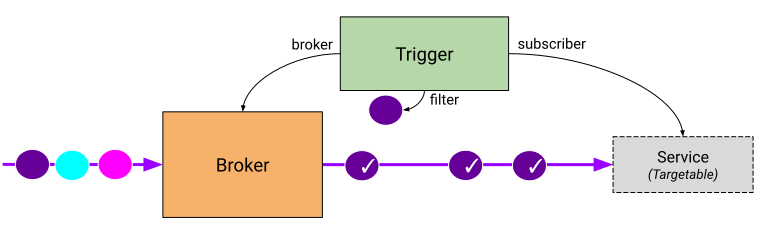

Knative Eventing is a system that is designed to address a common need for cloud
native development and provides composable primitives to enable late-binding
event sources and event consumers.

## Conceptual Overview

### So you want to process events?

Perfect, you’re in the right place. The resources in this section will guide you
through some use cases and get you started in no time flat. There are different ways to go
about handling event-driven architectures. In the resources in this section, we’ll share use
cases and architecture examples ranging from straightforward to more complex.
You can go through these resources in any order or only read the sections that you
need. As a starting point, though, we’ll go over some terminology.

#### What is event-driven

Microservices, and functions, usually get their input from something else. That
“something else” is the trigger for a microservice to take care of business. The
piece of information that is sent across is called an event. The microservices
in an event-driven architecture are constantly reacting to events and producing
events themselves. As an example, think about your version control system. When
you make changes to a project and want to merge it into the main branch, you
need to create a Pull Request (PR). When you create that PR, it could trigger a
bunch of other actions like code linting, quality tests, and update tickets.
All those actions are started by events and the actions consume (act on) that
data.

#### Traditional Pub/Sub Model
To get event data to consumers, one model you can use is the traditional
“Pub/Sub” model. This model was made popular with the rise of
service-oriented architecture, where events are placed on channels
(or “topics”) and all subscribers receive are notified. Modern tools that fit
in this category are Amazon SNS, Azure Service Bus, and Google Cloud Pub/Sub.

#### Event-Driven Functions
In the traditional serverless experience, users package their code (the
functions they want to deploy) and associate them with the event source that
should start those functions (invoke them). This pattern was made popular by
hosted Function-as-a-Service platforms like AWS Lambda, Azure Functions, and
Google Cloud Function.

#### Modern Event Mesh
As the serverless industry evolved and technology matured, the industry started
to build architectures where the producers and consumers were even more
separated. At the same time, the delivery of the events is governed by
high-level routing and event data is captured in a standard format (like Cloud
Events). These architectures are facilitated by so called brokers like AWS
EventBridge and Azure Event Grid.

### Use cases

* When this happens do that (1:1 event delivery): The most straightforward use case is that whenever events are products, you want some code to handle that event. (Read more - coming soon)

* When any of these happen do that (N:1 event delivery): Your functions might be able to handle multiple events. With a standard format for events, like Cloud Events, your function already knows how to handle receiving the event and you’ll only need to update your business logic to handle processing the new data type. (Read more - coming soon)

* When this happens do these (1:N event delivery): Similar to the first scenario, you can have multiple consumers that are all interested in the same event. By leveraging channels we make handling this scenario simple. (Read more - coming soon)

* When this happens do this thing and then another (pipe / tee): When you’re building functionality, it can be useful to split up functionality into smaller chunks. For example, in Unix operating systems the idea is that each command like tool does only one thing. Using the concepts of pipe and tee, you can string these commands together. (Read more - coming soon)

* When these things happen do these things and then some (N:M:Z event delivery): So, there’s a lot of things we can do with the constructs introduced in the use cases above, but the one downside with them is that for more complex use cases, where there are a multitude of Sources sending events, Functions consuming/transforming and so forth, it can get a bit unwieldy to keep track of which Channel is handling which events. Furthermore, sometimes you might only want to consume only some events, but with the constructs introduced so far, you would have to receive all of them, and throw out the ones you’re not interested in. To make these kinds of interactions easier and allow the user to only focus on declaring which events they are interested in and where to send them, there is an easier way to reason about them. This is where _Broker_ and _Trigger_ are meant to provide a straightforward user experience. (Read more - coming soon)

## Functionality

Knative Eventing supports multiple modes of usage. The following scenarios are
well-supported by the existing components; since the system is modular, it's
also possible to combine the components in novel ways.

1. **I just want to publish events, I don't care who consumes them.** Send
   events to a [Broker](broker/README.md) as an HTTP POST. The
   [SinkBinding](samples/sinkbinding/README.md) can be useful to decouple the destination
   configuration from your application.

1. **I just want to consume events like X, I don't care how they are
   published.** Use a [Trigger](broker/README.md) to consume events from a Broker based
   on CloudEvents attributes. Your application will receive the events as an
   HTTP POST.

1. **I want to transform events through a series of steps.** Use [Channels and
   Subscriptions](channels/README.md) to define complex message-passing topologies. For
   simple pipelines, the [Sequence](flows/sequence.md) automates construction of
   Channels and Subscriptions between each stage.

Knative also supports some additional patterns such as
[Parallel](flows/parallel.md) fanout of events, and routing response events from
both Channels and Brokers.

## Design overview

Knative Eventing is designed around the following goals:

1. Knative Eventing services are loosely coupled. These services can be
   developed and deployed independently on, and across a variety of platforms
   (for example Kubernetes, VMs, SaaS or FaaS).
1. Event producers and event consumers are independent. Any producer (or
   source), can generate events before there are active event consumers that are
   listening. Any event consumer can express interest in an event or class of
   events, before there are producers that are creating those events.
1. Other services can be connected to the Eventing system. These services can
   perform the following functions:
   - Create new applications without modifying the event producer or event
     consumer.
   - Select and target specific subsets of the events from their producers.
1. Ensure cross-service interoperability. Knative Eventing is consistent with
   the
   [CloudEvents](https://github.com/cloudevents/spec/blob/master/spec.md#design-goals)
   specification that is developed by the
   [CNCF Serverless WG](https://lists.cncf.io/g/cncf-wg-serverless).

### Event consumers

To enable delivery to multiple types of Services, Knative Eventing defines two
generic interfaces that can be implemented by multiple Kubernetes resources:

1. **Addressable** objects are able to receive and acknowledge an event
   delivered over HTTP to an address defined in their `status.address.url`
   field. As a special case, the core
   [Kubernetes Service object](https://kubernetes.io/docs/reference/generated/kubernetes-api/v1.18/#service-v1-core)
   also fulfils the Addressable interface.
1. **Callable** objects are able to receive an event delivered over HTTP and
   transform the event, returning 0 or 1 new events in the HTTP response. These
   returned events may be further processed in the same way that events from an
   external event source are processed.

### Event sources

To learn about using event sources, see the [event sources](./sources/README.md) documentation.

### Event brokers and triggers

Broker and Trigger objects make it easy to filter events based on event
attributes.

A Broker provides a bucket of events which can be selected by attribute. It
receives events and forwards them to subscribers defined by one or more matching
Triggers. Since a Broker implements Addressable, event senders can submit events
to the Broker by POSTing the event to the Broker's `status.address.url`.

A Trigger describes a filter on event attributes which should be delivered to an
Addressable. You can create as many Triggers as necessary.

For most use cases, a single bucket (Broker) per namespace is sufficient, but
there are serveral use cases where multiple buckets (Brokers) can simplify
architecture. For example, separate Brokers for events containing Personally
Identifiable Information (PII) and non-PII events can simplify audit and access
control rules.

### Event registry

Knative Eventing defines an EventType object to make it easier for consumers to
discover the types of events they can consume from Brokers.

The registry consists of a collection of event types. The event types stored in
the registry contain (all) the required information for a consumer to create a
Trigger without resorting to some other out-of-band mechanism.

To learn how to use the registry, see the
[Event Registry documentation](./event-registry.md).

### Simplify event delivery

The [SinkBinding](samples/sinkbinding/README.md) custom object supports decoupling event
production from delivery addressing.

When you create a SinkBinding, you reference an Addressable and a Kubernetes
object which provides a PodTemplateSpec. The SinkBinding will inject environment
variables (`$K_SINK` for the destination URL) into the PodTemplateSpec so that
the application code does not need to interact with the Kubernetes API to locate
the event destination.

### Event channels and subscriptions

Knative Eventing also defines an event forwarding and persistence layer, called
a
[**Channel**](https://github.com/knative/eventing/blob/master/pkg/apis/messaging/v1/channel_types.go#L57).
Each channel is a separate Kubernetes [Custom Resource](https://kubernetes.io/docs/concepts/extend-kubernetes/api-extension/custom-resources/).
Events are delivered to Services or forwarded to other channels
(possibly of a different type) using
[Subscriptions](https://github.com/knative/eventing/blob/master/pkg/apis/messaging/v1/subscription_types.go).
This allows message delivery in a cluster to vary based on requirements, so that
some events might be handled by an in-memory implementation while others would
be persisted using Apache Kafka or NATS Streaming.

See the [List of Channel implementations](../eventing/channels/channels.yaml).

### Higher Level eventing constructs

There are cases where you may want to utilize a set of co-operating functions
together and for those use cases, Knative Eventing provides two additional
resources:

1. **[Sequence](./flows/sequence.md)** provides a way to define an in-order list of functions.
1. **[Parallel](./flows/parallel.md)** provides a way to define a list of branches for events.

### Future design goals

The focus for the next Eventing release will be to enable easy implementation of
event sources. Sources manage registration and delivery of events from external
systems using Kubernetes
[Custom Resources](https://kubernetes.io/docs/concepts/extend-kubernetes/api-extension/custom-resources/).
Learn more about Eventing development in the
[Eventing work group](https://github.com/knative/community/blob/master/working-groups/WORKING-GROUPS.md#eventing).

## Installation

[Follow the instructions to install on the platform of your choice](../install/README.md).

## Getting Started

- [Install the Eventing component](#installation)
- [Setup Knative Serving](../install/README.md)
- [Run samples](./samples/)
- [Default Channels](./channels/default-channels.md) provide a way to choose the
  persistence strategy for Channels across the cluster.
