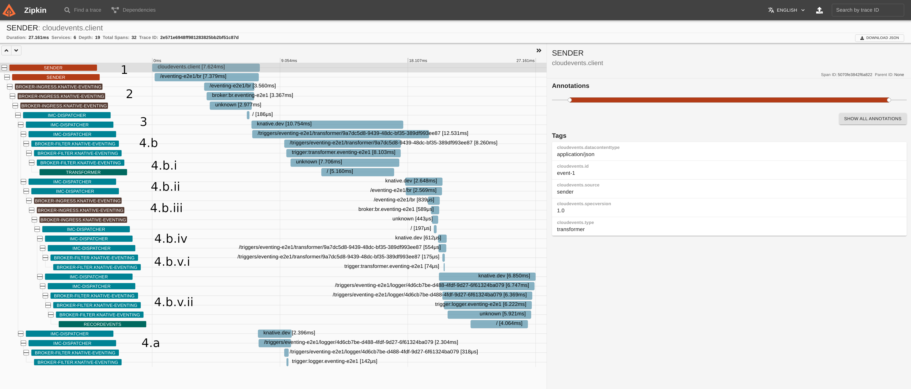
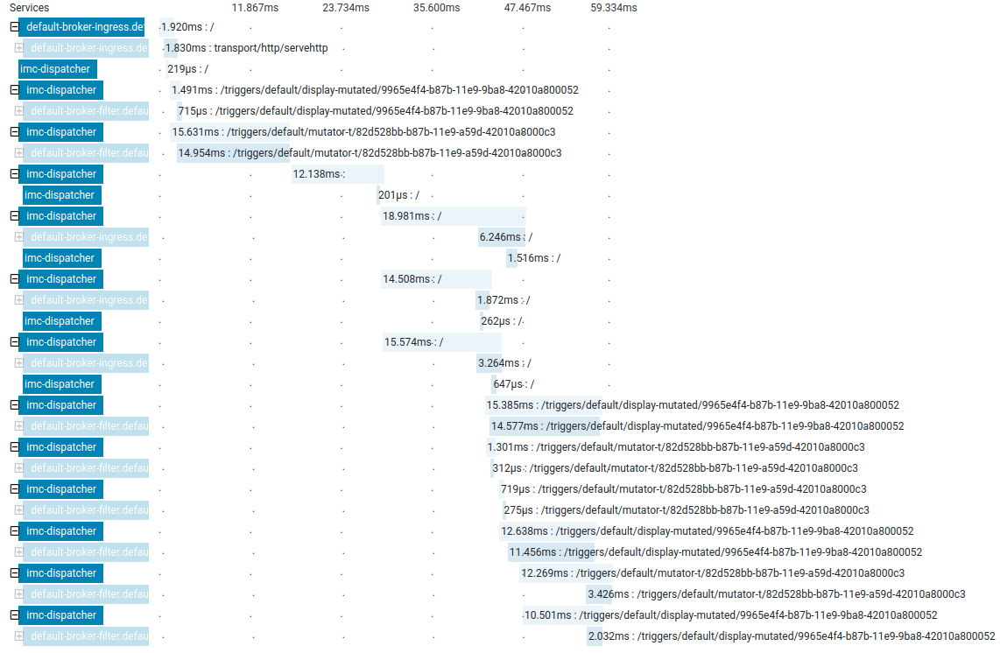
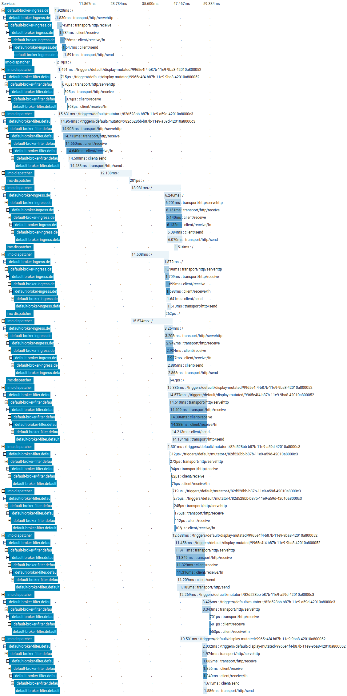

Depending on the request tracing tool that you have installed on your Knative
Eventing cluster, see the corresponding section for details about how to
visualize and trace your requests.

## Installation

Knative Eventing uses the same tracing installation as Knative Service. Follow Knative Serving's [installation instructions](./../serving/installing-logging-metrics-traces.md) to set up the necessary components.

## Configuration

Most Knative Eventing tracing configuration is handled by the `config-tracing` ConfigMap in the `knative-eventing` namespace. This single ConfigMap controls tracing for:
 - Brokers
 - Triggers
 - Channel Dispatchers

Here is an example ConfigMap that samples 10% of all CloudEvents.
```yaml
apiVersion: v1
kind: ConfigMap
metadata:
  name: config-tracing
  namespace: knative-eventing
data:
  enable: "true"
  zipkin-endpoint: "http://zipkin.istio-system.svc.cluster.local:9411/api/v2/spans"
  sample-rate: "0.1
```

To see your current configuration:

```shell script
kubectl -n knative-eventing get configmap config-tracing -oyaml
```

The `_example` section explains all the available options.

Updating the ConfigMap will cause the new configuration to go live almost immediately.

### Importer Configuration

Most importers do _not_ use the configuration from the shared ConfigMap. Instead, they have a static, 1% sampling rate.


## Tools

To access the traces, you will use a tool such as Zipkin or Jaeger. Follow the Knative Serving [instructions](./../serving/accessing-traces.md) for accessing the traces:
 - [Zipkin](./../serving/accessing-traces.md#zipkin)
 - [Jaeger](./../serving/accessing-traces.md#jaeger)

### Example

Everything happens in the `default` namespace.
- Broker named `default`
- Two Triggers associated with the Broker:
    - `mutator-t` - Filters to only allow events whose type is `original`. It will reply with an identical event, except the replied event's type will be `mutated`.
    - `display-mutated` - Filters to only allow events whose type is `mutated`.
- An event is sent in with the type `original`.

So we expect the event to do the  following:

1. Go to the Broker's ingress Pod.
1. Go to the InMemory dispatcher.
1. Go to both Triggers.
    1. Go to the Broker's filter Pod for the Trigger `display-mutated`. The Trigger's filter ignores this event.
    1. Go to the Broker's filter Pod for the Trigger `mutator-t`. The filter does pass, so it goes to the Knative Service pointed at.
        1. It replies with an event.
        1. Go to an InMemory dispatcher.
        1. Go to the Broker's ingress Pod.
        1. Go to the InMemory dispatcher.
        1. Go to both Triggers.
            1. Go to the Broker's filter Pod for the Trigger `mutator-t`. The Trigger's filter ignores the event.
            1. Go to the Broker's filter Pod for the Trigger `display-mutated`. The filter passes, so it goes to the Knative Service pointed at. There is no reply.

This is a screenshot of the Zipkin trace, partially collapsed. All the red letters have been added to the screenshot and correspond to the expectations earlier in this section:



This is the same screenshot without the annotations.



Our libraries actually create traces inside their own code. Here is the fully expanded version of the trace:



If you are interested, here is the [raw JSON](./data/ea2ead6af3a34b2ea59bff624b223415.json) of the trace.
