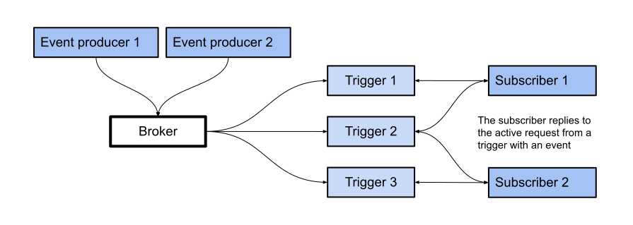

Brokers are Kubernetes [custom resources](https://kubernetes.io/docs/concepts/extend-kubernetes/api-extension/custom-resources/) that define an event mesh for collecting a pool of [CloudEvents](https://cloudevents.io/), and provide a discoverable endpoint, `status.address`, for event delivery. Event producers can send events to a broker by POSTing the event to the `status.address.url` of the broker.

Event delivery mechanics are an implementation detail that depend on the configured [broker class](./configuring-brokers/#configuring-the-default-broker-class). Using brokers and triggers abstracts the details of event routing from the event producer and event consumer.

Once an event has entered a broker, it can be forwarded to subscribers by using triggers. Triggers allow events to be filtered by attributes, so that events of a particular class can be sent to subscribers that have registered interest in that class of events.

A subscriber can be any URL or _Addressable_ resource. Subscribers can also reply to an active request from the broker, and can respond with a new CloudEvent that will be sent back into the broker.

For most use cases, a single broker per namespace is sufficient, but
there are several use cases where multiple brokers can simplify
architecture. For example, separate brokers for events containing Personally
Identifiable Information (PII) and non-PII events can simplify audit and access
control rules.

## Next steps

- Learn about [supported broker types](./broker-types).
- Configure [default broker settings](./configuring-brokers/).
