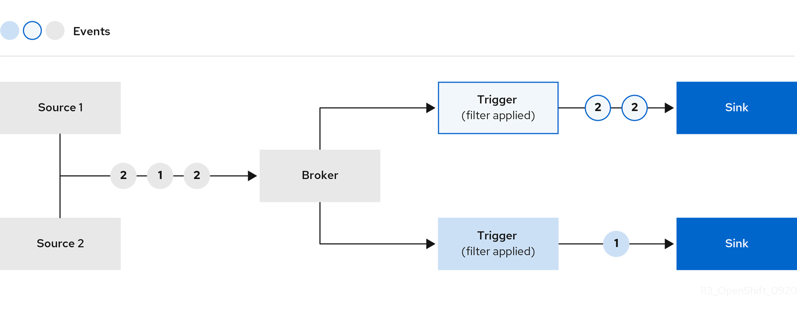

Brokers are Kubernetes [custom resources](https://kubernetes.io/docs/concepts/extend-kubernetes/api-extension/custom-resources/) that define an event mesh for collecting a pool of events, and provide a discoverable endpoint, `status.address`, for event delivery. Event producers can send events
to a broker by POSTing the event to the `status.address.url` of the broker.

Once an event has entered a broker, it can be forwarded to subscribers or sinks by using triggers.

Triggers allow events to be filtered by class, so that events of a particular class can be sent to subscribers that have registered interest in that class of events. A subscriber or sink can be any URL or Addressable endpoint. This event delivery mechanism hides details of event routing from the event producer and event consumer.

For most use cases, a single broker per namespace is sufficient, but
there are several use cases where multiple brokers can simplify
architecture. For example, separate brokers for events containing Personally
Identifiable Information (PII) and non-PII events can simplify audit and access
control rules.

## Next steps

- Learn about [supported broker types](broker-types)
- Create a [broker](create-broker)
- Create a [trigger](create-triggers)
