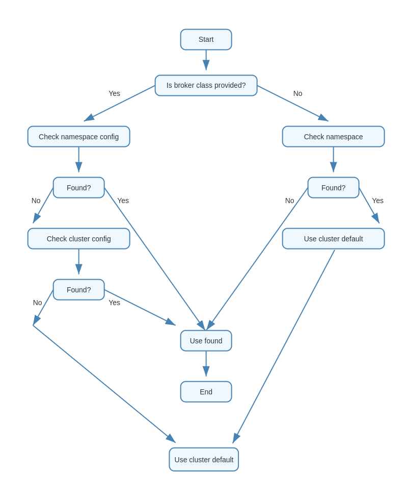

# Configuring Broker Defaults

## Overview

Knative Eventing allows you to configure default Broker classes at both the cluster and namespace levels. This feature provides flexibility in managing Broker configurations across your Knative installation. This document explains how to set up and use default Broker classes using the `config-br-defaults` ConfigMap.

## The `config-br-defaults` ConfigMap

The `config-br-defaults` ConfigMap in the `knative-eventing` namespace contains the configuration settings that govern default Broker creation. Here's an example of its structure:

```yaml
apiVersion: v1
kind: ConfigMap
metadata:
  name: config-br-defaults
  namespace: knative-eventing
data:
  default-br-config: |
    clusterDefault:
      brokerClass: MTChannelBasedBroker
      apiVersion: v1
      kind: ConfigMap
      name: config-br-default-channel
      namespace: knative-eventing
      brokerClasses:
        MTChannelBasedBroker:
          # Configuration for MTChannelBasedBroker
        KafkaBroker:
          # Configuration for KafkaBroker
    namespaceDefaults:
      namespace-1:
        brokerClass: KafkaBroker
        brokerClasses:
          KafkaBroker:
            # Configuration for KafkaBroker in namespace-1
      namespace-2:
        brokerClass: MTChannelBasedBroker
        brokerClasses:
          MTChannelBasedBroker:
            # Configuration for MTChannelBasedBroker in namespace-2
```


## Configuration Decision Flow

The following flow chart illustrates the decision-making process for determining the broker class and configuration:



This flow chart demonstrates the priority and fallback mechanisms in place when determining the broker class and configuration. It visually represents the process described in the Configuration Hierarchy section.


## Configuration Hierarchy

The system uses the following priority order to determine the Broker class and configuration:

If a specific Broker class **is provided** for a Broker:

   1. Check namespace-specific configuration for the given Broker class
   2. If not found, check cluster-wide configuration for the given Broker class
   3. If still not found, use the cluster-wide default configuration

---
If **no specific Broker class** is provided:

   1. Check namespace-specific default Broker class
   2. If found, use its configuration
   3. If not found, use cluster-wide default Broker class and configuration

## Configuring Cluster-wide Defaults

To set a cluster-wide default Broker class and its configuration:

```yaml
clusterDefault:
  brokerClass: MTChannelBasedBroker
  brokerClasses:
    MTChannelBasedBroker:
      apiVersion: v1
      kind: ConfigMap
      name: config-br-default-channel
      namespace: knative-eventing
```

This configuration sets `MTChannelBasedBroker` as the default Broker class for the entire cluster and specifies its configuration.

## Configuring Namespace-specific Defaults

To set default Broker classes and configurations for specific namespaces:

```yaml
namespaceDefaults:
  namespace-1:
    brokerClass: KafkaBroker
    brokerClasses:
      KafkaBroker:
        apiVersion: v1
        kind: ConfigMap
        name: kafka-broker-config
        namespace: knative-eventing
  namespace-2:
    brokerClass: MTChannelBasedBroker
    brokerClasses:
      MTChannelBasedBroker:
        apiVersion: v1
        kind: ConfigMap
        name: mt-channel-broker-config
        namespace: knative-eventing
```

This configuration sets different default Broker classes and configurations for `namespace-1` and `namespace-2`.

## Best Practices and Considerations

1. **Consistency**: Ensure that the `brokerClass` specified matches a key in the `brokerClasses` map to maintain consistency.

2. **Namespace Isolation**: Use namespace-specific defaults to isolate Broker configurations between different namespaces.

3. **Fallback Mechanism**: The system will fall back to cluster-wide defaults if namespace-specific configurations are not found.

4. **Configuration Updates**: When updating the ConfigMap, be aware that changes may affect newly created Brokers but will not automatically update existing ones.

5. **Validation**: Always validate your ConfigMap changes before applying them to avoid potential misconfigurations.

## Conclusion

The default Broker classes feature in Knative Eventing offers a flexible way to manage Broker configurations across your cluster and individual namespaces. By properly configuring the `config-br-defaults` ConfigMap, you can ensure that your Brokers are created with the desired settings, promoting consistency and reducing manual configuration efforts.