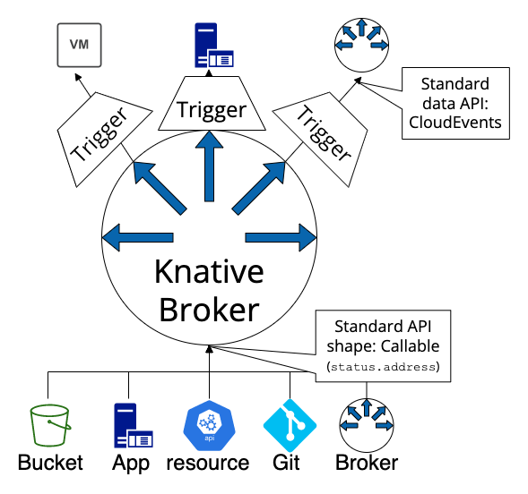

# Event Mesh

An Event Mesh is a dynamic infrastructure that is designed to smoothly transport events from producers to consumers via a network of interconnected _event brokers_ across any environment, and even between clouds in a seamless and loosely coupled way. In an Event Mesh both, producing and consuming application, can leverage their platform native event APIs. For instance a Python or Golang application can produce an event, using their native APIs, while a consuming application written in Java or Node.js can subscribe to it with their own native APIs as well.

## Knative Event Mesh

The above mentioned _event brokers_ are directly mapping to a key API in Knative Eventing: The `Broker` API offers a discoverable endpoint for event ingress and the `Trigger` API completes the offering with its event delivery capabilities. With these APIs Knative Eventing offers an Event Mesh as defined above:

As visible in the above diagram, the Event Mesh is defined with the `Broker` and `Trigger` APIs for the ingress and the egress of events. Knative Eventing complements the Event Mesh with its Duck type APIs, offering a pool of connector for sending events to the `Broker` and routing events to subscribers using the `Trigger`:

* **Events Ingress**: Support for a connectors API: Source duck type & Callable/Addressable Duck type. Even without any sources installed.
* **Event routing**: Broker + Triggers
* **Event egress** : Sinks API (i.e Callable)

It is important to note that `Source` and `Sink` are not directly part of the Event Mesh. However they are complementary, and benefit from the good Ducktype APIs (`Callable`/`Addressable`) for a smooth integration or connection with the "Event Mesh".
