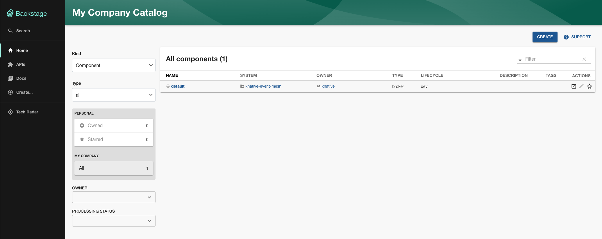
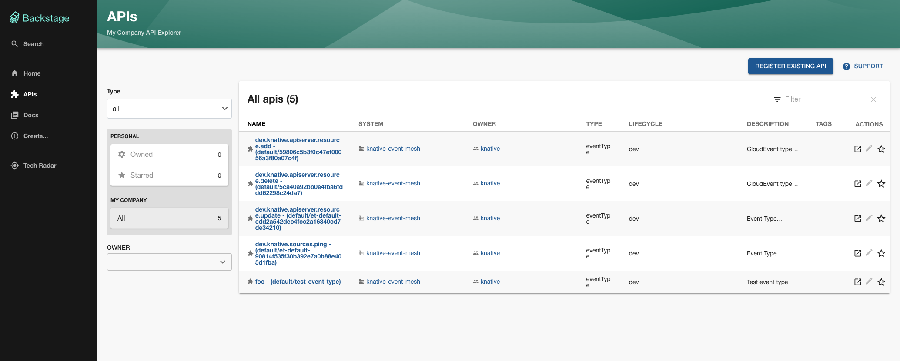
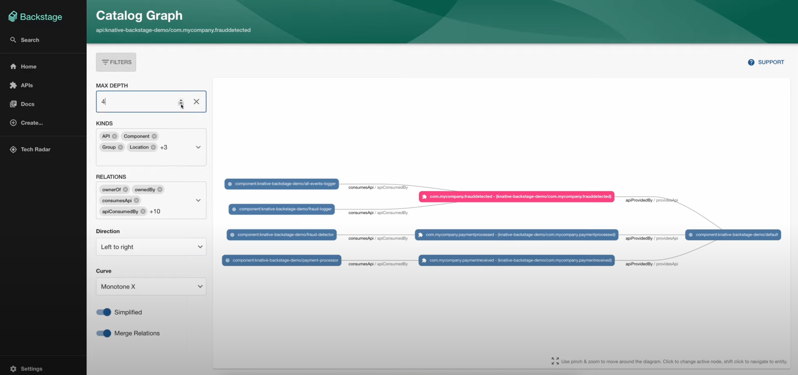
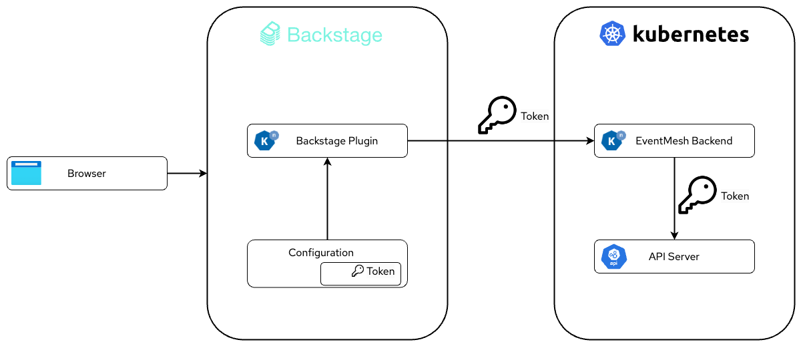

# Knative Event Mesh Backstage Plugin

!!! info
    For installation instructions, see the [plugin installation documentation](../../../install/installing-backstage-plugins).

The Knative Event Mesh plugin is a Backstage plugin that allows you to view and manage Knative Eventing resources. The 
plugin talks to a special backend that runs in the Kubernetes cluster and communicates with the Kubernetes API server.

[Backstage](https://backstage.io/){:target="_blank"} is a platform for building developer portals.
It provides a unified way to manage and visualize the different resources that developers use in their daily work.

While Backstage is not designed as a next generation Kubernetes Dashboard, it can visualize and partially manage Knative
resources. These resources would be read-only and focused on what's relevant to developers.





!!! info
    A demo setup for this plugin is available at <https://github.com/aliok/knative-backstage-demo>.

## How it works

The plugins are the frontend part of the Backstage instance. They are responsible for rendering the UI and communicating
with the backend. The backend is responsible for talking to the Kubernetes API server and providing the necessary 
information to the frontend.

This plugin leverages Backstage's [entity provider](https://backstage.io/docs/features/software-catalog/external-integrations/#custom-entity-providers){:target="_blank"} and [entity processor](https://backstage.io/docs/features/software-catalog/external-integrations/#custom-processors){:target="_blank"} 
concepts. The entity provider is responsible for fetching the resources from the backend and the entity processor is 
responsible for processing the resources and making them available to the frontend. 
The provider is the part that talks to the custom backend.

The plugin fetches Knative EventType, Broker, and Trigger resources from the backend. Instead of directly fetching the 
raw Kubernetes resources, it gathers a more user-friendly representation of the data. This means certain fields are 
excluded, some are combined for clarity, and others are transformed to be easier to understand within this interface.

## What is shown

Knative Triggers can be pointing at any [Addressable](https://knative.dev/docs/concepts/duck-typing/#addressable){:target="_blank"} or at even a URL directly. Since Backstage
side won't know how to handle these, the plugin will only show the trigger's subscriber if it is already registered in 
Backstage. For this relation, we use the [`backstage.io/kubernetes-id`](https://backstage.io/docs/features/kubernetes/configuration#surfacing-your-kubernetes-components-as-part-of-an-entity){:target="_blank"} 
annotation in the Backstage entity and in the Kubernetes resource.

How the matching works is documented with diagrams in the [Event Mesh plugin README file](https://github.com/knative-extensions/backstage-plugins?tab=readme-ov-file#event-mesh-plugin-1){:target="_blank"}.

What's really cool about this integration is that Backstage's ability to show graphs. For example, you can see 
the relationships between EventTypes, Brokers, and Trigger subscribers in a graph.


*Graphs in Backstage*

## Security


*Backstage Security*
[//]: # (https://drive.google.com/file/d/1qMu0yd-zGYcveUM_tLigw1yZ_0jksX9i/view?usp=drive_link)

Similar to other Backstage plugins, we wanted the plugin administrator to configure the plugin by setting up the 
necessary things like the backend URL and the token. It is a similar approach with the 
[Backstage Kubernetes plugin](https://backstage.io/docs/features/kubernetes/configuration#configuring-kubernetes-clusters), where the user needs to provide the URL and the token.

The token is stored in Backstage configuration and is passed to the backend with each request.
The backend uses this token to authenticate to the Kubernetes API server. 
The token is a service account token that has the necessary permissions to list the Knative Eventing 
resources in the cluster.

```yaml
...
catalog:
  providers:
    knativeEventMesh:
      dev:
        token: '${KNATIVE_EVENT_MESH_TOKEN}'
        baseUrl: "http://eventmesh-backend.knative-eventing.svc:8080"
        schedule: # optional; same options as in TaskScheduleDefinition
          # supports cron, ISO duration, "human duration" as used in code
          frequency: { minutes: 1 }
          # supports ISO duration, "human duration" as used in code
          timeout: { minutes: 1 }
```

The `token` is taken from the `KNATIVE_EVENT_MESH_TOKEN` environment variable. Backstage supports environment variables
in the configuration files, so you can set the token as an environment variable before starting the Backstage instance.
Actually, Backstage has other mechanisms, including configuration files, file includes and others. 
You can check the [Backstage documentation](https://backstage.io/docs/conf/writing/){:target="_blank"} for more information.

How to create the `ServiceAccount`, `ClusterRole`, `ClusterRoleBinding`, `Secret` and the token for that `Secret` is documented in 
the [plugin installation documentation](../../../install/installing-backstage-plugins).

## Usage

The plugin will show all `Broker` and `EventType` resources in the cluster. `Broker`s will be shown as Backstage
[`Component`s](https://backstage.io/docs/features/software-catalog/system-model#component){:target="_blank"} 
and `EventType`s will be shown as Backstage [`API`s](https://backstage.io/docs/features/software-catalog/system-model#api){:target="_blank"}.

The subscribers of the `Trigger`s will be shown as Backstage `Component`s. However, they will be shown if:

- They are registered in Backstage
- They have the [`backstage.io/kubernetes-id`](https://backstage.io/docs/features/kubernetes/configuration#surfacing-your-kubernetes-components-as-part-of-an-entity){:target="_blank"} annotation set to the Kubernetes resource's name
