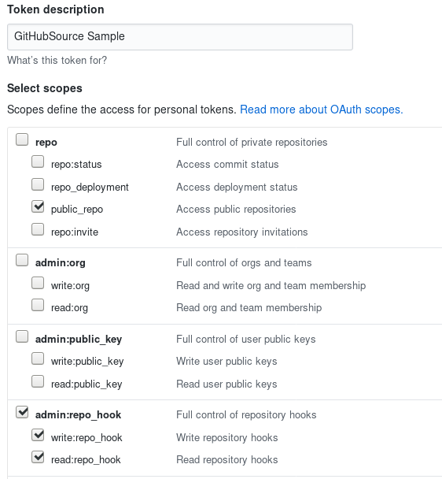

GitHub Source example shows how to wire GitHub events for consumption
by a Knative Service.

## Deployment Steps

### Prerequisites

You will need:

1. An internet-accessible Kubernetes cluster with Knative Serving
   installed. Follow the [installation
   instructions](../../../../install/)
   if you need to create one.
1. Ensure Knative Serving is [configured with a domain
   name](../../../serving/using-a-custom-domain.md)
   that allows GitHub to call into the cluster.
1. If you're using GKE, you'll also want to [assign a static IP address](../../../serving/gke-assigning-static-ip-address.).
1. Install [Knative
   Eventing](https://github.com/knative/docs/tree/master/eventing). Those
   instructions also install the default eventing sources, including
   the `GitHubSource` we'll use.

### Create a Knative Service

To verify the `GitHubSource` is working, we will create a simple Knative
`Service` that dumps incoming messages to its log. The `service.yaml` file
defines this basic service.

```yaml
apiVersion: serving.knative.dev/v1alpha1
kind: Service
metadata:
  name: github-message-dumper
spec:
  runLatest:
    configuration:
      revisionTemplate:
        spec:
          container:
            image: gcr.io/knative-releases/github.com/knative/eventing-sources/cmd/message_dumper
```

Enter the following command to create the service from `service.yaml`:

```shell
kubectl --namespace default apply --filename eventing/samples/github-source/service.yaml
```

### Create GitHub Tokens

Create a [personal access token](https://github.com/settings/tokens)
for GitHub that the GitHub source can use to register webhooks with
the GitHub API. Also decide on a secret token that your code will use
to authenticate the incoming webhooks from GitHub (_secretToken_).

The token can be named anything you find convenient. The Source
requires `repo:public_repo` and `admin:repo_hook`, to let it fire
events from your public repositories and to create webhooks for those
repositories. Copy and save this token; GitHub will force you to
generate it again if misplaced.

Here's an example for a token named "GitHubSource Sample" with the
recommended scopes:



Update `githubsecret.yaml` with those values. If your generated access
token is `'personal_access_token_value'` and you choose your _secretToken_
as `'asdfasfdsaf'`, you'd modify `githubsecret.yaml` like so:

```yaml
apiVersion: v1
kind: Secret
metadata:
  name: githubsecret
type: Opaque
stringData:
  accessToken: personal_access_token_value
  secretToken: asdfasfdsaf
```

Hint: you can makeup a random _secretToken_ with:

```shell
head -c 8 /dev/urandom | base64
```

Then, apply the githubsecret using `kubectl`:

```shell
kubectl --namespace default apply --filename eventing/samples/github-source/githubsecret.yaml
```

### Create Event Source for GitHub Events

In order to receive GitHub events, you have to create a concrete Event
Source for a specific namespace. Be sure to replace the
`ownerAndRepository` value with a valid GitHub public repository owned
by your GitHub user.

```yaml
apiVersion: sources.eventing.knative.dev/v1alpha1
kind: GitHubSource
metadata:
  name: githubsourcesample
spec:
  eventTypes:
    - pull_request
  ownerAndRepository: <YOUR USER>/<YOUR REPO>
  accessToken:
    secretKeyRef:
      name: githubsecret
      key: accessToken
  secretToken:
    secretKeyRef:
      name: githubsecret
      key: secretToken
  sink:
    apiVersion: serving.knative.dev/v1alpha1
    kind: Service
    name: github-message-dumper
```

Then, apply that yaml using `kubectl`:

```shell
kubectl --namespace default apply --filename eventing/samples/github-source/github-source.yaml
```

### Verify

Verify the GitHub webhook was created by looking at the list of
webhooks under the Settings tab in your GitHub repository. A hook
should be listed that points to your Knative cluster with a green
check mark to the left of the hook URL, as shown below.


### Create Events

Create a pull request in your GitHub repository. We will verify
that the GitHub events were sent into the Knative eventing system
by looking at our message dumper function logs.

```shell
kubectl --namespace default get pods
kubectl --namespace default logs github-message-dumper-XXXX user-container
```

You should log lines similar to:

```
2018/11/08 18:25:34 Message Dumper received a message: POST / HTTP/1.1
Host: github-message-dumper.knative-demo.svc.cluster.local
Accept-Encoding: gzip
Ce-Cloudeventsversion: 0.1
Ce-Eventid: a8d4cf20-e383-11e8-8069-46e3c8ad2b4d
Ce-Eventtime: 2018-11-08T18:25:32.819548012Z
Ce-Eventtype: dev.knative.source.github.pull_request
Ce-Source: https://github.com/someuser/somerepo/pull/1
Content-Length: 21060
Content-Type: application/json
User-Agent: Go-http-client/1.1
X-B3-Parentspanid: b2e514c3dbe94c03
X-B3-Sampled: 1
X-B3-Spanid: c85e346d89c8be4e
X-B3-Traceid: abf6292d458fb8e7
X-Envoy-Expected-Rq-Timeout-Ms: 60000
X-Envoy-Internal: true
X-Forwarded-For: 127.0.0.1, 127.0.0.1
X-Forwarded-Proto: http
X-Request-Id: 8a2201af-5075-9447-b593-ec3a243aff52

{"action":"opened","number":1,"pull_request": ...}
```

### Cleanup

You can remove the Github webhook by deleting the Github source:

```shell
kubectl --namespace default delete --filename eventing/samples/github-source/github-source.yaml
```

Similarly, you can remove the Service and Secret via:

```shell
kubectl --namespace default delete --filename eventing/samples/github-source/service.yaml
kubectl --namespace default delete --filename eventing/samples/github-source/githubsecret.yaml

```
