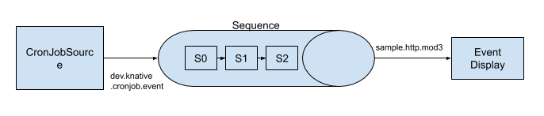

## Overview

We are going to create the following logical configuration. We create a
CronJobSource, feeding events to a [`Sequence`](../../../sequence.md), then
taking the output of that `Sequence` and displaying the resulting output.



## Prerequisites

For this example, we'll assume you have set up an `InMemoryChannel` as well as
Knative Serving (for our functions). The examples use `default` namespace,
again, if you want to deploy to another Namespace, you will need to modify the
examples to reflect this.

If you want to use different type of `Channel`, you will have to modify the
`Sequence.Spec.ChannelTemplate` to create the appropriate Channel resources.

## Setup

### Create the Knative Services

Change `default` below to create the steps in the Namespace where you want
resources created.

```yaml
apiVersion: serving.knative.dev/v1alpha1
kind: Service
metadata:
  name: first
spec:
  template:
    spec:
      containers:
        - image: us.gcr.io/probable-summer-223122/cmd-03315b715ae8f3e08e3a9378df706fbb@sha256:2656f39a7fcb6afd9fc79e7a4e215d14d651dc674f38020d1d18c6f04b220700
          env:
            - name: STEP
              value: "0"

---
apiVersion: serving.knative.dev/v1alpha1
kind: Service
metadata:
  name: second
spec:
  template:
    spec:
      containers:
        - image: us.gcr.io/probable-summer-223122/cmd-03315b715ae8f3e08e3a9378df706fbb@sha256:2656f39a7fcb6afd9fc79e7a4e215d14d651dc674f38020d1d18c6f04b220700
          env:
            - name: STEP
              value: "1"
---
apiVersion: serving.knative.dev/v1alpha1
kind: Service
metadata:
  name: third
spec:
  template:
    spec:
      containers:
        - image: us.gcr.io/probable-summer-223122/cmd-03315b715ae8f3e08e3a9378df706fbb@sha256:2656f39a7fcb6afd9fc79e7a4e215d14d651dc674f38020d1d18c6f04b220700
          env:
            - name: STEP
              value: "2"
---

```

```shell
kubectl -n default create -f ./steps.yaml
```

### Create the Sequence

The `sequence.yaml` file contains the specifications for creating the Sequence.
If you are using a different type of Channel, you need to change the
spec.channelTemplate to point to your desired Channel.

```yaml
apiVersion: messaging.knative.dev/v1alpha1
kind: Sequence
metadata:
  name: sequence
spec:
  channelTemplate:
    apiVersion: messaging.knative.dev/v1alpha1
    kind: InMemoryChannel
  steps:
    - ref:
        apiVersion: serving.knative.dev/v1alpha1
        kind: Service
        name: first
    - ref:
        apiVersion: serving.knative.dev/v1alpha1
        kind: Service
        name: second
    - ref:
        apiVersion: serving.knative.dev/v1alpha1
        kind: Service
        name: third
  reply:
    kind: Service
    apiVersion: serving.knative.dev/v1alpha1
    name: event-display
```

Change `default` below to create the `Sequence` in the Namespace where you want
the resources to be created.

```shell
kubectl -n default create -f ./sequence.yaml
```

### Create the Service displaying the events created by Sequence

```yaml
apiVersion: serving.knative.dev/v1alpha1
kind: Service
metadata:
  name: event-display
spec:
  template:
    spec:
      containers:
        - image: gcr.io/knative-releases/github.com/knative/eventing-sources/cmd/event_display
```

Change `default` below to create the `Sequence` in the Namespace where you want
your resources to be created.

```shell
kubectl -n default create -f ./event-display.yaml
```

### Create the CronJobSource targeting the Sequence

This will create a CronJobSource which will send a CloudEvent with {"message":
"Hello world!"} as the data payload every 2 minutes.

```yaml
apiVersion: sources.eventing.knative.dev/v1alpha1
kind: CronJobSource
metadata:
  name: cronjob-source
spec:
  schedule: "*/2 * * * *"
  data: '{"message": "Hello world!"}'
  sink:
    apiVersion: messaging.knative.dev/v1alpha1
    kind: Sequence
    name: sequence
```

```shell
kubectl -n default create -f ./cron-source.yaml
```

### Inspecting the results

You can now see the final output by inspecting the logs of the event-display
pods.

```shell
kubectl -n default get pods
```

Then look at the logs for the event-display pod:

```shell
kubectl -n default logs -l serving.knative.dev/service=event-display -c user-container
☁️  cloudevents.Event
Validation: valid
Context Attributes,
  cloudEventsVersion: 0.1
  eventType: samples.http.mod3
  source: /transformer/2
  eventID: df52b47e-02fd-45b2-8180-dabb572573f5
  eventTime: 2019-06-18T14:18:42.478140635Z
  contentType: application/json
Data,
  {
    "id": 0,
    "message": "Hello world! - Handled by 0 - Handled by 1 - Handled by 2"
  }
```

And you can see that the initial Cron Source message ("Hello World!") has been
appended to it by each of the steps in the Sequence.
