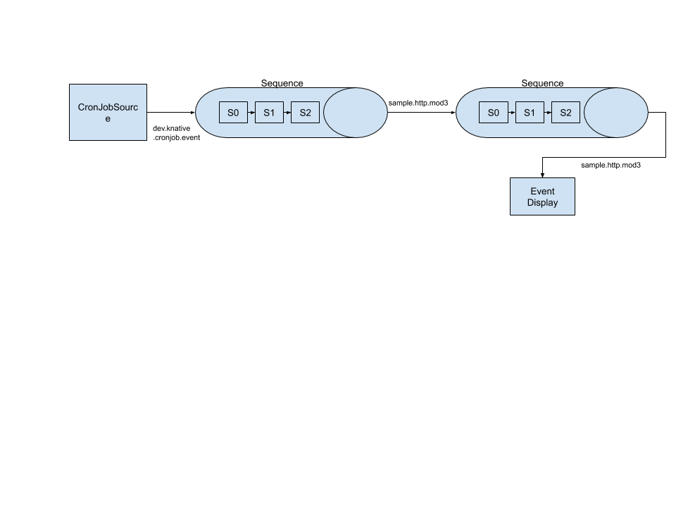

We are going to create the following logical configuration. We create a
PingSource, feeding events to a [`Sequence`](../../../flows/sequence.md), then
taking the output of that `Sequence` and sending it to a second `Sequence` and
finally displaying the resulting output.



The functions used in these examples live in
[https://github.com/knative/eventing-contrib/blob/master/cmd/appender/main.go](https://github.com/knative/eventing-contrib/blob/master/cmd/appender/main.go).

## Prerequisites

For this example, we'll assume you have set up an `InMemoryChannel` as well as
Knative Serving (for our functions). The examples use `default` namespace,
again, if you want to deploy to another namespace, you will need to modify the
examples to reflect this.

If you want to use different type of `Channel`, you will have to modify the
`Sequence.Spec.ChannelTemplate` to create the appropriate Channel resources.

## Setup

### Create the Knative Services

Change `default` below to create the steps in the Namespace where you want
resources created.

```yaml
apiVersion: serving.knative.dev/v1
kind: Service
metadata:
  name: first
spec:
  template:
    spec:
      containers:
        - image: gcr.io/knative-releases/knative.dev/eventing-contrib/cmd/appender
          env:
            - name: MESSAGE
              value: " - Handled by 0"

---
apiVersion: serving.knative.dev/v1
kind: Service
metadata:
  name: second
spec:
  template:
    spec:
      containers:
        - image: gcr.io/knative-releases/knative.dev/eventing-contrib/cmd/appender
          env:
            - name: MESSAGE
              value: " - Handled by 1"
---
apiVersion: serving.knative.dev/v1
kind: Service
metadata:
  name: third
spec:
  template:
    spec:
      containers:
        - image: gcr.io/knative-releases/knative.dev/eventing-contrib/cmd/appender
          env:
            - name: MESSAGE
              value: " - Handled by 2"
---
apiVersion: serving.knative.dev/v1
kind: Service
metadata:
  name: fourth
spec:
  template:
    spec:
      containers:
        - image: gcr.io/knative-releases/knative.dev/eventing-contrib/cmd/appender
          env:
            - name: MESSAGE
              value: " - Handled by 3"

---
apiVersion: serving.knative.dev/v1
kind: Service
metadata:
  name: fifth
spec:
  template:
    spec:
      containers:
        - image: gcr.io/knative-releases/knative.dev/eventing-contrib/cmd/appender
          env:
            - name: MESSAGE
              value: " - Handled by 4"
---
apiVersion: serving.knative.dev/v1
kind: Service
metadata:
  name: sixth
spec:
  template:
    spec:
      containers:
        - image: gcr.io/knative-releases/knative.dev/eventing-contrib/cmd/appender
          env:
            - name: MESSAGE
              value: " - Handled by 5"
---

```

```shell
kubectl -n default create -f ./steps.yaml
```

### Create the first Sequence

The `sequence1.yaml` file contains the specifications for creating the Sequence.
If you are using a different type of Channel, you need to change the
spec.channelTemplate to point to your desired Channel.

```yaml
apiVersion: flows.knative.dev/v1beta1
kind: Sequence
metadata:
  name: first-sequence
spec:
  channelTemplate:
    apiVersion: messaging.knative.dev/v1beta1
    kind: InMemoryChannel
  steps:
    - ref:
        apiVersion: serving.knative.dev/v1
        kind: Service
        name: first
    - ref:
        apiVersion: serving.knative.dev/v1
        kind: Service
        name: second
    - ref:
        apiVersion: serving.knative.dev/v1
        kind: Service
        name: third
  reply:
    ref:
      kind: Sequence
      apiVersion: flows.knative.dev/v1alpha1
      name: second-sequence
```

Change `default` below to create the `Sequence` in the Namespace where you want
your resources created.

```shell
kubectl -n default create -f ./sequence1.yaml
```

### Create the second Sequence

The `sequence2.yaml` file contains the specifications for creating the Sequence.
If you are using a different type of Channel, you need to change the
spec.channelTemplate to point to your desired Channel.

```yaml
apiVersion: flows.knative.dev/v1beta1
kind: Sequence
metadata:
  name: second-sequence
spec:
  channelTemplate:
    apiVersion: messaging.knative.dev/v1beta1
    kind: InMemoryChannel
  steps:
    - ref:
        apiVersion: serving.knative.dev/v1
        kind: Service
        name: fourth
    - ref:
        apiVersion: serving.knative.dev/v1
        kind: Service
        name: fifth
    - ref:
        apiVersion: serving.knative.dev/v1
        kind: Service
        name: sixth
  reply:
    ref:
      kind: Service
      apiVersion: serving.knative.dev/v1
      name: event-display
```


```shell
kubectl -n default create -f ./sequence2.yaml
```

### Create the Service displaying the events created by Sequence

```yaml
apiVersion: serving.knative.dev/v1
kind: Service
metadata:
  name: event-display
spec:
  template:
    spec:
      containerers:
        - image: gcr.io/knative-releases/knative.dev/eventing-contrib/cmd/event_display
```

Change `default` below to create the `Sequence` in the Namespace where you want
your resources created.

```shell
kubectl -n default create -f ./event-display.yaml
```

### Create the PingSource targeting the first Sequence

This will create a PingSource which will send a CloudEvent with `{"message":
"Hello world!"}` as the data payload every 2 minutes.

```yaml
apiVersion: sources.knative.dev/v1alpha2
kind: PingSource
metadata:
  name: ping-source
spec:
  schedule: "*/2 * * * *"
  jsonData: '{"message": "Hello world!"}'
  sink:
    ref:
      apiVersion: flows.knative.dev/v1beta1
      kind: Sequence
      name: first-sequence
```

```shell
kubectl -n default create -f ./ping-source.yaml
```

### Inspecting the results

You can now see the final output by inspecting the logs of the event-display
pods.

```shell
kubectl -n default get pods
```

Then look at the logs for the event-display pod:

```shell
kubectl -n default logs -l serving.knative.dev/service=event-display -c user-container --tail=-1
☁️  cloudevents.Event
Validation: valid
Context Attributes,
  specversion: 1.0
  type: dev.knative.sources.ping
  source: /apis/v1/namespaces/default/pingsources/ping-source
  id: 29d531df-78d8-4d11-9ffd-ba24045241a9
  time: 2020-03-02T21:18:00.0011708Z
  datacontenttype: application/json
Extensions,
  knativehistory: first-sequence-kn-sequence-0-kn-channel.default.svc.cluster.local; first-sequence-kn-sequence-1-kn-channel.default.svc.cluster.local; first-sequence-kn-sequence-2-kn-channel.default.svc.cluster.local; second-sequence-kn-sequence-0-kn-channel.default.svc.cluster.local; second-sequence-kn-sequence-1-kn-channel.default.svc.cluster.local; second-sequence-kn-sequence-2-kn-channel.default.svc.cluster.local
  traceparent: 00-e5abc9de525a89ead80560b8f328de5c-fc12b64a6296f541-00
Data,
  {
    "id": 0,
    "message": "Hello world! - Handled by 0 - Handled by 1 - Handled by 2 - Handled by 3 - Handled by 4 - Handled by 5"
  }
```

And you can see that the initial PingSource message `("Hello World!")` has been
appended to it by each of the steps in the Sequence.
