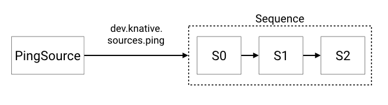

We are going to create the following logical configuration. We create a
CronJobSource, feeding events to a [`Sequence`](../../../flows/sequence.md). Sequence
can then do either external work, or out of band create additional events.



The functions used in these examples live in
[https://github.com/knative/eventing-contrib/blob/master/cmd/appender/main.go](https://github.com/knative/eventing-contrib/blob/master/cmd/appender/main.go).

## Prerequisites

For this example, we'll assume you have set up an `InMemoryChannel` as well as
Knative Serving (for our functions). The examples use `default` namespace,
again, if you want to deploy to another Namespace, you will need to modify the
examples to reflect this.

If you want to use different type of `Channel`, you will have to modify the
`Sequence.Spec.ChannelTemplate` to create the appropriate Channel resources.

## Setup

### Create the Knative Services

First create the 3 steps that will be referenced in the Steps.

```yaml
apiVersion: serving.knative.dev/v1
kind: Service
metadata:
  name: first
spec:
  template:
    spec:
      containers:
        - image: gcr.io/knative-releases/knative.dev/eventing-contrib/cmd/appender
          env:
            - name: MESSAGE
              value: " - Handled by 0"

---
apiVersion: serving.knative.dev/v1
kind: Service
metadata:
  name: second
spec:
  template:
    spec:
      containers:
        - image: gcr.io/knative-releases/knative.dev/eventing-contrib/cmd/appender
          env:
            - name: MESSAGE
              value: " - Handled by 1"
---
apiVersion: serving.knative.dev/v1
kind: Service
metadata:
  name: third
spec:
  template:
    spec:
      containers:
        - image: gcr.io/knative-releases/knative.dev/eventing-contrib/cmd/appender
          env:
            - name: MESSAGE
              value: " - Handled by 2"
---

```

```shell
kubectl -n default create -f ./steps.yaml
```

### Create the Sequence

The `sequence.yaml` file contains the specifications for creating the Sequence.
If you are using a different type of Channel, you need to change the
spec.channelTemplate to point to your desired Channel.

```yaml
apiVersion: flows.knative.dev/v1beta1
kind: Sequence
metadata:
  name: sequence
spec:
  channelTemplate:
    apiVersion: messaging.knative.dev/v1beta1
    kind: InMemoryChannel
  steps:
    - ref:
        apiVersion: serving.knative.dev/v1
        kind: Service
        name: first
    - ref:
        apiVersion: serving.knative.dev/v1
        kind: Service
        name: second
    - ref:
        apiVersion: serving.knative.dev/v1
        kind: Service
        name: third
```

Change `default` below to create the `Sequence` in the Namespace where you want
the resources to be created.

```shell
kubectl -n default create -f ./sequence.yaml
```

### Create the PingSource targeting the Sequence

This will create a PingSource which will send a CloudEvent with `{"message":
"Hello world!"}` as the data payload every 2 minutes.

```yaml
apiVersion: sources.knative.dev/v1alpha2
kind: PingSource
metadata:
  name: ping-source
spec:
  schedule: "*/2 * * * *"
  jsonData: '{"message": "Hello world!"}'
  sink:
    ref:
      apiVersion: flows.knative.dev/v1beta1
      kind: Sequence
      name: sequence
```

Here, if you are using different type of Channel, you need to change the
spec.channelTemplate to point to your desired Channel.

```shell
kubectl -n default create -f ./ping-source.yaml
```

### Inspecting the results

You can now see the final output by inspecting the logs of the event-display
pods. Note that since we set the `PingSource` to emit every 2 minutes, it
might take some time for the events to show up in the logs.

```shell
kubectl -n default get pods
```

Let's look at the logs for the first `Step` in the `Sequence`:

```shell
kubectl -n default logs -l serving.knative.dev/service=first -c user-container --tail=-1

2020/03/02 21:28:00 listening on 8080, appending " - Handled by 0" to events
2020/03/02 21:28:01 Received a new event:
2020/03/02 21:28:01 [2020-03-02T21:28:00.0010247Z] /apis/v1/namespaces/default/pingsources/ping-source dev.knative.sources.ping: &{Sequence:0 Message:Hello world!}
2020/03/02 21:28:01 Transform the event to:
2020/03/02 21:28:01 [2020-03-02T21:28:00.0010247Z] /apis/v1/namespaces/default/pingsources/ping-source dev.knative.sources.ping: &{Sequence:0 Message:Hello world! - Handled by 0}
```

Then we can look at the output of the second Step in the `Sequence`:

```shell
kubectl -n default logs -l serving.knative.dev/service=second -c user-container --tail=-1

2020/03/02 21:28:02 listening on 8080, appending " - Handled by 1" to events
2020/03/02 21:28:02 Received a new event:
2020/03/02 21:28:02 [2020-03-02T21:28:00.0010247Z] /apis/v1/namespaces/default/pingsources/ping-source dev.knative.sources.ping: &{Sequence:0 Message:Hello world! - Handled by 0}
2020/03/02 21:28:02 Transform the event to:
2020/03/02 21:28:02 [2020-03-02T21:28:00.0010247Z] /apis/v1/namespaces/default/pingsources/ping-source dev.knative.sources.ping: &{Sequence:0 Message:Hello world! - Handled by 0 - Handled by 1}
```

And you can see that the initial PingSource message `("Hello World!")` has now
been modified by the first step in the Sequence to include " - Handled by 0".
Exciting :)

Then we can look at the output of the last Step in the `Sequence`:

```shell
kubectl -n default logs -l serving.knative.dev/service=third -c user-container --tail=-1

2020/03/02 21:28:03 listening on 8080, appending " - Handled by 2" to events
2020/03/02 21:28:03 Received a new event:
2020/03/02 21:28:03 [2020-03-02T21:28:00.0010247Z] /apis/v1/namespaces/default/pingsources/ping-source dev.knative.sources.ping: &{Sequence:0 Message:Hello world! - Handled by 0 - Handled by 1}
2020/03/02 21:28:03 Transform the event to:
2020/03/02 21:28:03 [2020-03-02T21:28:00.0010247Z] /apis/v1/namespaces/default/pingsources/ping-source dev.knative.sources.ping: &{Sequence:0 Message:Hello world! - Handled by 0 - Handled by 1 - Handled by 2}
```

And as expected it's now been handled by both the first and second Step as
reflected by the Message being now: "Hello world! - Handled by 0 - Handled by 1"
