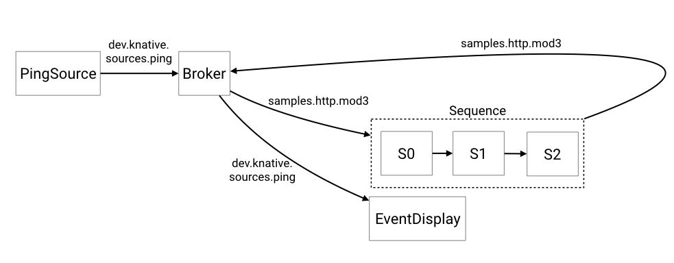

# Using Sequence with Broker and Trigger

## Prerequisites

For this example, we'll assume you have set up a `Broker` and an `InMemoryChannel`
as well as Knative Serving (for our functions). The examples use `newbroker`
namespace, again, if your broker lives in another Namespace, you will need to
modify the examples to reflect this.
If you want to use different type of `Channel`, you will have to modify the
`Sequence.Spec.ChannelTemplate` to create the appropriate Channel resources.

## Overview

We are going to create the following logical configuration. We create a CronJobSource,
feeding events into the Broker, then we create a `Filter` that wires those events
into a Sequence consisting of 3 steps. Then we take the end of the Sequence and
feed newly minted events back into the Broker and create another Trigger which 
will then display those events.
**NOTE** [TODO: Fix this](https://github.com/knative/eventing/issues/1421)
So, currently as set up, the events emitted by the Sequence do not make it into
the Broker.




## Setup

### Create the Knative Services

Change `newbroker` below to create the steps in the Namespace where you have configured your
`Broker`

```yaml
apiVersion: serving.knative.dev/v1alpha1
kind: Service
metadata:
  name: first
spec:
  runLatest:
    configuration:
      revisionTemplate:
        spec:
          container:
            image: us.gcr.io/probable-summer-223122/cmd-03315b715ae8f3e08e3a9378df706fbb@sha256:17f0bb4c6ee5b1e5580966aa705a51f1b54adc794356f14c9d441d91a26412a3
            env:
            - name: STEP
              value: "0"

---
apiVersion: serving.knative.dev/v1alpha1
kind: Service
metadata:
  name: second
spec:
  runLatest:
    configuration:
      revisionTemplate:
        spec:
          container:
            image: us.gcr.io/probable-summer-223122/cmd-03315b715ae8f3e08e3a9378df706fbb@sha256:17f0bb4c6ee5b1e5580966aa705a51f1b54adc794356f14c9d441d91a26412a3
            env:
            - name: STEP
              value: "1"
---
apiVersion: serving.knative.dev/v1alpha1
kind: Service
metadata:
  name: third
spec:
  runLatest:
    configuration:
      revisionTemplate:
        spec:
          container:
            image: us.gcr.io/probable-summer-223122/cmd-03315b715ae8f3e08e3a9378df706fbb@sha256:17f0bb4c6ee5b1e5580966aa705a51f1b54adc794356f14c9d441d91a26412a3
            env:
            - name: STEP
              value: "2"

---
```


```shell
kubectl -n newbroker create -f ./steps.yaml
```

### Create the Sequence

Here, if you are using different type of Channel, you need to change the
spec.channelTemplate to point to your desired Channel. Also, change the
spec.reply.name to point to your `Broker`

```yaml
apiVersion: messaging.knative.dev/v1alpha1
kind: Sequence
metadata:
  name: sequence
spec:
  channelTemplate:
    apiVersion: messaging.knative.dev/v1alpha1
    kind: InMemoryChannel
  steps:
  - ref:
      apiVersion: serving.knative.dev/v1alpha1
      kind: Service
      name: first
  - ref:
      apiVersion: serving.knative.dev/v1alpha1
      kind: Service
      name: second
  - ref:
      apiVersion: serving.knative.dev/v1alpha1
      kind: Service
      name: third
  reply:
    kind: Broker
    apiVersion: eventing.knative.dev/v1alpha1
    name: broker-test
```

Change `newbroker` below to create the `Sequence` in the Namespace where you have configured your
`Broker`. 
```shell
kubectl -n newbroker create -f ./sequence.yaml
```


### Create the CronJobSource targeting the Broker

```yaml
apiVersion: sources.eventing.knative.dev/v1alpha1
kind: CronJobSource
metadata:
  name: cronjob-source
spec:
  schedule: "*/2 * * * *"
  data: '{"message": "Hello world!"}'
  sink:
    apiVersion: eventing.knative.dev/v1alpha1
    kind: Broker
    name: broker-test
```

Here, if you are using different type of Channel, you need to change the
spec.channelTemplate to point to your desired Channel. Also, change the
spec.reply.name to point to your `Broker`

Change `newbroker` below to create the `Sequence` in the Namespace where you have configured your
`Broker`. 
```shell
kubectl -n newbroker create -f ./cron-source.yaml
```

### Create the Trigger targeting the Sequence

```yaml
apiVersion: eventing.knative.dev/v1alpha1
kind: Trigger
metadata:
  name: sequence-trigger
spec:
  filter:
    sourceAndType:
      type: dev.knative.cronjob.event
  subscriber:
    ref:
      apiVersion: messaging.knative.dev/v1alpha1
      kind: Sequence
      name: sequence
```

Change `newbroker` below to create the `Sequence` in the Namespace where you have configured your
`Broker`. 
```shell
kubectl -n newbroker create -f ./trigger.yaml

```

### Create the Service and Trigger displaying the events created by Sequence

**NOTE** This does not work yet because the events created by the Sequence in the last step
are filtered. [TODO: Fix this](https://github.com/knative/eventing/issues/1421)

```yaml
apiVersion: serving.knative.dev/v1alpha1
kind: Service
metadata:
  name: sequence-display
spec:
  runLatest:
    configuration:
      revisionTemplate:
        spec:
          container:
            image: gcr.io/knative-releases/github.com/knative/eventing-sources/cmd/event_display
---
apiVersion: eventing.knative.dev/v1alpha1
kind: Trigger
metadata:
  name: sequence-trigger
spec:
  filter:
    sourceAndType:
      type: samples.http.mod3
  subscriber:
    ref:
      apiVersion: serving.knative.dev/v1alpha1
      kind: Service
      name: sequence-display
---
```

Change `newbroker` below to create the `Sequence` in the Namespace where you have configured your
`Broker`. 
```shell
kubectl -n newbroker create -f ./display-trigger.yaml
```

